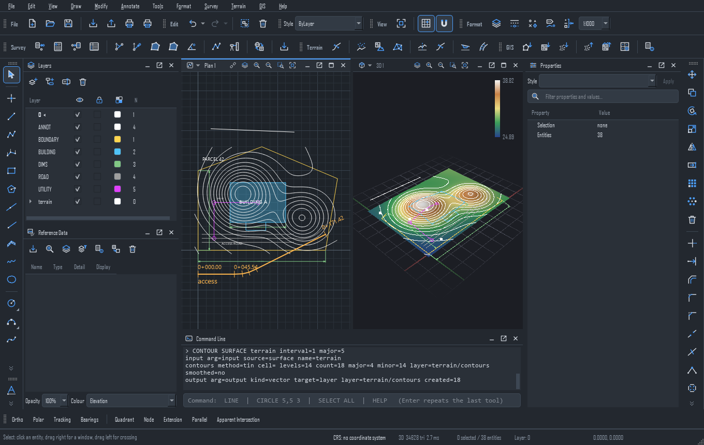
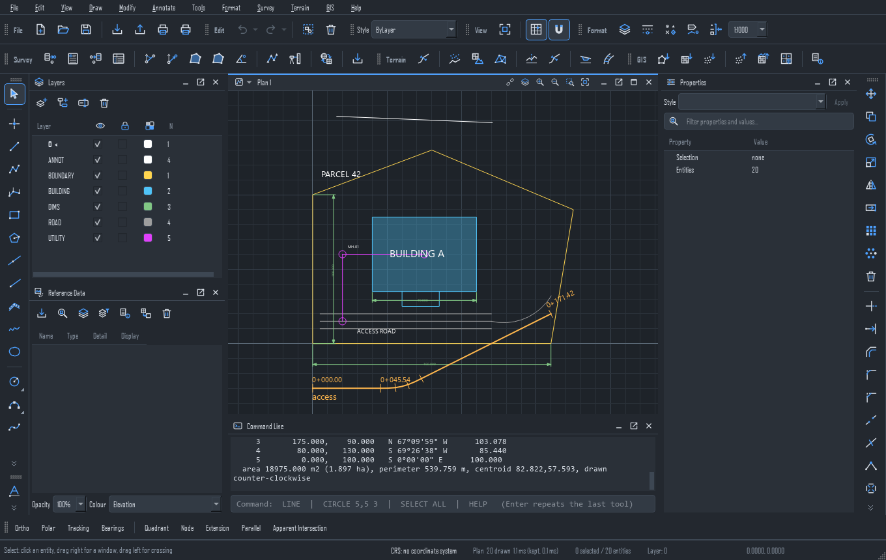
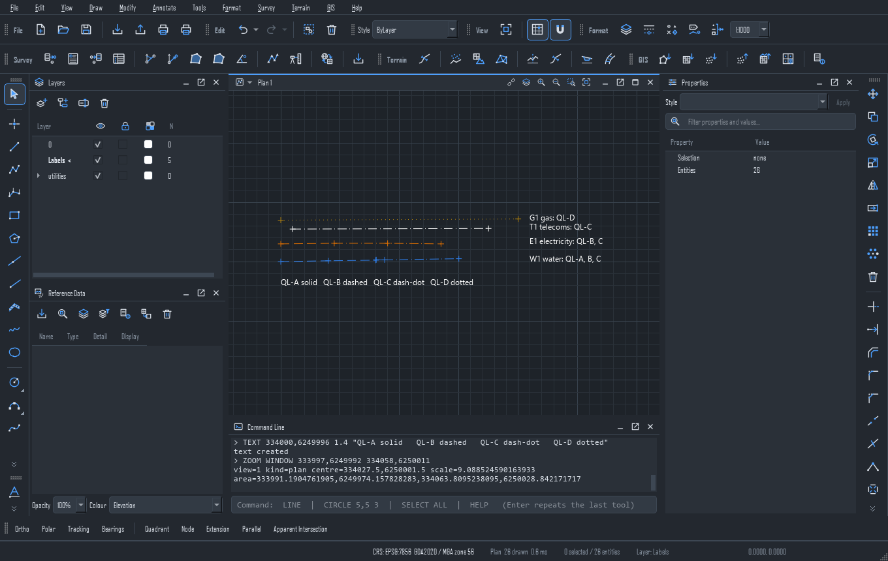
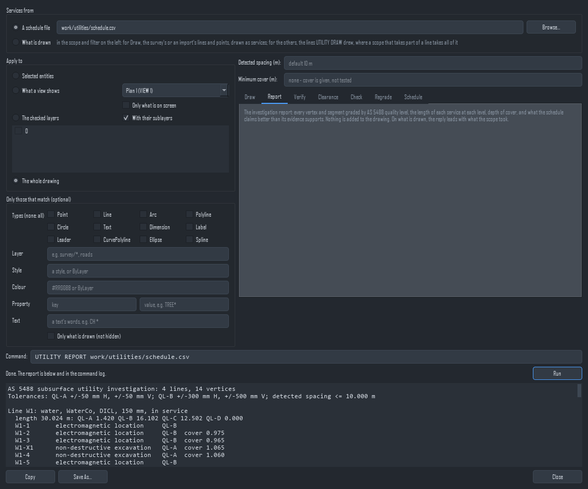
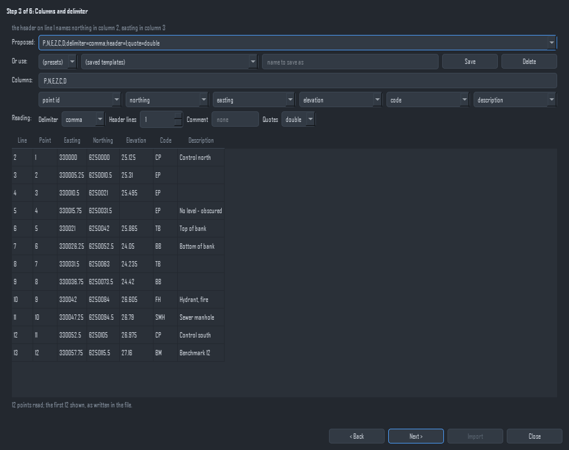
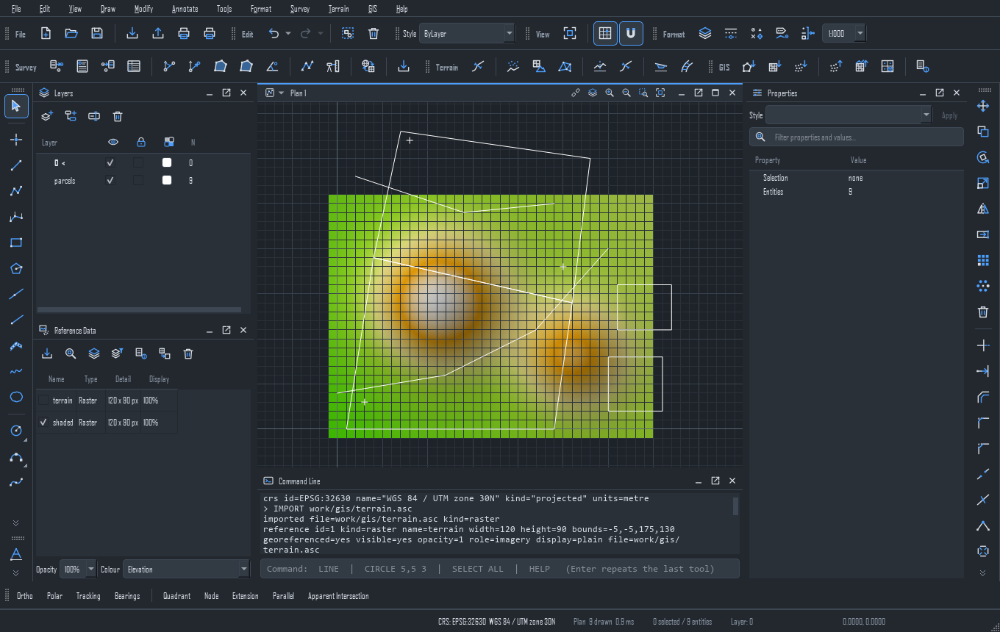
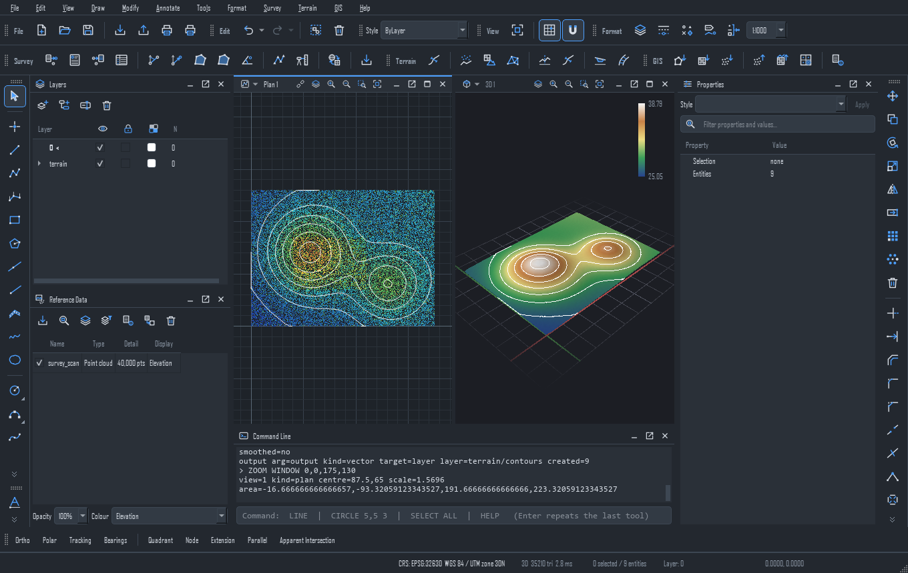
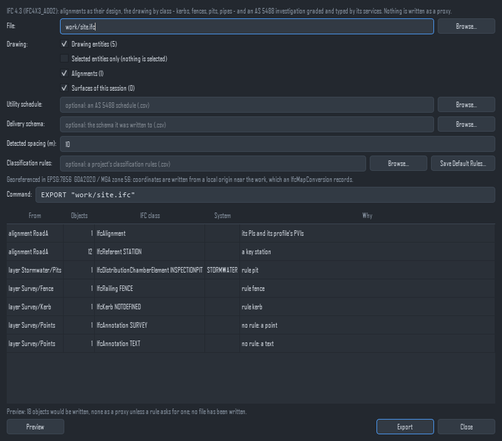
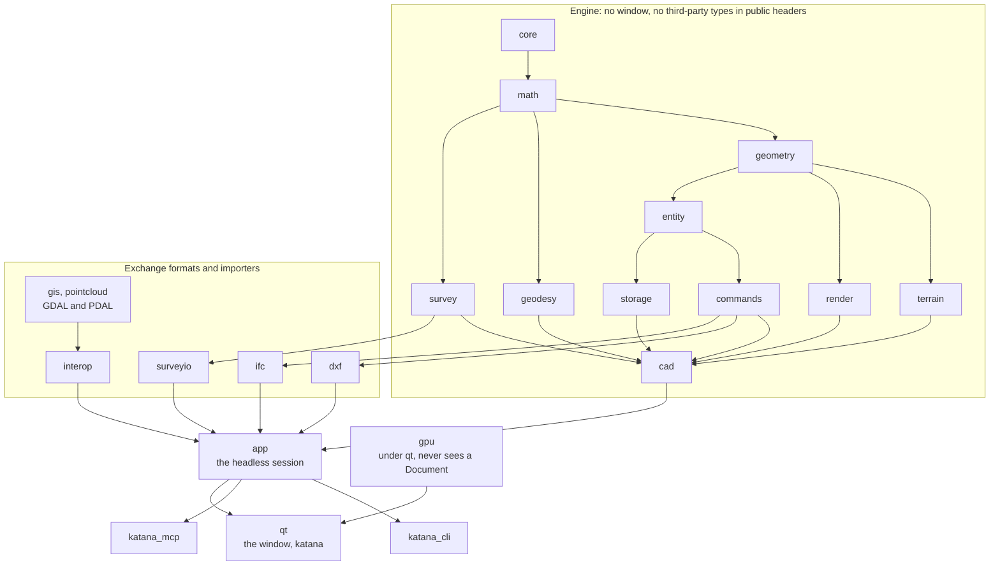

# Katana

**Survey, CAD, GIS and geospatial software for surveyors and civil engineers,
written by AI agents and directed by a person.**



*The desktop window on sample data from this repository: the plan view and the
3D view of one terrain surface. [More pictures](#gallery) are below.*

Katana draws and edits plans, runs survey calculations, builds terrain models,
lays out alignments and parcels, grades buried services by AS 5488 quality
level, and reads and writes GIS files, point clouds, DXF and IFC. It is for the
work between the field and the drawing: reducing a survey, building a ground
model, laying out a road centreline, checking where services are and how well
they were located, and handing the result to GIS and BIM tools.

One engine, three ways in. Most of it can be done in the desktop window with
the mouse, in a script on the command line, or by asking an AI agent over MCP
([where the three differ](#what-it-does)):

| Program | What it is |
|---|---|
| `katana` | the desktop application |
| `katana_cli` | the same engine on the command line, for scripts and batch work |
| `katana_mcp` | the engine served to Claude (or any MCP client) over the Model Context Protocol |

Published by **Jarada**.

## Quick start

On Windows, in an MSYS2 UCRT64 shell (MSYS2 installed at `C:/msys64`):

```sh
pacman -S --needed git mingw-w64-ucrt-x86_64-{gcc,cmake,ninja,qt6-base,eigen3,proj,cgal,sqlite3,nlohmann-json,gdal,pdal}
git clone https://github.com/kjarada/Katana.git
cd Katana
cmake --preset release
cmake --build build/release --parallel
cp -r samples/site_plan my_site_plan        # open a copy: opening a project can update it in place
build/release/bin/katana my_site_plan
```

On Linux, or macOS on Apple silicon, the toolchain comes from a script instead
of the package manager (it installs GCC 16, or clang on macOS, and the
libraries into `/opt/katana-toolchain`, or into `$KATANA_TOOLCHAIN` if you set
it, and needs write access to that folder):

```sh
python3 tools/setup_linux_toolchain.py
cmake --preset linux-release                # macOS: macos-release
cmake --build --preset linux-release --parallel
build/linux-release/bin/katana my_site_plan # macOS: build/macos-release/bin/katana
```

What you need is C++26 (GCC 15 or later; the project builds with GCC 16.2),
CMake 3.24 or later, Ninja, and Qt 6, Eigen, PROJ, CGAL, SQLite, nlohmann-json,
GDAL and PDAL. The MSYS2 package names above were checked against the MSYS2
package database on 2026-10-08; they were not tried on a machine with nothing
installed.

The first build is the slow part. On the maintainer's 24-thread Windows machine
it took about 19 minutes at `-j4`, and about 70 seconds with a warm compiler
cache (measured on 2026-09-29, `docs/building.md`, "Build and test speed"); the
compile steps add up to about 75 minutes of processor time, so expect it to
scale with your cores. To work on one area, add
`-DKATANA_MODULE_FILTER="katana_core;katana_math;katana_geometry" -DKATANA_BUILD_BENCHMARKS=OFF`
to the first configure line, and only those modules and their tests are built
(`docs/building.md`, "Options"). On 2026-10-08 that took about two minutes from
configure to a built tree on the maintainer's machine, and 375 of its 376 tests
passed; `packaging_installs_only_present_first_party_files` failed, because a
filtered tree has no program to install. More to run is under
[Try it](#try-it).

**Status.** Pre-release, version 0.2.0. At the time of writing (2026-10-08) no
release has been published and `git tag` lists no tags, so building from source
is the way in; [Install](#install) describes what a release contains once there
is one. Nothing here has been validated for professional or legal survey work:
check results against an independent calculation before you rely on them.

**Come and help.** Humans and AI agents are both welcome. Start with
[Contribute](#contribute), or read [CONTRIBUTING.md](CONTRIBUTING.md).

[Gallery](#gallery) | [What it does](#what-it-does) |
[Written by AI](#written-by-ai-with-a-human-in-charge) | [Try it](#try-it) |
[Architecture](#architecture) | [Contribute](#contribute) |
[Licence](#licence) | [Install](#install)

---

## Gallery

Every picture is the real program, run headless by its own `--screenshot`
switch on copies of sample data committed in this repository
(`docs/headless.md`). The offscreen window draws with fallback fonts, so a real
display looks a little different. They were made with
`KATANA_BUILTIN_CUSTOMISATION=none`, which leaves out the customisation a
default build carries; the command-line output further down was made the same
way, since a default `katana_cli` prints one extra first line on stdout naming
that customisation. In the IFC picture the alignment was renamed in the copy,
because the fallback font draws a 0 like a D.



**The window.** The sample site plan (`samples/site_plan`): a parcel, a
building, a road, services, dimensions and an alignment with chainage ticks,
with the Layers, Reference Data, Properties and Command Line panels. The command
line has just run `PARCEL 1`, which prints the parcel's courses, area and
centroid.



**Buried services.** `UTILITY DRAW` on `samples/utilities/schedule.csv`: four
services graded by AS 5488 quality level. The line style of each stretch is its
level: QL-A solid, QL-B dashed, QL-C dash-dot, QL-D dotted. The labels were
added afterwards with `TEXT`. W1 is QL-B, then a QL-A trench where a pothole
exposed it, then QL-C past the detected spacing.



**The report.** Survey > Subsurface Utilities (AS 5488): the report for the
sample schedule starts in the box at the bottom. The dialog only builds the
`UTILITY REPORT` line and hands it to the same command executor a typed line
uses.



**Survey import.** The wizard's columns step on a twelve-point test fixture,
`tests/surveyio/data/survey_points_pnezd.csv`: the column roles are proposed
from the header, and the first rows are shown as the file wrote them.



**GIS.** A hillshaded relief raster made from the sample DEM (`RASTER SHADE`)
under the sample parcels (`samples/gis/parcels.geojson`, EPSG:32630), which
`IMPORT ... LOCAL` moved to the origin so they sit over the raster. GDAL's
algorithms run on all three front ends.



**Point clouds.** A 40,000-point sample LAS file (`samples/gis/survey_scan.las`)
coloured by elevation in the plan view, listed under Reference Data. Its
ground-classified points (29,512 of them) were triangulated by `SURFACE FROM
CLOUD` into the surface in the 3D view and contoured at 2 m.



**IFC 4.3 export.** File > Export IFC previews which IFC class each thing in
the drawing becomes before any file is written: alignments, kerbs, fences, pits
and survey annotations, and a generic proxy only if a rule asks for one.

---

## What it does

Each line is a capability that exists in the source today, with the document
that records how and why it works. `docs/index.md` lists every document.

- **Draw and edit plans.** Lines, polylines, arcs, splines, ellipses, hatches,
  text, dimensions, leaders, layers with sub-layers, styles, snapping, grips
  and vertex tools, with undo for every edit. One scope and filter grammar
  (selection, view, layers, drawing, area) is read today by `MODIFY`, the
  `UTILITY` verbs, `CODE` and `LINEWORK`; the rule is that every verb on
  drawing data takes it, and `ERASE`, `SELECT` and the rest do not yet. See
  [cad.md](docs/cad.md), [drawing.md](docs/drawing.md),
  [annotation.md](docs/annotation.md), [tools.md](docs/tools.md).
- **Survey.** Inverse, forward, area and traverse calculations, levelling,
  least-squares network adjustment and error propagation; field-file import
  for delimited points, Leica GSI, opcode field files and Sokkia SDR, with
  readers also registered for TDS RW5, Topcon GTS-7, Trimble JobXML and RINEX
  observations; survey codes and linework. See [survey.md](docs/survey.md),
  [survey_coding.md](docs/survey_coding.md).
- **Coordinate systems.** Projected and geographic systems through PROJ,
  transformations, grid and ground factors, geodesics and site calibration.
  See [geodesy.md](docs/geodesy.md).
- **Alignments, profiles, corridors and parcels.** Horizontal alignments with
  radii and spirals, vertical profiles, stationing, corridor quantities, and
  parcels with bearings, areas and deed wording. There is also a library
  engine for grading to a surface, with no menu or verb yet. See
  [cad.md](docs/cad.md), [geometry.md](docs/geometry.md).
- **Terrain.** TIN surfaces from rasters, point clouds or the drawing;
  contours, volumes, slope and aspect, hillshade, viewshed and line of sight,
  zonal statistics and draping. See [terrain.md](docs/terrain.md).
- **Subsurface utilities by AS 5488.** Grade located services by quality
  level, check depth of cover and clearance, verify detections by exposure,
  check a delivery schema, and draw the result. See
  [subsurface_utilities.md](docs/subsurface_utilities.md).
- **GIS and geospatial data.** Any vector, raster or point-cloud format GDAL
  or PDAL reads, any GDAL algorithm through one verb, COPC conversion, and
  imagery, elevation and features from public web services in the window.
  DWG, ECW and E57 are not supported. See [interop.md](docs/interop.md),
  [geoprocessing.md](docs/geoprocessing.md), [gis_online.md](docs/gis_online.md).
- **Exchange.** DXF read and write with no third-party library, IFC 4.3
  export and IFC import (IFC2X3, IFC4 and IFC4X3), GeoJSON, GeoPackage,
  shapefile, LAS and LAZ. See [dxf.md](docs/dxf.md), [ifc.md](docs/ifc.md).
- **Plotting.** Sheet sets with frames, title blocks and generators, plotted
  to PDF, PNG or TIFF. See [plotting.md](docs/plotting.md).
- **Headless and agent use.** The window can run without a display and take
  its own screenshots, so a change to the look can be reviewed by someone who
  cannot watch a screen; `katana_mcp` gives an agent the verbs `katana_cli`
  has, as tools. See [headless.md](docs/headless.md), [mcp.md](docs/mcp.md).

`katana_cli -c "HELP"` prints the verbs: 385 lines in a default build, 384 with
no built-in customisation, at the time of writing.

**Where the three ways in differ.** Not every capability is on all three yet.
`katana_cli` and `katana_mcp` refuse `PLOT`, `PLOTSHEETS`, `SNAPSHOT`,
`ONLINE`, `SCRIPT`, `GRID` and `EXAGGERATION` by name, because they need the
window (a headless `katana` run has `--plot` and `--plot-sheets`; see
[mcp.md](docs/mcp.md) and [headless.md](docs/headless.md)). Traverse and Level
Book are window dialogs with no verb (`TRAVERSE` and `LEVEL` are unknown to
`katana_cli`), and corridors and grading have no verb either.

---

## Written by AI, with a human in charge

Katana's code is written by AI agents, Anthropic's Claude models, working in
this repository. A person, Jarada, directs the work, makes the decisions and
owns the repository. Katana makes no claim to be the first application of its
kind; that cannot be checked. What follows is what the repository shows, and
the commands that measured each figure are at the end of the section.

- **The agents.** 788 of the 791 non-merge commits carry a
  `Co-Authored-By: Claude` trailer. The three that do not are a commit of
  sample files and a commit that removed the old planning documents, both under
  the maintainer's name, and one work-in-progress commit by an agent. Of the
  791, 145 have the author `Claude`; the other 646 are committed under the
  maintainer's name.
- **The contract.** `CLAUDE.md` is loaded at the start of every agent session.
  Its rules include: every feature ships on all three surfaces (window, command
  line and MCP) in the same change; the whole suite runs before a commit; the
  affected document is updated in the same change; a commit message gives the
  evidence and what is still open; and agents never push, merge a pull request
  or delete a remote branch unless the owner asks.
- **Tests are the arbiter.** There are 7,366 registered tests. The cardinal
  rule is that nobody, human or agent, changes an expected value to match what
  the program produced. A failing test is fixed in the code, or the expectation
  is corrected from a source outside the program (a standard, a published
  constant, a hand calculation). A failing test is never deleted or disabled to
  make a run green, and a bug fix needs a regression test shown to fail without
  the fix.
- **Parallel work.** Larger jobs are split across agents, each in its own git
  worktree on its own branch with a named set of files. The branches are
  merged and the whole suite is run on the merged result. 154 of the commits
  are merges, 44 of them of work branches named `wt-`, `wv-` or `ws-`.
- **Independent review.** The audit of 2026-09-23 used ten independent
  auditors, one per subsystem, and handed every defect they reported to a
  second, adversarial reader told to refute it. What survived is listed in
  [docs/audit/2026-09-23-defects.md](docs/audit/2026-09-23-defects.md). Later
  review rounds are in the history: 31 commit subjects mention a review.
- **Documents as the record.** Thirty-one documents in `docs/` record
  decisions, measurements, the alternatives that were rejected, and what is not
  done.

The limits, plainly:

- The trailer shows that an agent took part in a commit. It cannot show who
  wrote which line, and the repository does not record how closely a person
  reads each change, so no figure is given for that.
- A passing suite shows that the tests pass. Nothing in this repository claims
  Katana has been validated for professional or legal survey work, so check
  results against an independent calculation before you rely on them.
- AI agents make mistakes, and so do people. The audit above exists because
  defects were found in the code after it was written, and its register shows
  entries that are still open.

<details>
<summary>How the figures were measured</summary>

At commit `7207d782` on 2026-10-08, from a checkout of `main`:

| Figure | Command |
|---|---|
| 945 commits, 791 not merges | `git rev-list --count main`, then `git rev-list --no-merges --count main` |
| 788 of 791 with a Claude trailer | `git rev-list --no-merges --count --grep='Co-Authored-By: Claude' main` |
| 145 authored as `Claude`, 646 under the maintainer's name (it is spelled two ways, 561 and 85) | `git log main --no-merges --format=%an \| sort \| uniq -c` |
| 154 merges, 44 of work branches | `git rev-list --merges --count main`, then `git log main --format=%s \| grep -c "^Merge branch 'w[tvs]-"` |
| 31 commits that mention a review | `git log main --format=%s \| grep -ciE '(^\|[^p])review'` (the pattern skips "preview") |
| 7,366 tests | `ctest --test-dir build/release -N` in a release build |
| 980 source and header files, about 349,000 lines | `git ls-files 'src/*' 'include/*'`, filtered to `.cpp .hpp .h .inl`, then `wc -l` |
| 452 test and benchmark files, about 220,000 lines | the same over `tests/*` and `benchmarks/*` |
| 31 documents in `docs/` | `ls docs/*.md \| wc -l` (the two audit files are in `docs/audit/`) |

These move every day. Run the commands for today's numbers.

</details>

---

## Try it

Build first: [Quick start](#quick-start). The commands below use the Windows
build tree, `build/release`; on Linux and macOS read `build/linux-release` or
`build/macos-release`, and `linux-release` or `macos-release` for the preset.

**Run a command line.** `HELP` lists the verbs. A script or a `-c` batch stops
at the first failing command and exits 1.

```sh
build/release/bin/katana_cli -c "RECT 0,0 30,20" -c "AREA 1"
```

```
rectangle created
Area of 1 outline - drawing unit 'metre' (project settings)
  1  polyline  area 600.000 m² (0.0600 ha)   perimeter 100.000 m
  Total  area 600.000 m² (0.0600 ha)   perimeter 100.000 m
  A self-intersecting outline is not detected; the areas of its lobes cancel
```

```sh
build/release/bin/katana_cli -c "INVERSE 0,0 30,40"
```

```
Inverse  E 0.000 N 0.000  ->  E 30.000 N 40.000
  dE +30.000   dN +40.000
  Horizontal distance 50.000
  Azimuth 36°52'11.63"   back azimuth 216°52'11.63"
  Bearing N 36°52'11.63" E
  No height difference: neither end has an elevation
```

A default build prints one more line first, naming its built-in customisation;
the outputs here are as `KATANA_BUILTIN_CUSTOMISATION=none` gives them. The
second one is a 3-4-5 triangle, so you can check it in your head. More to try:
`katana_cli samples/site_plan.kcs -c STATUS`,
`katana_cli -c "UTILITY REPORT samples/utilities/schedule.csv"` and
`katana_cli -c "INFO samples/gis/terrain.asc"`.

**Start the MCP server.** An MCP client starts `katana_mcp` itself. With
Claude Code (`docs/mcp.md` has Claude Desktop and the tools), on Windows:

```sh
claude mcp add katana -- C:/path/to/Katana/build/release/bin/katana_mcp.exe --project C:/work/my_site_plan
```

On Linux and macOS the program is
`/path/to/Katana/build/linux-release/bin/katana_mcp` (or `macos-release`). Then
ask in plain words: "draw a 30 by 20 lot at 1000,2000 and label its bearings".

**Take a screenshot, headless.** This is how the pictures above were made:

```sh
QT_QPA_PLATFORM=offscreen timeout 120 build/release/bin/katana my_site_plan --screenshot plan.png
```

**Run the tests.**

```sh
ctest --preset release                              # everything, in build/release
ctest --test-dir build/release -R '^qt_'            # the window's tests only
```

The whole suite takes minutes; `docs/testing.md` explains each kind of test.

---

## Architecture

The code is a stack of layers. A layer may include only its own headers and
those of the layers below it that `tools/check_layering.cmake` allows, and the
`layering` test fails the build when one reaches further. The diagram shows the
main routes, not every allowed edge.



Four rules explain most of the shape (`docs/architecture.md` has all seven):

- **One door for edits.** Nothing changes the model except a validated,
  undoable command. The window, `katana_cli` and `katana_mcp` all issue the same
  commands through one `CommandInterpreter`, and a dialog only builds the line
  that a person could have typed.
- **The renderer is not the source of truth.** It draws a list of plain
  geometry and does not know a document exists.
- **Third-party libraries stay behind our own interfaces.** GDAL, PDAL, PROJ,
  CGAL, SQLite and Qt do not appear in a public header. `cad` cannot see
  `interop`, so the core builds with `-DKATANA_BUILD_IO=OFF` and no GDAL or PDAL.
- **Same input, same output.** Parallel and vectorised code gives the same
  bits as the serial scalar code, unless a document says otherwise and why.

---

## Contribute

You are welcome here whether you are a surveyor, a C++ programmer, someone who
likes writing tests, or an AI agent. There is a lot to do that needs no survey
knowledge: build and packaging work, the window's usability, tests, and
documents.

Questions and proposals go in an issue: Issues are enabled on the repository,
and Discussions are not. There is no `LICENSE` file yet, so read
[Licence](#licence) before you spend a lot of time on a large change.

**Build it and run the tests.** [Quick start](#quick-start) has the build and
[Try it](#try-it) the commands to run; `docs/building.md` has the toolchains,
presets and options, and `docs/testing.md` has the kinds of test and what makes
a test evidence.

**The contract everyone follows.** `CLAUDE.md` is written for AI agents but
binds every contributor. In two sentences: every feature ships in the same
change on the window, the command line and MCP, with its tests and its
document; and a test's expected value is never changed to match what the
program produced. [CONTRIBUTING.md](CONTRIBUTING.md) turns it into a checklist.

### Where to start

The "Not done" lists at the end of the documents in `docs/` are a ready
backlog, written by the people who found the gap. A few that were real on
2026-10-08:

- **Small.** `docs/headless.md`, "Not done": `--fill` cannot tick a checkable
  list row, so a headless run cannot drive the shared scope widget's layer
  list. A `ROW=on` form of `--fill` would close it.
- **Medium.** `docs/ifc.md`, "Not done": IFC export takes the selection or the
  whole drawing, but not the shared scope words (`VIEW`, `AREA`, `LAYERS`,
  `WHERE`) that `MODIFY` and the `UTILITY` verbs take, and its dialog lacks the
  "Apply to" controls.
- **Larger.** `docs/gis_online.md`, "Not done": `katana_cli` and `katana_mcp`
  have no `ONLINE` verbs, so an agent cannot fetch web data a person can. That
  is a gap against the three-surface rule.
- **No C++ needed.** `docs/release.md`, "Not done": the Linux package is a
  tarball, with no AppImage, `.deb` or Flatpak, and nothing builds on every
  change.
- **Defects.** [docs/audit/2026-09-23-defects.md](docs/audit/2026-09-23-defects.md)
  lists defects with their failure scenarios and a status. Statuses lag the
  fixes, so run `git log --grep <ID>` before you start on one.

### How to propose a change

Branch from `main`, write the test first, make the change, run the whole suite,
and update the document in the same change. Open a pull request, and for
anything large open an issue first so that the design is discussed before the
work is done. The maintainer merges; agents do not merge their own pull
requests.

### Agents are welcome too

An agent contributes the way a person does, under the same contract, and says
plainly what it did not do. The history's commits made with an agent's help
carry a `Co-Authored-By` trailer; please do the same.

---

## Licence

There is no `LICENSE` file in this repository. The licence has not been chosen
yet; until one is added, all rights are reserved by the owner. What that means
for contributions is the owner's decision too, so if it matters to you, ask in
an issue before you start on something large.

One file has a licence question of its own.
`resources/customisation/nsw.customisation.json`, the customisation compiled
into a default build, was converted from style and survey-code libraries that
came under someone else's licence. The owner decided on 2026-10-08 to commit
it. Nothing in the repository records a permission from the libraries' owner,
and none is claimed here. Anyone who redistributes a build, or a copy of the
repository, should read the libraries' notice first; it is kept with the
original library files, so ask the owner (`docs/customisation.md`, "Why the
built-in is in the repository"). It is the one exception to the rule that
third-party reference data stays out of the repository, and it is not a
precedent: do not add another.

---

## Install

Pick a package, or [build from source](#build-from-source). This part is the
reference for installing, verifying and running Katana on each platform.

### Download

When a release has been published, its page on the repository's **Releases**
tab has one package per platform:

| Platform | File | Runs on |
|---|---|---|
| Windows, Intel/AMD 64-bit | `Katana-X.Y.Z-win64.exe` (installer) or `Katana-X.Y.Z-win64.zip` | Windows 10 and 11, x64 |
| Windows on ARM | `Katana-X.Y.Z-win-arm64.exe` (installer) or `Katana-X.Y.Z-win-arm64.zip` | Windows 11 on ARM64 (Snapdragon and similar) |
| Linux, Intel/AMD 64-bit | `Katana-X.Y.Z-linux-x86_64.tar.gz` | glibc 2.28 or later: Ubuntu 20.04+, Debian 10+, RHEL/Rocky/Alma 8+, Fedora 29+ |
| Linux on ARM | `Katana-X.Y.Z-linux-aarch64.tar.gz` | the same distributions on 64-bit ARM (AWS Graviton, Ampere, Raspberry Pi 4/5 with a 64-bit OS) |
| macOS | `Katana-X.Y.Z-macos-arm64.dmg` | macOS 13 Ventura or later on Apple silicon (M1 and later); Intel Macs are not supported |
| all | `SHA256SUMS.txt` | the checksum of every file above |
| all, when signed | `*.asc`, `katana-signing-key.asc` | OpenPGP signatures, and the key they verify against |

Every package is self-contained. It carries Qt, GDAL, PDAL, PROJ and the
C++ runtime, so you don't need to install anything else except where a
platform below says so. Nothing is written outside the folder (or the app)
you install it into, apart from your own projects and settings.

---

### Install on Windows

#### With the installer (x64 or ARM64)

1. Download `Katana-X.Y.Z-win64.exe` (Intel/AMD) or
   `Katana-X.Y.Z-win-arm64.exe` (ARM) and run it. Check which one you need
   in **Settings > System > About > System type**.
2. If Windows SmartScreen says "Windows protected your PC", choose
   **More info**, then **Run anyway**. This appears while the installer is
   not signed with a certificate Windows already trusts; see
   [Verify a download](#verify-a-download).
3. Choose a folder (the default is `C:\Program Files\Katana`) and finish.
   Katana appears in the Start menu. Uninstall it from
   **Settings > Apps**, where the publisher is shown as Jarada.

To install it without questions, for example from a deployment script, run
the installer with `/S`, and choose the folder with `/D=`, which must come
last and is not quoted:

```powershell
Start-Process .\Katana-X.Y.Z-win64.exe -ArgumentList '/S','/D=C:\Katana' -Wait
```

Its uninstaller, `C:\Katana\Uninstall.exe`, takes `/S` too.

#### From the zip (x64 or ARM64)

1. Download `Katana-X.Y.Z-win64.zip` (Intel/AMD) or
   `Katana-X.Y.Z-win-arm64.zip` (ARM). Check which one you need in
   **Settings > System > About > System type**.
2. Right-click the zip, choose **Properties**, tick **Unblock** if it is
   there, then **OK**. This stops Windows from asking about every file
   inside.
3. Right-click it again and choose **Extract All...** into a folder you own,
   for example `C:\Katana`.
4. Run `C:\Katana\Katana-X.Y.Z-win64\bin\katana.exe`. To pin it, right-click
   `katana.exe` and choose **Pin to Start**.

To remove it, delete the folder.

#### From a terminal

```powershell
C:\Katana\Katana-X.Y.Z-win64\bin\katana_cli.exe --help
C:\Katana\Katana-X.Y.Z-win64\bin\katana_cli.exe -c "RECT 0,0 30,20" -c "SAVE C:\work\first"
```

---

### Install on Linux

1. Pick the package for your processor (`uname -m` prints `x86_64` or
   `aarch64`) and unpack it wherever you like:

   ```sh
   mkdir -p ~/opt
   tar -xzf Katana-X.Y.Z-linux-x86_64.tar.gz -C ~/opt
   ~/opt/Katana-X.Y.Z-linux-x86_64/bin/katana
   ```

   For everyone on the machine, unpack it into `/opt` with `sudo` instead.

2. Katana leaves the graphics driver, the font setup and X11 to your system,
   as every desktop program does. A desktop install already has them; a
   minimal or server install may need:

   | Distribution | Command |
   |---|---|
   | Debian, Ubuntu | `sudo apt install libgl1 libegl1 libopengl0 libfontconfig1 libfreetype6 libx11-6 libxcb1 libx11-xcb1 libxkbcommon-x11-0` |
   | Fedora, RHEL, Rocky, Alma | `sudo dnf install mesa-libGL mesa-libEGL libglvnd-opengl fontconfig freetype libX11 libxcb libX11-xcb libxkbcommon-x11` |
   | openSUSE | `sudo zypper install Mesa-libGL1 Mesa-libEGL1 libOpenGL0 fontconfig libfreetype6 libX11-6 libxcb1 libX11-xcb1 libxkbcommon-x11-0` |
   | Arch | `sudo pacman -S libglvnd fontconfig freetype2 libx11 libxcb libxkbcommon-x11` |

   The 3D view draws on the GPU through Vulkan when the machine has a Vulkan
   driver (Mesa's `mesa-vulkan-drivers` on Debian/Ubuntu, `mesa-vulkan-drivers`
   on Fedora). Without one it draws in software, and everything still works.

3. Optional, a menu entry. Save this as
   `~/.local/share/applications/katana.desktop`, with the path changed to
   yours:

   ```ini
   [Desktop Entry]
   Type=Application
   Name=Katana
   Comment=Survey and CAD
   Exec=/home/you/opt/Katana-X.Y.Z-linux-x86_64/bin/katana %F
   Terminal=false
   Categories=Graphics;Engineering;
   ```

4. Optional, the command line on your `PATH`:

   ```sh
   ln -s ~/opt/Katana-X.Y.Z-linux-x86_64/bin/katana_cli ~/.local/bin/katana_cli
   ```

To remove it, delete the folder (and the `.desktop` file and link if you
made them).

---

### Install on macOS

1. Download `Katana-X.Y.Z-macos-arm64.dmg`. It runs on Apple silicon only:
   **Apple menu > About This Mac** must show the chip as "Apple M...".
2. Open the `.dmg` and drag **Katana** onto the **Applications** folder
   beside it. Then eject the disk image.
3. Open Katana from Applications or Launchpad. To keep it in the Dock,
   right-click its Dock icon while it runs and choose **Options > Keep in
   Dock**.
4. If the release was not notarised by Apple, macOS says "Katana can't be
   opened because Apple cannot check it". Clear the download quarantine
   once, and it opens normally from then on:

   ```sh
   xattr -dr com.apple.quarantine /Applications/Katana.app
   ```

   A notarised release (see [Verify a download](#verify-a-download)) opens
   without this step.

The command-line programs are inside the app. To use them from Terminal:

```sh
/Applications/Katana.app/Contents/MacOS/katana_cli --help
ln -s /Applications/Katana.app/Contents/MacOS/katana_cli /usr/local/bin/katana_cli   # optional
```

To remove it, drag Katana from Applications to the Bin.

---

### Verify a download

**Checksums, on every platform.** Put the downloaded files beside
`SHA256SUMS.txt` and compare them:

```sh
sha256sum --check --ignore-missing SHA256SUMS.txt       # Linux
shasum -a 256 --check --ignore-missing SHA256SUMS.txt   # macOS
```

```powershell
Get-FileHash Katana-X.Y.Z-win64.zip -Algorithm SHA256   # Windows: compare with SHA256SUMS.txt
```

**Signatures.** Releases are signed under the publisher's name, Jarada, with
whatever signing keys the repository holds when the release is made:

| Signature | Where | How to check |
|---|---|---|
| OpenPGP | a `.asc` beside every file | `gpg --import katana-signing-key.asc`, then `gpg --verify Katana-X.Y.Z-linux-x86_64.tar.gz.asc` |
| Authenticode (Windows) | inside `katana.exe`, `katana_cli.exe`, `katana_mcp.exe` and the installer | right-click the file > **Properties** > **Digital Signatures** |
| Developer ID and notarisation (macOS) | on the disk image, and inside the app and every library | `codesign --verify --deep --strict --verbose=2 /Applications/Katana.app` and `spctl --assess --type execute -v /Applications/Katana.app` |

A release made without a key has only the checksums, and the platforms
behave as described in the install steps above: SmartScreen on Windows,
quarantine on macOS. How the keys are set up is in `docs/release.md`,
"Signing".

---

### First steps

**The window.** Open a project folder by passing it, or use **File > Open**.
The repository's `samples/` folder holds example projects. Open a copy,
since opening a project can update it in place.

```sh
katana path/to/a/copy/of/site_plan
```

**The command line.** It runs the same commands as the window's command bar:

```sh
katana_cli                                        # interactive; HELP lists the commands, QUIT leaves
katana_cli drawing.kcs                            # run a script
katana_cli -c "RECT 0,0 30,20" -c "SAVE site"     # one command after another
katana_cli -c "INFO parcels.geojson"              # what a GIS file holds
```

A script stops at the first command that fails and exits with 1, so it
composes with shell scripts.

**Claude.** Point an MCP client at `katana_mcp`. For example, with Claude Code:

```sh
claude mcp add katana -- /path/to/Katana/bin/katana_mcp --project /path/to/a/project
```

Then ask for the work in plain words. `docs/mcp.md` has the Claude Desktop
set-up and the tools it offers.

**Performance.** Katana uses the processor's vector instructions (AVX2 on
Intel and AMD, NEON on ARM) and draws the 3D view on the GPU: Direct3D 11 on
Windows, Vulkan on Linux, Metal on macOS. It falls back to exact
software paths where either is missing. `KATANA_SIMD=scalar` and
`KATANA_RENDERER=software` force the fallbacks, for comparison or
trouble-shooting.

---

## Build from source

The toolchains, presets and options are in `docs/building.md`; in short:

| Platform | Toolchain | Commands |
|---|---|---|
| Windows | MSYS2 UCRT64 (x64) or CLANGARM64 (ARM64) | `cmake --preset release` then `cmake --build build/release --parallel` |
| Linux (x64, ARM64) | `python3 tools/setup_linux_toolchain.py` installs GCC 16 and the libraries from conda-forge | `cmake --preset linux-release` then `cmake --build --preset linux-release --parallel` |
| macOS (Apple silicon) | the same script installs clang and the libraries | `cmake --preset macos-release` then `cmake --build --preset macos-release --parallel` |

`cmake --build <build> --target package` makes the same package a release
ships. The tests run with `ctest --preset <preset>`; `docs/testing.md` covers
them.

## Make a release

Releases are built by the **Release** workflow, which runs only when started
by hand: **Actions > Release > Run workflow**. Given a tag `vX.Y.Z` matching
`project(Katana VERSION ...)` in `CMakeLists.txt`, it builds all five
platforms, runs the whole test suite on each, starts each package and
installer as a user would, signs them, and publishes the release. Without a
tag it builds and tests them only.
`docs/release.md` has the details, including how to add the signing keys.

## Documentation

`docs/index.md` lists every document: what each covers and when to update
it.

---

## Licence

Katana is free software, licensed under **GPL-3.0-or-later** (the GNU General
Public License, version 3 or any later version) with additional attribution
terms under section 7 of that licence. It is the same family of licence as
Linux, which uses an earlier version, `GPL-2.0-only`; Katana uses version 3
because of the libraries it is built on. Anyone may use it for any purpose,
commercial use included. A copy of it, or a work based on it, that is passed on
must stay under the same licence, with its source.

A work that includes or is based on Katana's code must carry this line, in its
documentation and, if it has one, in its About dialog:

> Based on Katana by Jarada, https://github.com/kjarada/Katana

Using Katana, and the drawings and data made with it, needs no attribution.

| File | Holds |
|---|---|
| `LICENSE` | the licence text |
| `ADDITIONAL_TERMS.md` | the attribution terms |
| `LICENSING.md` | the licence in plain words, what it does not cover, how to contribute |
| `THIRD_PARTY_NOTICES.md` | the libraries Katana is built with and their licences |

Two things in the repository are not covered by the licence: the built-in
customisation (`resources/customisation/nsw.customisation.json`), converted
from third-party files, and the example data in `samples/`. `LICENSING.md` says
what is known about each.
