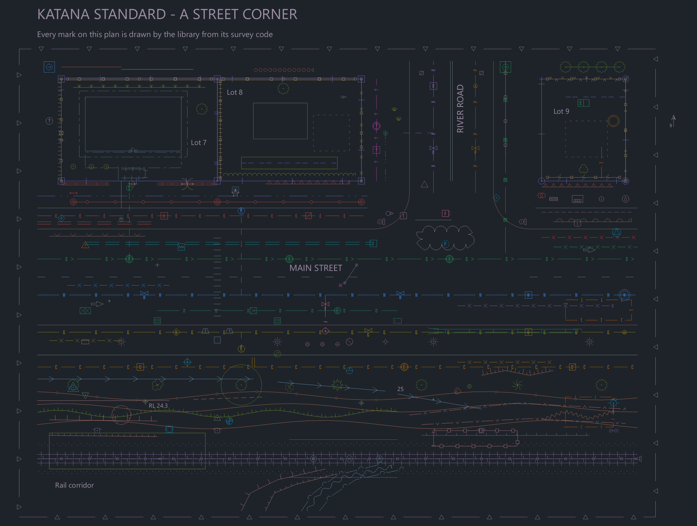
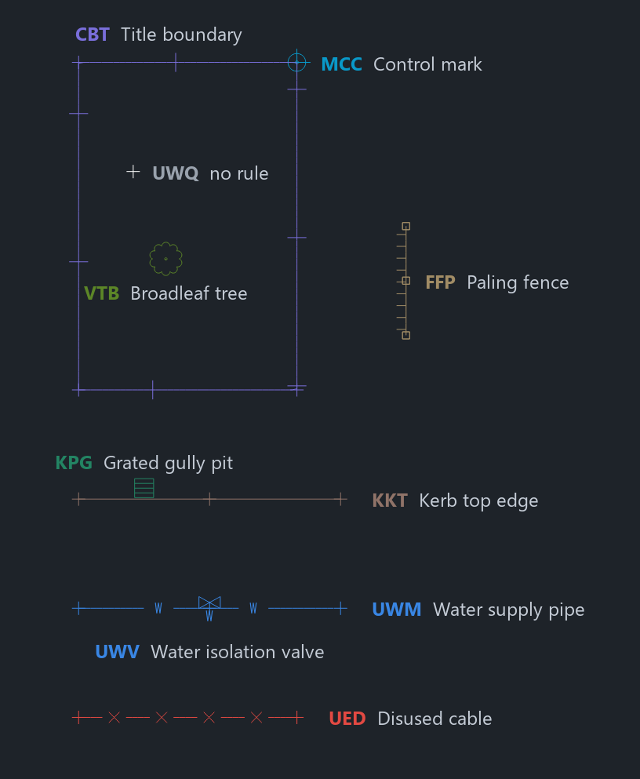
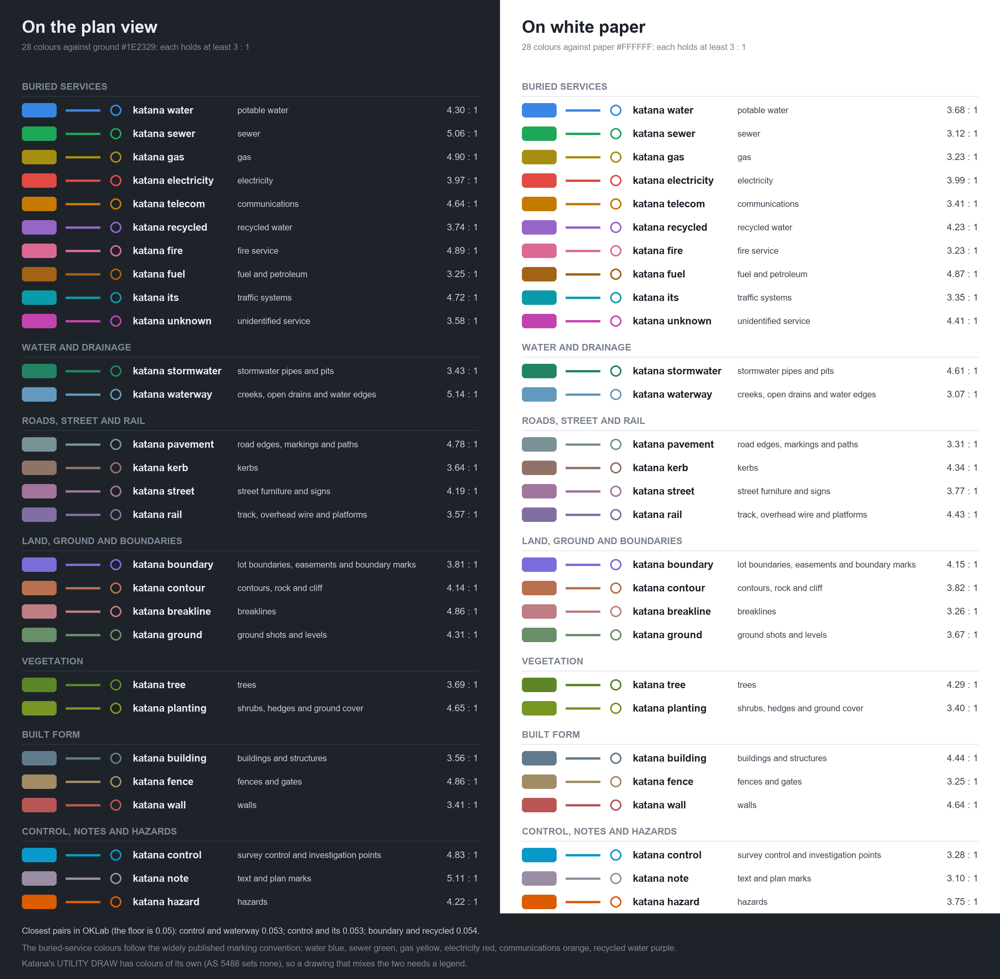
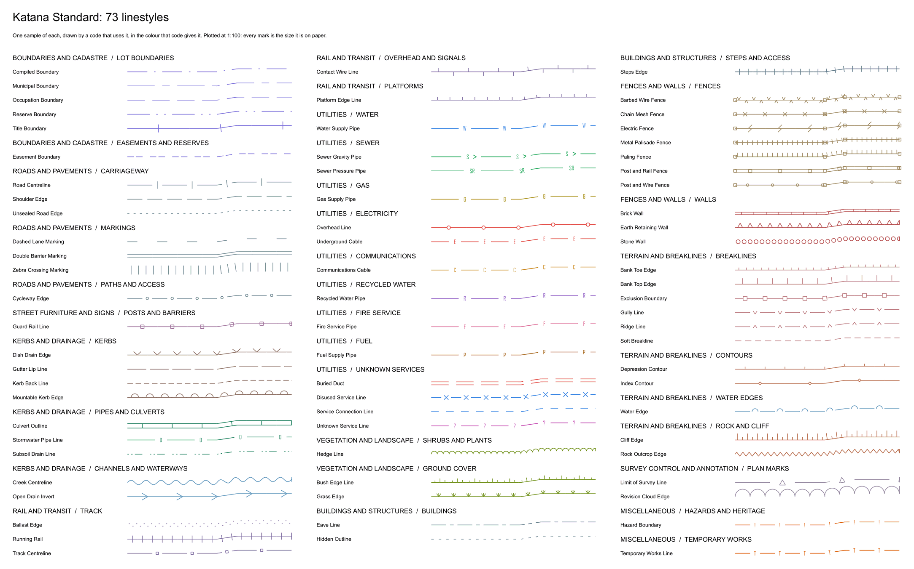
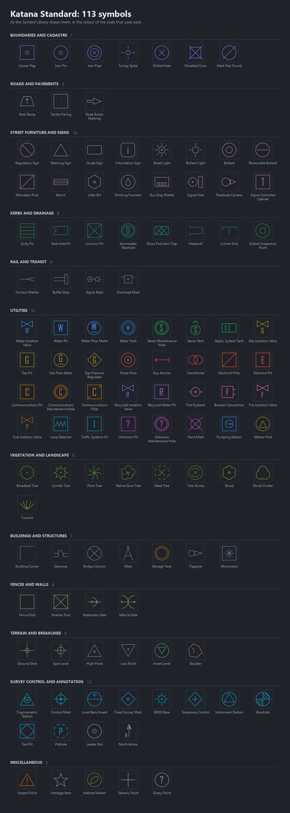

# Katana Standard

Katana Standard is a survey feature library written for Katana: one Katana customisation file, `resources/customisation/katana-standard.customisation.json`, with 73 linestyles, 113 symbols and 245 survey codes (770 rules) in 12 classes, and a palette of 28 colours. It is original work. Every name, code, colour and stroke was designed for it from a written specification and none was taken from another library ("Originality", below). This document is its catalogue: how to load it, how to read a code, every definition and every code, and what Katana does and does not yet do with what the file says.

Everything below that is a table, a count or a description is generated from the data by `tools/katana_standard/make_katana_standard.py --docs`, so it cannot disagree with the file; the prose around it is written by hand in `tools/katana_standard/catalogue.py`. "How it is made and held" says what keeps the two true.

*An invented street corner, drawn in Katana's plan view with nothing but the library: 221 of its 245 codes are in it, kerbs and lots, houses, fences, trees, the services under and over the road, a stretch of rail on a bridge, contours and a creek, control marks and the labels. Every mark is the size it is on paper and sits where its code put it (`tools/katana_standard/showcase.py`). Katana does not yet apply a code's pen weight, so every line is drawn at one width here and the weight ladder of "Pen weights" is not shown.*

**Contents.** [At a glance](#at-a-glance) · [Using it](#using-it) · [Reading a code](#reading-a-code) · [The palette](#the-palette) · [Linestyles](#linestyles) · [Symbols](#symbols) · [The codes](#the-codes) · [Alphabetical index](#the-codes-in-alphabetical-order) · [Originality](#originality) · [Decisions](#decisions-and-what-was-rejected) · [How it is made and held](#how-it-is-made-and-held) · [Not done](#not-done)

## At a glance

|  |  |
|---|---|
| Name | `Katana Standard`, edition 1, Katana customisation format version 1 |
| Definitions | 186: 73 linestyles and 113 symbols, in 49 groups, all in paper units, so a mark keeps its size at any zoom and plot scale |
| Survey codes | 245, each three capital letters, in 12 classes and 49 subgroups; 770 rules |
| Layers | 130, always three levels (`class/subgroup/family`), lower case |
| Palette | 28 named colours, each at least 3:1 against the plan view's ground and against white paper |
| Says nothing of | linework control words and import automation: loading it never resets a colleague's spellings or switches |
| Notice | Katana Standard is original work made for Katana. It contains no third-party customisation, style library or survey code file. Its licence is that of the Katana repository. |

## Using it

What is true now. Katana Standard is **not** the built-in: the program still starts with the customisation compiled into it, and there is no chooser between two compiled-in libraries ("Not done", below). It is loaded like any customisation file (`docs/customisation.md`, "Using the customisation").

1. **Load it alone.** `CUSTOMISE REPLACE resources/customisation/katana-standard.customisation.json` in the window's command line, in `katana_cli` or through `katana_mcp`; or File > Settings > Import with "Replace instead of merging" ticked. Its definitions become the whole library and its rules the whole of the codes. It brings no linework spellings and no import switches, so the session keeps its own.
2. **Merging works, with one caution.** `CUSTOMISE <file>`, or Import without the tick, merges by name. The rules here are exact three-letter prefix rules, and the most specific rule wins field by field, so a broader prefix rule already in the session can still supply a field these rules leave unsaid (a symbol, a text). Load it alone when you want its library and nothing else.
3. **For one run**, name it as the built-in for that run: `KATANA_BUILTIN_CUSTOMISATION=<file>` in the environment of `katana`, `katana_cli` or `katana_mcp` (`docs/headless.md`, "The customisation a run starts with").
4. **Compiled in**: `-DKATANA_BUILTIN_CUSTOMISATION=<file>` at configure time embeds a different file (`docs/building.md`, "The built-in customisation and the reference folder"). Only the one-run form of this has been run with Katana Standard; no program was built with it embedded.
5. **Then work as usual.** `SURVEY IMPORT <file>` or Survey > Import Survey Points codes and strings the points by these rules in one undo step; `CODE`, `LINEWORK`, `CODE EXPLAIN <code>`, `CODE LIST` and `CODE CHECK` read them. `CODE CHECK` reports no problems on the file: 770 rules checked.

A worked example, run for this document and held by `cli.katana_standard_imports_a_field_file_and_reports_the_mistyped_code`. The invented field file `tests/data/katana_standard/street_corner.fld` has twenty entered coordinates: a lot boundary coded `CBT` in string 1 and closed by opcode 20, a kerb `KKT`, a paling fence `FFP`, a water main `UWM` and a disused cable `UED`, five single points (a valve `UWV`, a tree `VTB`, a gully pit `KPG`, a control mark `MCC`) and one mistyped code, `UWQ`. With the library loaded by `CUSTOMISE REPLACE`, `SURVEY IMPORT` draws 20 points and 5 lines: 19 points are coded onto 9 layers in 9 styles, and the 20th, `UWQ`, is reported as a code no rule answers, since every code has its own rule and no family rule swallows a typo. The lot boundary is a closed line of 100 m round, 600 square metres; the kerb and the water main are 24 m, the fence 10 m and the cable 20 m. Worked out by hand from the codes below before it was run.

*After the import, from the top: the closed lot boundary with its control mark and its tree; the paling fence beside it; the kerb with a gully pit; the water main with its valve; the disused cable. The plain cross inside the lot is `UWQ`, the point no rule answers. Pen weights are not yet applied, so the boundary is no heavier than the fence. The words beside each feature are laid on the screenshot afterwards, from the library's own legend labels.*

## Reading a code

A code is **three capital letters**: the class, the subgroup in that class, and the item. `UWM` is Utilities, Water, Main; `KKT` is Kerbs and Drainage, Kerbs, Top edge. In the field a point's code is the key and a string number, then control words: `UWM1 ST`, `UWM1`, `UWM1 END` is one water main. The grammar, in full:

1. A key is THREE capital letters: class, subgroup, item. `UWM` is Utilities, Water, Main; `KKT` is Kerbs and Drainage, Kerbs, Top edge. The first two letters are in the table of classes below and fix the group and the first two levels of the layer; the third names the item inside its subgroup.
2. Utility items share their third letter across services, so it is learnt once: M main, B branch or connection (a fire booster is UFB), D disused main, V isolation valve, X meter, P pit, H maintenance hole, K marker post or pillar, T tank or transformer, C cable, N duct, O overhead line. An item with no plain letter takes the next natural one, and those are this library's own and are learnt with it: U pumping station (UWU), P pumping station and power pole (USP, UEP; the power pit is J, UEJ), Y pole guy (UEY), H hydrant (UFH; a fire main has no maintenance hole), R pressure sewer and gas regulator (USR, UGR), E sewer vent (USE), L loop detector and unknown line (UIL, UXL), and M, free in the unknown services because their line is L, is the surface paint mark (UXM). The service letters are those of the one-letter asset types of AS 5488 where one exists (C E F G I P S W); R (recycled water) and X (unknown) are ours.
3. DIGITS ARE NEVER PART OF A KEY. `UWM`, `UWM1` and `UWM01` are one code; the digits are the STRING NUMBER, which the linework reads: `UWM1` and `UWM2` are two water mains. A key written with a digit before its `*` would match only numbered names. A key is matched as written, in capitals: `uwm1` matches no rule (`CODE EXPLAIN uwm1` says the key `UWM*` differs only in letter case), so set the data collector to send capitals.
4. Control words follow the code, after a space: `ST` first point, `END` last point, `CL` last point and close, `BC` and `EC` begin and end a curve (three points fix an arc), `JPN n` also join to point number n, `RECT` the third point of a rectangle. These are Katana's default spellings; the library says nothing about them, so loading it never resets a colleague's own. No key is a control word.
5. There is no left or right suffix: the rule engine matches a key exactly or by prefix and has nothing else. Handedness is by walking direction. Ticks, barbs, triangles, scallops and chevrons always fall to the LEFT of travel, and each code's field-book line says which way to walk. Symbols are drawn upright and are not turned to a bearing (Katana reads a rule's rotation and does not yet apply it), so a symbol's position is its message.
6. Every code owns a `KEY*` rule, so a typo (`UWQ`) is reported as "no rule" and is never swallowed by a family rule. All keys are three letters, so no key is a prefix of another; there is no bare `*` rule, and no rule is shadowed or repeated.
7. What a code sets, in this order. `feature`: layer, colour, draw (line or point), linestyle (lines only), weight, group and comment. `symbol` for points and for lines that carry a symbol at every vertex (`both`: fences, tree rows, leaders). `text` for the six text codes. `pipe` for the nine pipe codes. `attributes`. `surface`, written for EVERY code, true or false: true for ground shots and levels, kerb, carriageway and path edges, banks, ridges, gullies, hard and soft breaklines, water edges, the cliff edge, drain inverts, and ballast and platform edges; false for everything else, including the exclusion boundary.
8. Attributes. An attribute with an EMPTY value is a PROMPT: the code asks for it. One with a value is applied. Names carry their unit (`Depth (m)`, `Diameter (mm)`). Every buried utility asks Owner, Depth (m) and Condition, and a pipe also Material and Diameter (mm). Every utility code sets `utility.type` to its service word, and a disused code sets `utility.status` to `disused`. So do the stormwater pits and pipes of class K (KP and KC: `utility.type` is `stormwater`), which sit in Kerbs and Drainage because they are drainage, and are services all the same. Those are the keys and words Katana's utility tools read, so a coded string is already typed for UTILITY DRAW. The kerbs, channels and creeks of class K set none. The prompts use the library's own names, not `utility.owner`, so an empty prompt never reads as "recorded".
9. `comment` is the LEGEND LABEL: a noun phrase in sentence case, 1 to 36 characters, which the plot legend prints in capitals. When several codes share one linestyle the legend takes the linestyle's name instead, unless every coded entity agrees on the label. Longer text is the meaning and the field-book line.
10. Weights, in millimetres of pen: 0.13 hairline, 0.18 fine, 0.25 light, 0.35 medium, 0.50 strong (0.70 is reserved). The hairline is for hatching, joints, hidden detail, tree rows and canopies, flow paths, text and leaders; nothing in the planting or ground classes is lighter than 0.18, since those colours are the faintest on paper. Katana stores `weight` and does not yet apply it; the scale is still the documented intent.
11. What Katana applies today and what it only stores. `CODE` applies layer, colour, linestyle, symbol name and size, and the string attributes (a value starting with `$` is deferred, not written), and the legend prints the comment. It stores, lists and lints, and does not yet apply: weight, group, hide, surface, text rules, pipe rules (justify, shape, sizes taken from the attributes), rotation, offset and raise. The rules are written for the day it does.
12. Load the library alone, or with Replace. Merged onto another customisation, a broader prefix rule there can supply a field these rules leave unsaid (a symbol, a text), because the most specific rule wins field by field.

### The twelve classes

| Letter | Class | Codes | Subgroups | What it holds |
|---|---|---|---|---|
| `C` | Boundaries and Cadastre | 18 | `CB` Lot Boundaries, `CE` Easements and Reserves, `CM` Boundary Marks | Where one owner's land ends and the next begins, and the marks that prove it. |
| `R` | Roads and Pavements | 19 | `RC` Carriageway, `RM` Markings, `RP` Paths and Access | The made surface: its edges, its paint and the paths beside it. |
| `S` | Street Furniture and Signs | 17 | `SS` Signs, `SL` Lighting, `SB` Posts and Barriers, `SA` Amenities, `ST` Traffic Control | What people read, sit on, light their way by or steer round. |
| `K` | Kerbs and Drainage | 21 | `KK` Kerbs, `KP` Pits and Structures, `KC` Pipes and Culverts, `KW` Channels and Waterways | Where the street meets the water: kerbs, pits, pipes and channels. |
| `T` | Rail and Transit | 10 | `TT` Track, `TO` Overhead and Signals, `TP` Platforms | Track, the wires above it and the platforms beside it. |
| `U` | Utilities | 60 | `UW` Water, `US` Sewer, `UG` Gas, `UE` Electricity, `UC` Communications, `UR` Recycled Water, `UF` Fire Service, `UP` Fuel, `UI` Traffic Systems, `UX` Unknown Services | Everything buried or strung that carries a service, one family per service. |
| `V` | Vegetation and Landscape | 16 | `VT` Trees, `VS` Shrubs and Plants, `VG` Ground Cover | Trees, shrubs and the edges of planted and natural ground cover. |
| `B` | Buildings and Structures | 15 | `BB` Buildings, `BS` Structures, `BA` Steps and Access | What stands on the ground: buildings, bridges, masts, tanks and steps. |
| `F` | Fences and Walls | 17 | `FF` Fences, `FW` Walls, `FG` Gates and Posts | What divides land: fences, walls, and the posts and gates between. |
| `G` | Terrain and Breaklines | 23 | `GP` Ground Points, `GB` Breaklines, `GC` Contours, `GW` Water Edges, `GR` Rock and Cliff | The shape of the ground: shots, breaklines, contours, water edges and rock. |
| `M` | Survey Control and Annotation | 20 | `MC` Control Marks, `MI` Investigation Points, `MT` Text and Notes, `MM` Plan Marks | The survey's own marks, its investigations and the words on the plan. |
| `X` | Miscellaneous | 9 | `XH` Hazards and Heritage, `XG` General, `XT` Temporary Works | Hazards, heritage, temporary works and the catch-alls. |

### Pen weights

Every code names one of five weights, in millimetres of pen; a sixth is reserved. Katana stores a rule's `weight` and does not yet apply it to what it draws, so the scale is the documented intent, for the day it does.

| Weight | Role | For |
|---|---|---|
| 0.13 | hairline | hatching, joints, hidden detail, tree rows, leaders, text |
| 0.18 | fine | vegetation, ground shots and levels, intermediate contours, markings, minor services |
| 0.25 | light | everyday detail: fences, paths, branches |
| 0.35 | medium | primary detail: kerbs, building walls, service mains, index contours |
| 0.50 | strong | title boundary, bridge decks, limit of survey |
| 0.70 | bold | reserved; not used by a code in edition 1 |

**What Katana applies today.** `CODE` and a survey import apply layer, colour, linestyle, symbol name and the string attributes, and the plot legend prints the comment. Katana stores, lists and lints, and does not yet apply: `weight`, `group`, `hide`, `surface`, text rules, pipe rules, and a symbol's rotation, offset and raise. So the codes `GPG` and `GPR` (ground points shown by their level) are marked `hide` and still draw their one-millimetre plus, the six text codes draw a plus until text rules are applied, and the plain continuous lines of one colour on one layer, such as the two carriageway edges `RCE` and `RCI`, or the kerb top `KKT` and the kerb return `KKR` (one feature, straight and curved), look the same on the plan until the weight is applied. The rules are written for the day it does.

## The palette

Twenty-eight colours, each named `katana <role>` so a rule reads as the thing it colours, and none can fold onto one of the 27 standard names Katana already knows. Each is at least 3:1 against the plan view's ground (`#1E2329`, a blue-grey that is almost black) and against white paper, since one library is plotted and read on the screen; and no two are closer than 0.05 in OKLab, about where two thin lines of different colour stop being told apart. That leaves only a narrow band of lightness, so the six warm classes (kerb, wall, contour, fuel, fence, breakline) were placed by a search, each at least 0.06 from every other colour, and the six classes drawn with the thinnest pens (tree, planting, ground, building, wall, communications) keep at least 3.25 : 1 on both grounds. The six buried-service colours follow the widely published convention for marking buried utilities (water blue, sewer green, gas yellow, electricity red, communications orange, recycled water purple), tuned so the yellow and the orange still read on white. Colour does not carry a class alone: for a reader who confuses red with green some warm pairs stay close whatever their values, so every pipe has its letter and every line class its own pattern.

**The two utility conventions differ.** Katana's own `UTILITY DRAW` has colours of its own (electricity orange, communications white, sewer cream, stormwater green; `docs/subsurface_utilities.md`: they are Katana's defaults, and AS 5488 sets none). A drawing that mixes coded survey strings and `UTILITY DRAW` output has two conventions in it and wants a legend. Aligning one to the other is the owner's decision ("Not done").

**Buried services**

| Colour | Value | Used for | On the ground | On white |
|---|---|---|---|---|
| `katana water` | `#3986E4` | potable water | 4.30 : 1 | 3.68 : 1 |
| `katana sewer` | `#1DA758` | sewer | 5.06 : 1 | 3.12 : 1 |
| `katana gas` | `#A68E12` | gas | 4.90 : 1 | 3.23 : 1 |
| `katana electricity` | `#E24942` | electricity | 3.97 : 1 | 3.99 : 1 |
| `katana telecom` | `#C57A00` | communications | 4.64 : 1 | 3.41 : 1 |
| `katana recycled` | `#9565C7` | recycled water | 3.74 : 1 | 4.23 : 1 |
| `katana fire` | `#DC6995` | fire service | 4.89 : 1 | 3.23 : 1 |
| `katana fuel` | `#A36215` | fuel and petroleum | 3.25 : 1 | 4.87 : 1 |
| `katana its` | `#0B9BA8` | traffic systems | 4.72 : 1 | 3.35 : 1 |
| `katana unknown` | `#C344AE` | unidentified service | 3.58 : 1 | 4.41 : 1 |

**Water and drainage**

| Colour | Value | Used for | On the ground | On white |
|---|---|---|---|---|
| `katana stormwater` | `#238463` | stormwater pipes and pits | 3.43 : 1 | 4.61 : 1 |
| `katana waterway` | `#6399BE` | creeks, open drains and water edges | 5.14 : 1 | 3.07 : 1 |

**Roads, street and rail**

| Colour | Value | Used for | On the ground | On white |
|---|---|---|---|---|
| `katana pavement` | `#789295` | road edges, markings and paths | 4.78 : 1 | 3.31 : 1 |
| `katana kerb` | `#907368` | kerbs | 3.64 : 1 | 4.34 : 1 |
| `katana street` | `#A2759D` | street furniture and signs | 4.19 : 1 | 3.77 : 1 |
| `katana rail` | `#816FA3` | track, overhead wire and platforms | 3.57 : 1 | 4.43 : 1 |

**Land, ground and boundaries**

| Colour | Value | Used for | On the ground | On white |
|---|---|---|---|---|
| `katana boundary` | `#796EDA` | lot boundaries, easements and boundary marks | 3.81 : 1 | 4.15 : 1 |
| `katana contour` | `#B9704F` | contours, rock and cliff | 4.14 : 1 | 3.82 : 1 |
| `katana breakline` | `#BE7D83` | breaklines | 4.86 : 1 | 3.26 : 1 |
| `katana ground` | `#688F68` | ground shots and levels | 4.31 : 1 | 3.67 : 1 |

**Vegetation**

| Colour | Value | Used for | On the ground | On white |
|---|---|---|---|---|
| `katana tree` | `#5C8627` | trees | 3.69 : 1 | 4.29 : 1 |
| `katana planting` | `#779624` | shrubs, hedges and ground cover | 4.65 : 1 | 3.40 : 1 |

**Built form**

| Colour | Value | Used for | On the ground | On white |
|---|---|---|---|---|
| `katana building` | `#627B8C` | buildings and structures | 3.56 : 1 | 4.44 : 1 |
| `katana fence` | `#A18C65` | fences and gates | 4.86 : 1 | 3.25 : 1 |
| `katana wall` | `#BA5556` | walls | 3.41 : 1 | 4.64 : 1 |

**Control, notes and hazards**

| Colour | Value | Used for | On the ground | On white |
|---|---|---|---|---|
| `katana control` | `#0999C9` | survey control and investigation points | 4.83 : 1 | 3.28 : 1 |
| `katana note` | `#9A8EA4` | text and plan marks | 5.11 : 1 | 3.10 : 1 |
| `katana hazard` | `#DD5C00` | hazards | 4.22 : 1 | 3.75 : 1 |

## Linestyles

73 linestyles, each a repeating cell. A linestyle named by a rule replaces the line, so the gaps are the library's job; every one is drawn so that it reads at plan scale on screen and on a plotted sheet.

*One sample of each, drawn by a code that uses it. Pen weights are not yet applied, so every line is the same width here.*

**How they are drawn.** The rules the data's own check enforces:

- Units are paper millimetres, so a pattern keeps its size at any plan scale.  +x runs along the line and +y is to its LEFT.  Instance k starts at k times `length`; every stroke lies inside 0..length in x and inside plus or minus 3.4 mm in y, so a pattern closes on itself and nothing overshoots a join.
- A cell is laid out from x = 0.  A dash starts it, so a line opens with a full dash, and every dash is one stroke inside its cell: nothing abuts across the join, which would show as a faint seam where two antialiased ends meet.  Marks stand at the exact middle of a gap or of the cell.  Waves start on the line.
- The repeating pattern is mirror-symmetric along the line, about the middle of one of its dashes or marks, so read from either end it has the same marks in the same places: only where a mark stands to one side (a tick, a hump) does the digitising direction show, always as the LEFT.  The few patterns with a direction of their own (the flow chevrons, the dot-dot-dash drain) or an irregular tuft are named in SYMMETRY with "none", and the lightning bolt, which leans, with "point"; the check proves the symmetry of the rest.
- Katana lays a definition by giving every stroke POINT its own distance along the line, so a long straight stroke is a chord and cuts a corner.  Every straight run along the line is drawn in chords of at most one millimetre (`_Pen.run`), which keeps a dash or a baseline within about 0.35 mm of a right-angle corner.
- A dot is a 0.6 mm dash.  Katana draws the `dot` stroke as one point the width of the pen: a speck a third of the line's weight on a plot and a single pixel on the screen, so that a dash-dot line reads as dashes.
- Posts stand ON the line, which runs through them: guard rails, fence posts, chain mesh.  Beads are THREADED on it, the line stopping at each side of the bead and the inside left open: the contour diamond, the insulator ring, the exclusion square.  The two kinds of mark are then told apart at a glance even where their outlines match.
- Letters are 2.4 mm and `middle-centre`, in a gap of 5 mm or more.  Numbers carry at most three decimals. No stroke names a pen: the code's rule gives the colour.

Reading a table: *Period* is the length of one cell in millimetres of paper; *Used by* lists the codes that name it. A linestyle shared by several codes is the same line in each: the layer and the colour tell them apart.

### Boundaries and Cadastre/Lot Boundaries

| Linestyle | Period (mm) | What it looks like and when to use it | Used by |
|---|---|---|---|
| `Title Boundary` | 25 | Unbroken line crossed by a short tick every 25 mm: the registered title boundary, the firmest line in the cadastre. | `CBT` |
| `Occupation Boundary` | 10 | Even dashes, 7 on and 3 off: a boundary as occupied on the ground (a fence line, a wall face) and not as titled. | `CBO` |
| `Compiled Boundary` | 14 | Long dash, then one dot: a boundary compiled from plans and not measured in the field. | `CBC` |
| `Reserve Boundary` | 18 | Long dash, then two dots: the limit of a public road reserve or of a park or reserve. | `CBR` `CER` |
| `Municipal Boundary` | 20 | Long dash and a short dash in turn: the boundary between two local government areas. | `CBM` |

### Boundaries and Cadastre/Easements and Reserves

| Linestyle | Period (mm) | What it looks like and when to use it | Used by |
|---|---|---|---|
| `Easement Boundary` | 9 | Paired short dashes, 2.6 on, 0.9 off, 2.6 on, then 2.9 off: the edge of an easement or covenant area; the code says what it carries. | `CEA` `CED` `CES` `CEG` `CEV` |

### Roads and Pavements/Carriageway

| Linestyle | Period (mm) | What it looks like and when to use it | Used by |
|---|---|---|---|
| `Unsealed Road Edge` | 2.5 | A fine stipple of short specks, like gravel thrown on the edge: the edge of an unsealed road. | `RCU` |
| `Shoulder Edge` | 8 | Dashes, 6 on and 2 off: the outer edge of the road shoulder. | `RCS` |
| `Road Centreline` | 14 | Long dashes with a cross tick standing in each gap: the centre of the carriageway, shot at the crown. | `RCL` |

### Roads and Pavements/Markings

| Linestyle | Period (mm) | What it looks like and when to use it | Used by |
|---|---|---|---|
| `Dashed Lane Marking` | 12 | Short painted dashes with long gaps, 4 on and 8 off: the dashed line between traffic lanes. | `RMD` |
| `Double Barrier Marking` | 10 | Two close unbroken lines, 1 mm apart: the double continuous barrier line painted on a road. | `RMB` |
| `Zebra Crossing Marking` | 3 | A row of bars across the line with no baseline, like the stripes of a zebra crossing; shoot it along the crossing's width. | `RMZ` |

### Roads and Pavements/Paths and Access

| Linestyle | Period (mm) | What it looks like and when to use it | Used by |
|---|---|---|---|
| `Cycleway Edge` | 10 | Dashes with a small bead in each gap: the edge of a cycleway or a shared path. | `RPC` |

### Street Furniture and Signs/Posts and Barriers

| Linestyle | Period (mm) | What it looks like and when to use it | Used by |
|---|---|---|---|
| `Guard Rail Line` | 12 | Unbroken line with a small square post every 12 mm, the rail running through it: a roadside guard rail or crash barrier. | `SBL` |

### Kerbs and Drainage/Kerbs

| Linestyle | Period (mm) | What it looks like and when to use it | Used by |
|---|---|---|---|
| `Gutter Lip Line` | 9 | Long dashes with a narrow gap, 7.6 on and 1.4 off, like the joints of a concrete gutter: the flow line at the foot of a kerb face. | `KKL` |
| `Kerb Back Line` | 3.3 | Fine short dashes, 2.2 on and 1.1 off, stitched along the line: the back edge of a kerb, where it meets the verge or the path. | `KKB` |
| `Mountable Kerb Edge` | 6 | Unbroken line with a rounded hump to the left every 6 mm: a low kerb a vehicle can drive over. | `KKM` |
| `Dish Drain Edge` | 8 | Unbroken line with a shallow V standing to its left every 8 mm: a V-shaped concrete dish drain. | `KKD` |

### Kerbs and Drainage/Pipes and Culverts

| Linestyle | Period (mm) | What it looks like and when to use it | Used by |
|---|---|---|---|
| `Stormwater Pipe Line` | 16 | A line broken by the letter D every 16 mm: a stormwater pipe, shot at the surface or inside the pits. | `KCP` |
| `Subsoil Drain Line` | 9 | Two dots and a dash in turn, written in the digitising direction: a perforated subsoil drain. | `KCS` |
| `Culvert Outline` | 12 | Two parallel lines 1.8 mm apart joined by a tie every 12 mm, like a ladder: a rectangular culvert. | `KCB` |

### Kerbs and Drainage/Channels and Waterways

| Linestyle | Period (mm) | What it looks like and when to use it | Used by |
|---|---|---|---|
| `Open Drain Invert` | 14 | Unbroken line with an open chevron that points the way you shot, downstream: an open drain, a swale or a flow path. | `KWD` `KWS` `KWF` |
| `Creek Centreline` | 12 | A smooth continuous wave 1.8 mm high and 6 mm long: the centre of a creek or river bed. | `KWC` |

### Rail and Transit/Track

| Linestyle | Period (mm) | What it looks like and when to use it | Used by |
|---|---|---|---|
| `Running Rail` | 4 | Unbroken line crossed by a tie every 4 mm, like a ladder: the head of a running rail. | `TTR` |
| `Track Centreline` | 14 | Long dashes with a small square standing in each gap: the centre of the track between the rails. | `TTC` |
| `Ballast Edge` | 3 | Two rows of tiny dashes, one 1 mm above the other and staggered, like stones: the shoulder of the ballast. | `TTB` |

### Rail and Transit/Overhead and Signals

| Linestyle | Period (mm) | What it looks like and when to use it | Used by |
|---|---|---|---|
| `Contact Wire Line` | 12 | Unbroken line with a tick to the left, then a tick to the right: the overhead contact wire, shot at each mast. | `TOW` |

### Rail and Transit/Platforms

| Linestyle | Period (mm) | What it looks like and when to use it | Used by |
|---|---|---|---|
| `Platform Edge Line` | 5 | Unbroken line with a short tick to the left every 5 mm: the edge of a platform. | `TPE` |

### Utilities/Water

| Linestyle | Period (mm) | What it looks like and when to use it | Used by |
|---|---|---|---|
| `Water Supply Pipe` | 16 | A line broken by the letter W every 16 mm: a pressure main that carries drinking water. | `UWM` |

### Utilities/Sewer

| Linestyle | Period (mm) | What it looks like and when to use it | Used by |
|---|---|---|---|
| `Sewer Gravity Pipe` | 20 | A line broken by the letter S and a small flow chevron: a gravity sewer. The chevron points the way you shot, so shoot downhill. | `USM` |
| `Sewer Pressure Pipe` | 20 | A line broken by the letters SR every 20 mm: a pressure sewer that carries flow uphill. | `USR` |

### Utilities/Gas

| Linestyle | Period (mm) | What it looks like and when to use it | Used by |
|---|---|---|---|
| `Gas Supply Pipe` | 16 | A line broken by the letter G every 16 mm: a pipe that carries natural gas. | `UGM` |

### Utilities/Electricity

| Linestyle | Period (mm) | What it looks like and when to use it | Used by |
|---|---|---|---|
| `Underground Cable` | 12 | A line broken by the letter E every 12 mm: a buried electricity cable. | `UEC` |
| `Overhead Line` | 14 | Unbroken line with a small ring, an insulator, threaded on it every 14 mm: an overhead power or communications line. | `UEO` `UCO` |

### Utilities/Communications

| Linestyle | Period (mm) | What it looks like and when to use it | Used by |
|---|---|---|---|
| `Communications Cable` | 12 | A line broken by the letter C every 12 mm: a buried telephone, data or fibre cable. | `UCC` |

### Utilities/Recycled Water

| Linestyle | Period (mm) | What it looks like and when to use it | Used by |
|---|---|---|---|
| `Recycled Water Pipe` | 16 | A line broken by the letter R every 16 mm: a main that carries recycled water. | `URM` |

### Utilities/Fire Service

| Linestyle | Period (mm) | What it looks like and when to use it | Used by |
|---|---|---|---|
| `Fire Service Pipe` | 16 | A line broken by the letter F every 16 mm: a main that serves hydrants and sprinklers. | `UFM` |

### Utilities/Fuel

| Linestyle | Period (mm) | What it looks like and when to use it | Used by |
|---|---|---|---|
| `Fuel Supply Pipe` | 16 | A line broken by the letter P every 16 mm: a pipeline for fuel or oil. | `UPM` |

### Utilities/Unknown Services

| Linestyle | Period (mm) | What it looks like and when to use it | Used by |
|---|---|---|---|
| `Unknown Service Line` | 12 | A line broken by a question mark every 12 mm: a buried line whose service is not yet known. | `UXL` |

### Utilities/All Services

| Linestyle | Period (mm) | What it looks like and when to use it | Used by |
|---|---|---|---|
| `Buried Duct` | 10 | Two close parallel dashed lines, 1.2 mm apart: a duct or conduit that carries cable, whatever the service. | `UEN` `UCN` `UIC` |
| `Service Connection Line` | 6 | Fine even dashes, 3 on and 3 off: the small property connection between a main and a lot. | `UWB` `USB` `UGB` `URB` |
| `Disused Service Line` | 8 | Dashes with a small cross in each gap: a service that is no longer in use, whatever its kind. | `UWD` `USD` `UGD` `UED` `UCD` `URD` |

### Vegetation and Landscape/Shrubs and Plants

| Linestyle | Period (mm) | What it looks like and when to use it | Used by |
|---|---|---|---|
| `Hedge Line` | 2.4 | A row of small round scallops to the left with no baseline: a clipped hedge, shot along its face. | `VSH` |

### Vegetation and Landscape/Ground Cover

| Linestyle | Period (mm) | What it looks like and when to use it | Used by |
|---|---|---|---|
| `Bush Edge Line` | 7 | Unbroken line with three uneven ticks to the left, like a tuft: the edge of scrub or bush. | `VGB` |
| `Grass Edge` | 6 | Unbroken line with a small fan of three blades to the left every 6 mm: the edge of mown grass. | `VGL` |

### Buildings and Structures/Buildings

| Linestyle | Period (mm) | What it looks like and when to use it | Used by |
|---|---|---|---|
| `Eave Line` | 10.5 | A long dash and a short dash in turn, 1.5 mm apart: the edge of a roof overhang, a verandah or an awning. | `BBE` `BBV` |
| `Hidden Outline` | 3 | Fine short dashes, 1 on and 2 off: a building edge seen only on a plan, or a building not yet finished. | `BBH` `BBU` |

### Buildings and Structures/Steps and Access

| Linestyle | Period (mm) | What it looks like and when to use it | Used by |
|---|---|---|---|
| `Steps Edge` | 3.5 | Unbroken line crossed by a row of treads 2.4 mm long, one every 3.5 mm: the nosing of a flight of steps. | `BAS` |

### Fences and Walls/Fences

| Linestyle | Period (mm) | What it looks like and when to use it | Used by |
|---|---|---|---|
| `Chain Mesh Fence` | 8 | Unbroken line with a small cross every 8 mm: a wire mesh fence on steel posts. | `FFC` |
| `Paling Fence` | 2 | Unbroken line with a close comb of ticks to the left, one every 2 mm: a timber paling fence. | `FFP` |
| `Post and Rail Fence` | 12 | Two parallel rails 1 mm apart with a square post every 12 mm: a timber or steel post and rail fence. | `FFR` |
| `Post and Wire Fence` | 10 | Unbroken line with a small ring for a post every 10 mm: a rural fence of plain wire on posts. | `FFW` |
| `Barbed Wire Fence` | 6 | Unbroken line with a small V barb above the line, then one below it: a rural fence with barbed wire. | `FFB` |
| `Electric Fence` | 12 | Unbroken line with a lightning bolt every 12 mm: a fence with an electrified wire. | `FFE` |
| `Metal Palisade Fence` | 2 | Unbroken line crossed by a close row of short bars, one every 2 mm: a steel palisade or pool fence. | `FFM` |

### Fences and Walls/Walls

| Linestyle | Period (mm) | What it looks like and when to use it | Used by |
|---|---|---|---|
| `Brick Wall` | 5 | Two parallel lines 1 mm apart with a joint across them every 5 mm: a brick or block wall, shot on its lower face. | `FWB` `FWK` |
| `Stone Wall` | 2.4 | A chain of separate rings, 1.6 mm across and 0.8 mm apart, centred on the line: a dry or mortared stone wall. | `FWS` |
| `Earth Retaining Wall` | 4 | Unbroken line with a small triangle to the left every 4 mm: a wall that holds back earth; the barbs point to the lower side. | `FWR` `FWT` |

### Terrain and Breaklines/Breaklines

| Linestyle | Period (mm) | What it looks like and when to use it | Used by |
|---|---|---|---|
| `Bank Top Edge` | 6 | Unbroken line with a long tick to the left every 6 mm: the top edge of a slope, the ticks pointing downhill. | `GBT` `GBK` |
| `Bank Toe Edge` | 3 | Unbroken line with a short tick to the left every 3 mm: the bottom edge of a slope, the ticks standing away from the slope. | `GBB` `GBF` |
| `Ridge Line` | 10 | Dashes with a small caret pointing to the left in each gap: a line along a crest. | `GBR` |
| `Gully Line` | 10 | Dashes with a small caret pointing to the right in each gap: a line along the bottom of a gully. | `GBG` |
| `Soft Breakline` | 4 | Fine short dashes, 2.5 on and 1.5 off: a gentle change in grade that a surface should still follow. | `GBS` |
| `Exclusion Boundary` | 8 | Unbroken line with a small hollow square threaded on it every 8 mm: an area a surface must leave out, such as a building or a lake. | `GBX` |

### Terrain and Breaklines/Contours

| Linestyle | Period (mm) | What it looks like and when to use it | Used by |
|---|---|---|---|
| `Index Contour` | 20 | Unbroken line with a small diamond bead threaded on it every 20 mm: every fifth contour, marked so it can be followed. | `GCI` |
| `Depression Contour` | 8 | Unbroken line with a short tick to the left every 8 mm: a contour round a hollow, the ticks pointing downhill. | `GCD` |

### Terrain and Breaklines/Water Edges

| Linestyle | Period (mm) | What it looks like and when to use it | Used by |
|---|---|---|---|
| `Water Edge` | 10 | Dashes with a small ripple arc to the left in each gap: the edge of water, or the line of the highest recent water. | `GWE` `GWH` |

### Terrain and Breaklines/Rock and Cliff

| Linestyle | Period (mm) | What it looks like and when to use it | Used by |
|---|---|---|---|
| `Rock Outcrop Edge` | 5 | A sharp zigzag 1.6 mm high with no baseline: the edge of exposed rock. | `GRO` |
| `Cliff Edge` | 4 | Unbroken line with ticks to the left, a long one and a short one in turn: the top edge of a cliff, pointing downhill. | `GRC` |

### Survey Control and Annotation/Plan Marks

| Linestyle | Period (mm) | What it looks like and when to use it | Used by |
|---|---|---|---|
| `Limit of Survey Line` | 24 | Long dashes with an open triangle in each gap: the edge of the surveyed area; nothing beyond it was measured. | `MMS` |
| `Revision Cloud Edge` | 6 | A row of large round scallops to the left with no baseline: a cloud drawn round an area that has changed. | `MMV` |

### Miscellaneous/Hazards and Heritage

| Linestyle | Period (mm) | What it looks like and when to use it | Used by |
|---|---|---|---|
| `Hazard Boundary` | 10 | Dashes with an exclamation mark in each gap: the boundary of a hazardous area. | `XHB` |

### Miscellaneous/Temporary Works

| Linestyle | Period (mm) | What it looks like and when to use it | Used by |
|---|---|---|---|
| `Temporary Works Line` | 10 | Dashes with the letter T in each gap: a temporary fence, a hoarding or the edge of a work zone. | `XTF` `XTW` |

## Symbols

113 symbols, every one drawn at its vertex, unrotated, in paper millimetres, with its origin at the centre of its box unless its description says where else.

**The house style**, which makes each symbol learnt once:

- **Cell.** Three size classes by larger extent: S about 3 mm (small furniture, posts, marks), M about 4.4 mm (most objects), L about 6 mm (canopies, tanks, stations, primary control).  The origin is the centre of the bounding box, so a symbol sits on its vertex without a rule offsetting it.  Where the surveyed point is NOT the box centre (a valve beside its letter, a doorway's wall line, a building corner, a camera's pole, a station's dot, a north arrow's shaft) the origin is within 0.6 mm of the box centre and the description says where it is; the check holds both.
- **Weight.** One weight: every symbol is outline.  The renderer applies the entity's own pen, so a symbol never carries a colour or a width.  Gaps are fixed: 0.4 mm between the rings of a double ring, 0.3 mm between a ring and a ray or tick, and a letter is always 2.4 mm high.
- **Fill.** There are no fills.  A solid centre mark (a very small ring with a dot in it, because Katana draws a `dot` as one pen-width point whatever its radius) means "a physical mark or stem is here and this is its exact point": pegs, pins, pipes, stations, poles, trunks.  A shape WITHOUT one is a cover, a sign or an observation.  Hatching (at most four strokes) means "solid": a borehole's quadrants, a trap's grating.  A dashed ring means a temporary or former state: a dead tree, a pothole.  Rays mean a light (street light, bollard light, signal lamp) or, on a GNSS base, a signal.
- **Services.** One grammar for every service, learnt once; the service colour comes from the rule and the letter names the service (W water, S sewer, G gas, E electricity, C communications, R recycled, F fire, P fuel, I traffic systems, ? unknown).  Square = pit or box; single ring = round cover or pole; double ring = maintenance hole; bow-tie = valve; diamond = regulator or marker; ring with a bar = meter.  A letter is inside a pit, a ring or a hole, and BELOW a valve.
- **Trees.** Distinguished by canopy outline, all with a trunk dot: scalloped = broadleaf, spiked star = conifer, curved fronds = palm, irregular lobes with branches = native gum, dashed ring with a cross = dead, rings = stump; shrubs are the same scallop at a smaller size.
- **Control.** Distinguished by class: triangle with ring and dot = primary station; ring with long cross-hairs and dot = secondary mark; ring with a bar and arrow = benchmark; diamond with dot = fixed mark; open diamond with a plus = temporary; ring with a compass of rays and dot = GNSS base; triangle in a ring = instrument station.
- **Direction.** A symbol is not rotated, so a symbol that points (an arrow, a lens, a gate) points to +x or +y; the rule and the line it sits on say the rest.

Reading a table: *Size* is the symbol's width and height in millimetres of paper, measured from its strokes.

### Boundaries and Cadastre/Boundary Marks

| Symbol | Size (mm) | What it looks like and when to use it | Used by |
|---|---|---|---|
| `Corner Peg` | 3.2 x 3.2 | Square with a centre dot. A peg or stake set at a boundary corner. | `CMP` |
| `Iron Pin` | 3.2 x 3.2 | Ring with a centre dot. A round iron pin or rod set at a corner. | `CMI` |
| `Iron Pipe` | 3.4 x 3.4 | Double ring with a centre dot. An iron pipe: the inner ring is its bore. | `CMT` |
| `Survey Spike` | 2.6 x 2.6 | Small ring held by four ticks. A spike or nail driven into a hard surface; no dot, the ring is the head. | `CMS` |
| `Drilled Hole` | 2.2 x 2.2 | Ring with a small cross inside it. A hole drilled in rock or concrete, with the cross cut at its centre. | `CMD` |
| `Chiselled Cross` | 3.9 x 3.9 | Square with a cross whose arms run past the corners. A cross cut into a kerb, step or slab. | `CMX` |
| `Mark Not Found` | 3.2 x 3.2 | Ring struck through by a slash that runs past it. A mark that was searched for and not found. | `CMN` |

### Roads and Pavements/Markings

| Symbol | Size (mm) | What it looks like and when to use it | Used by |
|---|---|---|---|
| `Road Arrow Marking` | 6.0 x 2.6 | Block arrow pointing +x, drawn as an outline. A painted lane arrow; turn it by drawing the line the other way. | `RMA` |

### Roads and Pavements/Paths and Access

| Symbol | Size (mm) | What it looks like and when to use it | Used by |
|---|---|---|---|
| `Kerb Ramp` | 3.6 x 2.4 | Trapezoid, wide at the kerb and narrowing away, with an arrow up the ramp. A pedestrian kerb ramp. | `RPR` |
| `Tactile Paving` | 3.2 x 3.2 | Square holding a three by three grid of dots. Tactile ground surface indicators. | `RPT` |

### Street Furniture and Signs/Signs

| Symbol | Size (mm) | What it looks like and when to use it | Used by |
|---|---|---|---|
| `Regulatory Sign` | 3.4 x 3.4 | Ring crossed edge to edge by a backslash bar. A regulatory sign face such as a prohibition or a limit. | `SSR` |
| `Warning Sign` | 3.6 x 3.1 | Triangle, apex up. A warning sign face (hazard ahead, give way, signals). | `SSW` |
| `Guide Sign` | 3.6 x 2.2 | Wide rectangle. A direction or guide sign face, such as a street name or destination. | `SSG` |
| `Information Sign` | 3.2 x 3.2 | Round-cornered square holding a lower-case i. An information or tourist sign face; the round corners tell it from a pit. | `SSI` |

### Street Furniture and Signs/Lighting

| Symbol | Size (mm) | What it looks like and when to use it | Used by |
|---|---|---|---|
| `Street Light` | 4.4 x 4.4 | Ring with a centre dot and eight rays. A street light pole and its lantern. | `SLS` |
| `Bollard Light` | 3.1 x 3.1 | Small ring with four short rays. A light built into a bollard. | `SLB` |

### Street Furniture and Signs/Posts and Barriers

| Symbol | Size (mm) | What it looks like and when to use it | Used by |
|---|---|---|---|
| `Bollard` | 2.0 x 2.0 | Ring inside a ring. A fixed bollard. | `SBB` |
| `Removable Bollard` | 1.9 x 1.9 | Ring with a bar across its middle. A bollard that lifts out or lowers. | `SBR` |
| `Delineator Post` | 1.8 x 1.8 | Small square with one diagonal. A roadside delineator or marker post. | `SBG` |

### Street Furniture and Signs/Amenities

| Symbol | Size (mm) | What it looks like and when to use it | Used by |
|---|---|---|---|
| `Bench` | 4.0 x 1.6 | Long rectangle with two slat lines. A seat or bench. | `SAB` |
| `Litter Bin` | 2.3 x 2.6 | Hexagon with a centre dot. A litter or waste bin. | `SAR` |
| `Drinking Fountain` | 3.4 x 3.4 | Ring holding a teardrop. A drinking fountain or bubbler. | `SAF` |
| `Bus Stop Shelter` | 5.4 x 3.6 | Rectangle holding a bench divided into seats. A bus shelter; the large box is its roof outline. | `SAS` |

### Street Furniture and Signs/Traffic Control

| Symbol | Size (mm) | What it looks like and when to use it | Used by |
|---|---|---|---|
| `Signal Pole` | 3.5 x 2.8 | Ring with a dot beside a tall box holding three lamp dots. A traffic signal pole and its signal head. | `STS` |
| `Roadside Camera` | 3.8 x 2.2 | Ring with a triangular lens pointing +x. A speed, red-light or traffic camera; the origin is its pole, the ring's centre. | `STC` |
| `Signal Controller Cabinet` | 3.2 x 3.2 | Square holding the letter T. The traffic signal controller cabinet. | `STK` |

### Kerbs and Drainage/Pits and Structures

| Symbol | Size (mm) | What it looks like and when to use it | Used by |
|---|---|---|---|
| `Gully Pit` | 3.2 x 3.2 | Square with three grate bars. A stormwater gully pit with its grating. | `KPG` |
| `Kerb Inlet Pit` | 4.0 x 2.4 | Rectangle with a V notch cut into its left end. A side-entry pit; the notch faces the kerb. | `KPK` |
| `Junction Pit` | 3.2 x 3.2 | Square with both diagonals. A stormwater junction pit. | `KPJ` |
| `Stormwater Manhole` | 3.4 x 3.4 | Double ring holding the letter D. A stormwater maintenance hole (D for drainage). | `KPH` |
| `Gross Pollutant Trap` | 5.4 x 3.2 | Rectangle crossed by four hatch lines. A gross pollutant trap or litter trap. | `KPT` |
| `Headwall` | 5.3 x 3.8 | Three sides of a box, open to -x, with wings flaring outward. A pipe headwall; the pipe arrives from the open side. | `KPW` |
| `Culvert End` | 4.0 x 2.0 | T shape with turned-in ends. A culvert end: the bar is its headwall, the stem the pipe running away from it. | `KPC` |
| `Subsoil Inspection Point` | 2.2 x 2.2 | Small ring holding a smaller square, the cap of the riser. An inspection point on a subsoil drain. | `KPS` |

### Rail and Transit/Track

| Symbol | Size (mm) | What it looks like and when to use it | Used by |
|---|---|---|---|
| `Turnout Marker` | 4.5 x 1.0 | Y shape forking toward +x. The toe of a turnout (points). | `TTX` |
| `Buffer Stop` | 3.8 x 2.6 | Two rails ending against a block. The end of a track. | `TTE` |

### Rail and Transit/Overhead and Signals

| Symbol | Size (mm) | What it looks like and when to use it | Used by |
|---|---|---|---|
| `Signal Mast` | 4.7 x 1.9 | Pole ring with a dot, joined to a lamp ring with rays. A railway signal on its mast. | `TOS` |
| `Overhead Mast` | 4.4 x 2.4 | Square with a centre dot and two arms. A mast carrying overhead wires. | `TOM` |

### Utilities/Water

| Symbol | Size (mm) | What it looks like and when to use it | Used by |
|---|---|---|---|
| `Water Isolation Valve` | 3.6 x 4.4 | Bow-tie with the letter W below. A water main valve; the origin is between valve and letter. | `UWV` |
| `Water Pit` | 3.4 x 3.4 | Square holding W. A water meter or valve pit. | `UWP` |
| `Water Flow Meter` | 3.4 x 3.4 | Ring holding W above a bar. A water meter on the line. | `UWX` |
| `Water Tank` | 5.6 x 5.6 | Ring inside a ring holding W. A water tank or reservoir seen from above. | `UWT` |

### Utilities/Sewer

| Symbol | Size (mm) | What it looks like and when to use it | Used by |
|---|---|---|---|
| `Sewer Maintenance Hole` | 3.8 x 3.8 | Double ring holding S. A sewer maintenance hole. | `USH` |
| `Sewer Vent` | 2.8 x 4.0 | Ring holding S with a chevron above. A sewer vent shaft. | `USE` |
| `Septic System Tank` | 5.6 x 3.4 | Two-cell box with S in the left cell. A septic or treatment tank. | `UST` |

### Utilities/Gas

| Symbol | Size (mm) | What it looks like and when to use it | Used by |
|---|---|---|---|
| `Gas Isolation Valve` | 3.6 x 4.4 | Bow-tie with the letter G below. A gas main valve; the origin is between valve and letter. | `UGV` |
| `Gas Pit` | 3.4 x 3.4 | Square holding G. A gas valve or meter pit. | `UGP` |
| `Gas Flow Meter` | 3.4 x 3.4 | Ring holding G above a bar. A gas meter. | `UGX` |
| `Gas Pressure Regulator` | 3.8 x 3.8 | Diamond holding G. A gas pressure regulating set. | `UGR` |

### Utilities/Electricity

| Symbol | Size (mm) | What it looks like and when to use it | Used by |
|---|---|---|---|
| `Power Pole` | 3.1 x 3.1 | Ring, inner ring and centre dot. A power pole: the rings are the pole and its footing. | `UEP` |
| `Guy Anchor` | 3.6 x 1.2 | Line with an arrowhead at -x and an anchor bar at +x. A pole's stay wire running to its ground anchor. | `UEY` |
| `Transformer` | 3.8 x 2.4 | Two overlapping rings. A pole or pad transformer. | `UET` |
| `Electrical Pillar` | 3.0 x 3.0 | Square with one diagonal. A pillar, kiosk or service cabinet; the slash marks a pillar, as on the communications one. | `UEK` |
| `Electrical Pit` | 3.4 x 3.4 | Square holding E. An electrical pit. | `UEJ` |

### Utilities/Communications

| Symbol | Size (mm) | What it looks like and when to use it | Used by |
|---|---|---|---|
| `Communications Pit` | 3.4 x 3.4 | Square holding C. A communications pit. | `UCP` |
| `Communications Maintenance Hole` | 3.8 x 3.8 | Double ring holding C. A communications maintenance hole. | `UCH` |
| `Communications Pillar` | 3.2 x 3.2 | Square holding C with a broken diagonal. A communications pillar or cabinet. | `UCK` |

### Utilities/Recycled Water

| Symbol | Size (mm) | What it looks like and when to use it | Used by |
|---|---|---|---|
| `Recycled Isolation Valve` | 3.6 x 4.4 | Bow-tie with the letter R below. A recycled water valve; the origin is between valve and letter. | `URV` |
| `Recycled Water Pit` | 3.4 x 3.4 | Square holding R. A recycled water pit. | `URP` |

### Utilities/Fire Service

| Symbol | Size (mm) | What it looks like and when to use it | Used by |
|---|---|---|---|
| `Fire Hydrant` | 4.6 x 3.0 | Ring with a plus and a nozzle tick each side. A fire hydrant. | `UFH` |
| `Booster Connection` | 4.0 x 3.2 | Square holding F with two nozzle ticks on its right. A fire booster connection; the origin is the middle of the square. | `UFB` |
| `Fire Isolation Valve` | 3.6 x 4.4 | Bow-tie with the letter F below. A fire service valve; the origin is between valve and letter. | `UFV` |

### Utilities/Fuel

| Symbol | Size (mm) | What it looks like and when to use it | Used by |
|---|---|---|---|
| `Fuel Isolation Valve` | 3.6 x 4.4 | Bow-tie with the letter P below. A fuel line valve; the origin is between valve and letter. | `UPV` |

### Utilities/Traffic Systems

| Symbol | Size (mm) | What it looks like and when to use it | Used by |
|---|---|---|---|
| `Loop Detector` | 3.4 x 3.4 | Square holding a three-peak zigzag. A traffic detector loop. | `UIL` |
| `Traffic Systems Pit` | 3.4 x 3.4 | Square holding I. A traffic systems or ITS pit. | `UIP` |

### Utilities/Unknown Services

| Symbol | Size (mm) | What it looks like and when to use it | Used by |
|---|---|---|---|
| `Unknown Pit` | 3.4 x 3.4 | Square holding a question mark. A pit whose service is not known. | `UXP` |
| `Unknown Maintenance Hole` | 3.8 x 3.8 | Double ring holding a question mark. A hole whose service is not known. | `UXH` |
| `Paint Mark` | 1.7 x 1.7 | Cross through a small ring. A spray-paint mark on the ground. | `UXM` |

### Utilities/All Services

| Symbol | Size (mm) | What it looks like and when to use it | Used by |
|---|---|---|---|
| `Pumping Station` | 5.4 x 5.4 | Square holding a ring with a flow arrow. A pumping station of any service. | `UWU` `USP` |
| `Marker Post` | 2.0 x 2.0 | Ring holding an upward triangle. A route marker post for any service. | `UGK` `UPK` |

### Vegetation and Landscape/Trees

| Symbol | Size (mm) | What it looks like and when to use it | Used by |
|---|---|---|---|
| `Broadleaf Tree` | 5.4 x 5.6 | Scalloped canopy of ten round lobes with a trunk dot. A broadleaf or deciduous tree. | `VTB` `VTR` |
| `Conifer Tree` | 5.8 x 5.8 | Eight-point spiked star with a trunk dot. A conifer or pine. | `VTC` |
| `Palm Tree` | 5.5 x 5.3 | Seven curved leaf fronds from a trunk dot. A palm or tree fern. | `VTP` |
| `Native Gum Tree` | 5.4 x 5.6 | Irregular five-lobed canopy with two branches and a trunk dot. A native gum or other spreading tree. | `VTG` |
| `Dead Tree` | 4.0 x 4.0 | Dashed ring with a cross inside. A dead or fallen tree still on site. | `VTD` |
| `Tree Stump` | 2.0 x 2.0 | Ring with two broken growth rings and a centre dot. A cut stump; the broken rings tell it from a bollard. | `VTS` |

### Vegetation and Landscape/Shrubs and Plants

| Symbol | Size (mm) | What it looks like and when to use it | Used by |
|---|---|---|---|
| `Shrub` | 2.3 x 2.5 | Six-lobed scallop with a centre dot. A single shrub. | `VSS` |
| `Shrub Cluster` | 4.3 x 4.1 | One scalloped outline round three plants, each with its stem dot. A clump or bed of shrubs. | `VSC` |
| `Tussock` | 2.9 x 1.9 | Fan of five curved blades. A grass tussock or sedge clump. | `VST` |

### Buildings and Structures/Buildings

| Symbol | Size (mm) | What it looks like and when to use it | Used by |
|---|---|---|---|
| `Building Corner` | 1.2 x 1.2 | Right-angle bracket with its corner at the origin. A building corner; it opens to +x and -y. | `BBC` |
| `Doorway` | 4.4 x 2.1 | Wall ends, a door leaf at right angles and its swing arc. A door in a wall; the origin is on the wall centre line. | `BBD` |

### Buildings and Structures/Structures

| Symbol | Size (mm) | What it looks like and when to use it | Used by |
|---|---|---|---|
| `Bridge Column` | 3.2 x 3.2 | Ring crossed by an X. A bridge pier or column. | `BSP` |
| `Mast` | 2.6 x 4.0 | A-frame with a crossbar and a small ring on its apex. A communications or lighting mast. | `BST` |
| `Storage Tank` | 5.8 x 5.8 | Ring inside a ring. A storage tank or silo seen from above. | `UPT` `BSK` |
| `Flagpole` | 2.9 x 1.2 | Ring with a pennant flying to +x. A flagpole. | `BSF` |
| `Monument` | 3.2 x 3.2 | Square holding an eight-spoke star. A monument, memorial or statue base. | `BSM` |

### Fences and Walls/Gates and Posts

| Symbol | Size (mm) | What it looks like and when to use it | Used by |
|---|---|---|---|
| `Fence Post` | 1.2 x 1.2 | Small square. A fence post at every vertex of a fence line. | `FFC` `FFP` `FFR` `FFW` `FFB` `FFE` `FFM` `FGF` |
| `Strainer Post` | 1.8 x 1.8 | Small square with both diagonals. A braced end or corner post. | `FGS` |
| `Pedestrian Gate` | 4.4 x 2.8 | Two posts, fence stubs and a half-circle swing about the hinge. A pedestrian gate that opens either way; the origin is its centre. | `FGP` |
| `Vehicle Gate` | 6.1 x 5.6 | Two hinge posts and a half-circle swing about each. A double vehicle gate that opens either way; the origin is its centre. | `FGV` |

### Terrain and Breaklines/Ground Points

| Symbol | Size (mm) | What it looks like and when to use it | Used by |
|---|---|---|---|
| `Ground Shot` | 1.5 x 1.5 | Dot with a small plus. A surveyed ground point. | `GPG` `GPR` |
| `Spot Level` | 3.0 x 3.0 | Plus through a ring a millimetre and a half across. A spot level on the ground or a structure. | `GPS` |
| `High Point` | 3.4 x 2.9 | Triangle, apex up, with a centre dot. The top of a rise. | `GPH` |
| `Low Point` | 3.4 x 2.9 | Triangle, apex down, with a centre dot. The bottom of a dip. | `GPL` |
| `Invert Level` | 2.0 x 2.0 | Ring holding a downward triangle. The invert of a pipe or channel. | `GPI` |

### Terrain and Breaklines/Rock and Cliff

| Symbol | Size (mm) | What it looks like and when to use it | Used by |
|---|---|---|---|
| `Boulder` | 3.1 x 3.2 | Irregular hexagon with a crack. A boulder or loose rock. | `GRB` |

### Survey Control and Annotation/Control Marks

| Symbol | Size (mm) | What it looks like and when to use it | Used by |
|---|---|---|---|
| `Trigonometric Station` | 5.6 x 4.8 | Large triangle holding a ring and a dot. A primary control station; the origin is its dot. | `MCT` |
| `Control Mark` | 4.6 x 4.6 | Ring with long cross-hairs and a dot. A secondary or traverse control mark. | `MCC` |
| `Level Benchmark` | 3.2 x 3.2 | Ring with a bar across it and an upward arrow above the bar. A levelling benchmark. | `MCB` |
| `Fixed Survey Mark` | 3.6 x 3.6 | Diamond with a centre dot. A permanent survey mark. | `MCP` |
| `GNSS Base` | 5.8 x 5.8 | Ring with a dot and a compass of eight rays, the cardinal ones longer. A GNSS base or reference station. | `MCG` |
| `Temporary Control` | 3.6 x 3.6 | Open diamond with a plus and no dot. A temporary control point. | `MCW` |
| `Instrument Station` | 4.2 x 4.2 | Triangle inside a ring. A total station or instrument set-up point. | `MCI` |

### Survey Control and Annotation/Investigation Points

| Symbol | Size (mm) | What it looks like and when to use it | Used by |
|---|---|---|---|
| `Borehole` | 3.4 x 3.4 | Ring split into quadrants, two opposite ones evenly hatched. A borehole. | `MIB` |
| `Test Pit` | 3.4 x 3.4 | Square with a diamond joining the middles of its sides. A test pit or trench. | `MIT` |
| `Pothole` | 3.6 x 3.6 | Ring of eight dashes holding P. A pothole dug to expose a service. | `MIP` |

### Survey Control and Annotation/Plan Marks

| Symbol | Size (mm) | What it looks like and when to use it | Used by |
|---|---|---|---|
| `Leader Dot` | 1.2 x 1.2 | Small ring with a dot. The end of a leader line. | `MML` |
| `North Arrow` | 3.0 x 6.3 | Arrow with a split, half-shaded head and the letter N at its tail. Points to +y, the plan's north; the origin is midway along the shaft. | `MMN` |

### Miscellaneous/Hazards and Heritage

| Symbol | Size (mm) | What it looks like and when to use it | Used by |
|---|---|---|---|
| `Hazard Point` | 3.8 x 3.3 | Warning triangle holding an exclamation mark. Any hazard the crew flags: unstable ground, asbestos, a live line. | `XHZ` |
| `Heritage Item` | 3.8 x 3.6 | Five-point star outline. A protected heritage item such as a marker stone, a post or a plaque. | `XHT` |
| `Habitat Marker` | 3.4 x 3.4 | Ring holding a leaf. A habitat or protected-species marker. | `XHH` |

### Miscellaneous/General

| Symbol | Size (mm) | What it looks like and when to use it | Used by |
|---|---|---|---|
| `Generic Point` | 2.0 x 2.0 | Plus. A point that no other symbol describes; the code and notes say what it is. | `XGP` |
| `Query Point` | 3.4 x 3.4 | Ring holding a question mark. A point whose identity is in doubt and must be checked in the field. | `XGQ` |

## The codes

245 codes by class and subgroup. *Draws* is the linestyle or symbol, the colour and the pen weight; the text says what the code is and how to shoot it, and an example is the code field of consecutive points, separated by commas. Where a code draws the plain continuous line, Katana's own word `continuous` is its linestyle.

### Class C: Boundaries and Cadastre

Where one owner's land ends and the next begins, and the marks that prove it.

#### `CB` Lot Boundaries

The lines of title: registered, occupied, compiled, reserve and municipal.

| Code | Name | Draws | Layer | What it is and how to shoot it |
|---|---|---|---|---|
| `CBT` | Title Boundary | `Title Boundary`; `katana boundary` (#796EDA); 0.50 mm | `cadastre/lots/title` | Lot boundary as registered on the title. Shoot each boundary at the mark you found, or at the computed corner where a mark is missing (code that point CMN). One string per lot; close it with CL. Fill Plan Reference from the deposited plan. Example: `CBT1 ST, CBT1, CBT1, CBT1 CL`. |
| `CBO` | Occupation Boundary | `Occupation Boundary`; `katana boundary` (#796EDA); 0.35 mm | `cadastre/lots/occupation` | Boundary as occupied on the ground: a fence, a wall face or a hedge. Shoot the line the owners treat as the boundary. Where it parts from the title line (CBT) code both: the gap between them is the encroachment. Example: `CBO1 ST, CBO1, CBO1 END`. |
| `CBC` | Compiled Boundary | `Compiled Boundary`; `katana boundary` (#796EDA); 0.25 mm | `cadastre/lots/compiled` | Boundary taken from plans and not measured on this survey. Use where you drew the line from deposited plans without measuring it, and shoot only the corners you hold. Plan Reference names the plan you compiled from. Recode as CBT once the marks are found. Example: `CBC1 ST, CBC1, CBC1 END`. |
| `CBR` | Road Reserve Boundary | `Reserve Boundary`; `katana boundary` (#796EDA); 0.35 mm | `cadastre/lots/road-reserve` | Limit of a public road reserve. Shoot along the reserve limit from the title or the road plan, at each change of direction. Park and drainage reserves are CER, not this code. Example: `CBR1 ST, CBR1, CBR1 END`. |
| `CBM` | Municipal Boundary | `Municipal Boundary`; `katana boundary` (#796EDA); 0.50 mm | `cadastre/lots/municipal` | Boundary between two local government areas. Shoot only where the boundary is marked or the gazetted plan gives coordinates; do not draw it from a map. It is a long, quiet line: one point at each change of direction is enough. Example: `CBM1 ST, CBM1, CBM1 END`. |

#### `CE` Easements and Reserves

Land that carries another party's right or a public purpose.

| Code | Name | Draws | Layer | What it is and how to shoot it |
|---|---|---|---|---|
| `CEA` | Access Easement | `Easement Boundary`; `katana boundary` (#796EDA); 0.25 mm | `cadastre/easements/access` | Right of way over a lot for access. Shoot both edges of the easement from the registered plan, one string per side. Close with CL when it is a block, and END when it runs off the lot. Plan Reference is the plan that created it. Example: `CEA1 ST, CEA1, CEA1 END`. |
| `CED` | Drainage Easement | `Easement Boundary`; `katana boundary` (#796EDA); 0.25 mm | `cadastre/easements/drainage` | Easement that carries a drain or an overland flow path. Shoot both edges from the plan. Pipes and channels inside it are shot with their own codes (KCP, KWD); this code only says where the easement lies. Example: `CED1 ST, CED1, CED1 END`. |
| `CES` | Services Easement | `Easement Boundary`; `katana boundary` (#796EDA); 0.25 mm | `cadastre/easements/services` | Easement for pipes or cables, including pipeline easements. Shoot both edges from the plan. Owner is the authority the easement benefits and Plan Reference the plan that created it. The buried service itself gets its own U code. Example: `CES1 ST, CES1, CES1 END`. |
| `CEG` | General Easement | `Easement Boundary`; `katana boundary` (#796EDA); 0.25 mm | `cadastre/easements/general` | Easement whose purpose is not recorded. Use only when the plan shows an easement and gives no purpose. Say what you know in Plan Reference and flag it for the drafter; replace it with CEA, CED or CES once the purpose is found. Example: `CEG1 ST, CEG1, CEG1 END`. |
| `CER` | Public Reserve Boundary | `Reserve Boundary`; `katana boundary` (#796EDA); 0.35 mm | `cadastre/easements/reserve` | Limit of a park, a reserve or other public land. Shoot along the reserve limit from the title, at each change of direction. Road reserves are CBR. Example: `CER1 ST, CER1, CER1 END`. |
| `CEV` | Covenant Area | `Easement Boundary`; `katana boundary` (#796EDA); 0.25 mm | `cadastre/easements/general` | Area restricted by a covenant or a restriction on use. Shoot the outline of the restricted area from the plan or the covenant text and close with CL. Plan Reference points to the instrument. Example: `CEV1 ST, CEV1, CEV1, CEV1 CL`. |

#### `CM` Boundary Marks

Pegs, pins, spikes and crosses found or placed at corners.

| Code | Name | Draws | Layer | What it is and how to shoot it |
|---|---|---|---|---|
| `CMP` | Corner Peg | symbol `Corner Peg`; `katana boundary` (#796EDA); 0.25 mm | `cadastre/marks/found` | Peg found or placed at a boundary corner. Shoot the top centre of the peg. Mark Number is the plan's number for it; Condition says sound, leaning or disturbed. A nail or spike in hard ground is CMS. |
| `CMI` | Iron Pin | symbol `Iron Pin`; `katana boundary` (#796EDA); 0.25 mm | `cadastre/marks/found` | Iron pin found or placed at a boundary corner. Shoot the top centre of the pin. Condition records whether it stands proud, is flush, bent or rusted. |
| `CMT` | Iron Pipe | symbol `Iron Pipe`; `katana boundary` (#796EDA); 0.25 mm | `cadastre/marks/found` | Iron pipe found or placed at a boundary corner. Shoot the centre of the pipe's mouth, not its rim. Mark Number and Condition as for any mark. |
| `CMS` | Survey Spike | symbol `Survey Spike`; `katana boundary` (#796EDA); 0.25 mm | `cadastre/marks/found` | Spike or nail in a road, a kerb or concrete. Shoot the centre of the head, or of the washer when there is one. A drilled hole is CMD and a cut cross is CMX. |
| `CMD` | Drilled Hole | symbol `Drilled Hole`; `katana boundary` (#796EDA); 0.25 mm | `cadastre/marks/found` | Hole drilled in rock or concrete. Shoot the centre of the hole at the surface. When it holds a lead plug or a pin, the plug centre is the mark. |
| `CMX` | Chiselled Cross | symbol `Chiselled Cross`; `katana boundary` (#796EDA); 0.25 mm | `cadastre/marks/found` | Cross cut in rock, a kerb or concrete. Shoot the intersection of the two arms, not the end of either. Note in Condition if the arms are worn or the cross is not square. |
| `CMN` | Mark Not Found | symbol `Mark Not Found`; `katana boundary` (#796EDA); 0.25 mm | `cadastre/marks/not-found` | Boundary mark searched for and not found. Shoot the computed position of the missing mark, never a guess. Search Note says how long you looked and what you dug. It is the evidence behind any mark you later reinstate. |

### Class R: Roads and Pavements

The made surface: its edges, its paint and the paths beside it.

#### `RC` Carriageway

Edges, shoulders, centreline and islands of the road itself.

| Code | Name | Draws | Layer | What it is and how to shoot it |
|---|---|---|---|---|
| `RCE` | Sealed Road Edge | `continuous`; `katana pavement` (#789295); 0.35 mm | `roads/carriageway/edge` | Outer edge of a sealed carriageway that has no kerb. Shoot the edge of the seal at each change of direction, and every 10 m on a curve, with a level at each point. A kerbed street is shot as kerb (KKT, KKL) and this code is left out. Example: `RCE1 ST, RCE1, RCE1 END`. |
| `RCU` | Unsealed Road Edge | `Unsealed Road Edge`; `katana pavement` (#789295); 0.25 mm | `roads/carriageway/edge` | Edge of the formed gravel or earth running surface. Shoot the edge of the formed surface, not the edge of the verge. Where the edge wanders or is soft, take a point every 5 m. Example: `RCU1 ST, RCU1, RCU1 END`. |
| `RCS` | Shoulder Edge | `Shoulder Edge`; `katana pavement` (#789295); 0.25 mm | `roads/carriageway/edge` | Outer edge of the road shoulder, where it meets the verge. Shoot where the shoulder ends and the verge begins. The edge of the lane is RCE and is shot as its own string. Example: `RCS1 ST, RCS1, RCS1 END`. |
| `RCL` | Road Centreline | `Road Centreline`; `katana pavement` (#789295); 0.25 mm | `roads/carriageway/centreline` | Centre of the carriageway, shot at the crown. Shoot the crown of the road, not the painted line, with a level at each point: alignments and long sections are cut from this string. Walk in the direction of chainage. Example: `RCL1 ST, RCL1, RCL1 END`. |
| `RCJ` | Pavement Joint | `continuous`; `katana pavement` (#789295); 0.13 mm | `roads/carriageway/joint` | Construction or expansion joint in a concrete pavement. Shoot both ends of the joint and any bend in it, one string per joint. Needed only on concrete pavements where the jointing pattern matters. Example: `RCJ1 ST, RCJ1 END`. |
| `RCI` | Traffic Island Edge | `continuous`; `katana pavement` (#789295); 0.35 mm | `roads/carriageway/edge` | Edge of a raised or painted traffic island. Shoot the top front edge of a raised island, or the painted outline of a flush one, and close with CL. Example: `RCI1 ST, RCI1, RCI1, RCI1 CL`. |

#### `RM` Markings

Painted lines, crossings, hatching and arrows.

| Code | Name | Draws | Layer | What it is and how to shoot it |
|---|---|---|---|---|
| `RMD` | Dashed Lane Line | `Dashed Lane Marking`; `katana pavement` (#789295); 0.18 mm | `roads/markings/line` | Dashed painted line between traffic lanes. Shoot along the middle of the dashes at each change of direction, and every 10 m on a curve. The dash pattern is drawn for you, so do not shoot each dash. Example: `RMD1 ST, RMD1, RMD1 END`. |
| `RMB` | Barrier Line | `Double Barrier Marking`; `katana pavement` (#789295); 0.18 mm | `roads/markings/line` | Double continuous painted line, as at a no-overtaking section. Shoot along the middle of the pair of lines. The second line is drawn beside the first for you. Example: `RMB1 ST, RMB1, RMB1 END`. |
| `RMS` | Stop Line | `continuous`; `katana pavement` (#789295); 0.25 mm | `roads/markings/line` | Painted bar where traffic must stop. Shoot the two ends of the bar on its leading edge, the side traffic reaches first. Two points only. Example: `RMS1 ST, RMS1 END`. |
| `RMZ` | Zebra Crossing | `Zebra Crossing Marking`; `katana pavement` (#789295); 0.18 mm | `roads/markings/line` | Zebra crossing, shown as a row of stripes. Shoot the middle of the outer stripe at each end of the crossing, walking across the road. The stripes are drawn along the traffic direction for you. Example: `RMZ1 ST, RMZ1 END`. |
| `RMH` | Painted Hatch Area | `continuous`; `katana pavement` (#789295); 0.13 mm | `roads/markings/line` | Outline of a painted hatched or chevron area. Shoot each corner of the painted area and close with CL. The hatching itself is not shot. Example: `RMH1 ST, RMH1, RMH1, RMH1 CL`. |
| `RME` | Edge Line | `continuous`; `katana pavement` (#789295); 0.18 mm | `roads/markings/line` | Painted line along the edge of the carriageway. Shoot along the middle of the painted line. It is rarely the same line as the edge of the seal (RCE), so shoot both when both matter. Example: `RME1 ST, RME1, RME1 END`. |
| `RMP` | Parking Bay Line | `continuous`; `katana pavement` (#789295); 0.13 mm | `roads/markings/line` | Painted line that marks out a parking bay. Shoot the two ends of each painted line, or one closed string round a single marked bay. Example: `RMP1 ST, RMP1 END`. |
| `RMA` | Road Arrow | symbol `Road Arrow Marking`; `katana pavement` (#789295); 0.18 mm | `roads/markings/arrow` | Painted direction arrow on the carriageway. Shoot the middle of the arrow. The symbol is drawn pointing east and Katana does not yet turn symbols, so write the real direction in a drafting note. |

#### `RP` Paths and Access

Footpaths, cycleways, driveways, kerb ramps and tactile paving.

| Code | Name | Draws | Layer | What it is and how to shoot it |
|---|---|---|---|---|
| `RPF` | Footpath Edge | `continuous`; `katana pavement` (#789295); 0.25 mm | `roads/paths/edge` | Edge of a paved footpath. Shoot each edge where the paving meets the kerb, the verge or the property, with a level at each point. One string per side. Example: `RPF1 ST, RPF1, RPF1 END`. |
| `RPC` | Cycleway Edge | `Cycleway Edge`; `katana pavement` (#789295); 0.25 mm | `roads/paths/edge` | Edge of a cycleway or a shared path. Shoot each edge of the path. The bead in the gap tells a cycleway from a footpath on the plan at a glance. Example: `RPC1 ST, RPC1, RPC1 END`. |
| `RPD` | Driveway Edge | `continuous`; `katana pavement` (#789295); 0.25 mm | `roads/paths/edge` | Edge of a driveway, from the gutter to the boundary. Shoot each edge of the driveway from the gutter crossing to the property boundary, one string per side. Example: `RPD1 ST, RPD1, RPD1 END`. |
| `RPR` | Kerb Ramp | symbol `Kerb Ramp`; `katana pavement` (#789295); 0.25 mm | `roads/paths/ramp` | Pedestrian ramp cut down to the road at a kerb. Shoot the middle of the ramp where it meets the gutter. The footpath edges either side are shot as RPF. |
| `RPT` | Tactile Paving | symbol `Tactile Paving`; `katana pavement` (#789295); 0.25 mm | `roads/paths/ramp` | Patch of tactile ground surface indicators. Shoot the middle of each patch, one point per patch. A long strip is a point at each end. |

### Class S: Street Furniture and Signs

What people read, sit on, light their way by or steer round.

#### `SS` Signs

Regulatory, warning, guide and information signs.

| Code | Name | Draws | Layer | What it is and how to shoot it |
|---|---|---|---|---|
| `SSR` | Regulatory Sign | symbol `Regulatory Sign`; `katana street` (#A2759D); 0.25 mm | `street/signs/sign` | Sign that gives an order, such as a speed limit or a stop. Shoot the foot of the post, or the middle of the face when it is fixed to another structure. Sign Code is the code printed on the sign's standard; Face Text is the wording as it reads. |
| `SSW` | Warning Sign | symbol `Warning Sign`; `katana street` (#A2759D); 0.25 mm | `street/signs/sign` | Sign that warns of a hazard ahead. Shoot the foot of the post. Sign Code and Face Text as for a regulatory sign; a supplementary plate is noted in Face Text. |
| `SSG` | Guide Sign | symbol `Guide Sign`; `katana street` (#A2759D); 0.25 mm | `street/signs/sign` | Sign that gives a direction, a distance or a street name. Shoot the foot of the post. Put the wording in Face Text, one line per plate, so the sign can be checked without a site visit. |
| `SSI` | Information Sign | symbol `Information Sign`; `katana street` (#A2759D); 0.25 mm | `street/signs/sign` | Sign that informs, such as parking or a facility. Shoot the foot of the post. Face Text carries the message or the restriction times. |

#### `SL` Lighting

Street lights and bollard lights.

| Code | Name | Draws | Layer | What it is and how to shoot it |
|---|---|---|---|---|
| `SLS` | Street Light | symbol `Street Light`; `katana street` (#A2759D); 0.25 mm | `street/lighting/light` | Street light on its own pole, apart from the power network. Shoot the middle of the pole at ground level. Height (m) is to the lamp, Material is the pole's, and Owner is the lighting authority. A light on a power pole is coded UEP, not this. |
| `SLB` | Bollard Light | symbol `Bollard Light`; `katana street` (#A2759D); 0.25 mm | `street/lighting/light` | Low light on a bollard or a short post. Shoot the middle of the base. A bollard with no light is SBB. |

#### `SB` Posts and Barriers

Bollards, delineators and guard rail.

| Code | Name | Draws | Layer | What it is and how to shoot it |
|---|---|---|---|---|
| `SBB` | Bollard | symbol `Bollard`; `katana street` (#A2759D); 0.25 mm | `street/barriers/post` | Fixed bollard that stops vehicles and cannot be moved. Shoot the middle of the top of the bollard. For a closely spaced row shoot every bollard, not the ends. |
| `SBR` | Removable Bollard | symbol `Removable Bollard`; `katana street` (#A2759D); 0.25 mm | `street/barriers/post` | Bollard that lifts out of a socket to let vehicles through. Shoot the middle of the socket cover; if the bollard is standing, the middle of its top. |
| `SBG` | Delineator Post | symbol `Delineator Post`; `katana street` (#A2759D); 0.25 mm | `street/barriers/post` | Roadside delineator: a reflective marker post at the edge of the road. Shoot the middle of the post at ground level. Shoot every post of a run, not the first and last. |
| `SBL` | Guard Rail | `Guard Rail Line`; `katana street` (#A2759D); 0.35 mm | `street/barriers/guard-rail` | Roadside guard rail or crash barrier. Shoot the front face of the rail at each end and at each change of direction. The posts are drawn along the line at their usual spacing, so you do not shoot them. Example: `SBL1 ST, SBL1, SBL1 END`. |

#### `SA` Amenities

Benches, bins, fountains and shelters.

| Code | Name | Draws | Layer | What it is and how to shoot it |
|---|---|---|---|---|
| `SAB` | Bench | symbol `Bench`; `katana street` (#A2759D); 0.25 mm | `street/amenities/furniture` | Park or street bench, fixed or loose. Shoot the middle of the seat. A long bench is one point at its middle, not one at each end. |
| `SAR` | Litter Bin | symbol `Litter Bin`; `katana street` (#A2759D); 0.25 mm | `street/amenities/furniture` | Litter bin, free-standing or fixed to a post. Shoot the middle of the bin. A bin fixed to a post is shot at the post. |
| `SAF` | Drinking Fountain | symbol `Drinking Fountain`; `katana street` (#A2759D); 0.25 mm | `street/amenities/furniture` | Public drinking fountain. Shoot the middle of the fountain's base. Its feed is a water service and is shot as UWB. |
| `SAS` | Bus Stop Shelter | symbol `Bus Stop Shelter`; `katana street` (#A2759D); 0.25 mm | `street/amenities/furniture` | Bus shelter or other roofed waiting area. Shoot the middle of the roof outline. A shelter that needs its exact footprint is outlined with BBW. |

#### `ST` Traffic Control

Signal poles, cameras and controller cabinets.

| Code | Name | Draws | Layer | What it is and how to shoot it |
|---|---|---|---|---|
| `STS` | Signal Pole | symbol `Signal Pole`; `katana street` (#A2759D); 0.25 mm | `street/traffic/equipment` | Traffic signal pole that carries the lanterns, with or without a mast arm. Shoot the middle of the pole at ground level. Height (m) is to the top of the mast arm; Owner is the road authority. |
| `STC` | Roadside Camera | symbol `Roadside Camera`; `katana street` (#A2759D); 0.25 mm | `street/traffic/equipment` | Traffic or enforcement camera on its own pole or on a signal pole. Shoot the middle of the pole's base, not the camera. The pole's other attachments are not coded. |
| `STK` | Signal Controller Cabinet | symbol `Signal Controller Cabinet`; `katana street` (#A2759D); 0.25 mm | `street/traffic/equipment` | Cabinet that houses a signal controller. Shoot the middle of the cabinet's footprint. Owner is the road authority; Condition notes damage or a missing door. |

### Class K: Kerbs and Drainage

Where the street meets the water: kerbs, pits, pipes and channels.

#### `KK` Kerbs

Kerb top, gutter, back and return, and the mountable and dish forms.

| Code | Name | Draws | Layer | What it is and how to shoot it |
|---|---|---|---|---|
| `KKT` | Kerb Top Edge | `continuous`; `katana kerb` (#907368); 0.35 mm | `drainage/kerbs/top` | Top front edge of a kerb, where the face meets the top. Shoot the top front arris with a level at every point: the street's design levels come from this string. Take a point at each change of direction and every 10 m on a curve. Example: `KKT1 ST, KKT1, KKT1 END`. |
| `KKL` | Gutter Lip | `Gutter Lip Line`; `katana kerb` (#907368); 0.25 mm | `drainage/kerbs/gutter` | Flow line of the gutter at the foot of the kerb face. Shoot the line water runs on, where the gutter turns up into the kerb face. Level it carefully: gutter falls are checked against it. Example: `KKL1 ST, KKL1, KKL1 END`. |
| `KKB` | Kerb Back Edge | `Kerb Back Line`; `katana kerb` (#907368); 0.18 mm | `drainage/kerbs/back` | Back edge of the kerb top. Shoot where the kerb top meets the footpath or the verge. It is needed only when the width of the kerb matters; KKT alone is enough otherwise. Example: `KKB1 ST, KKB1, KKB1 END`. |
| `KKR` | Kerb Return | `continuous`; `katana kerb` (#907368); 0.35 mm | `drainage/kerbs/top` | Kerb round a street corner, shot as a curve. Shoot the straight kerb up to the curve, then BC at its first point, one point near the middle, and EC at its last. Three points fix the arc, so make the middle one a true midpoint. Example: `KKR1 ST, KKR1 BC, KKR1, KKR1 EC, KKR1 END`. |
| `KKM` | Mountable Kerb | `Mountable Kerb Edge`; `katana kerb` (#907368); 0.35 mm | `drainage/kerbs/top` | Low kerb that a vehicle can drive over. Shoot the top front edge. Walk with the carriageway on your left, so the bump in the line falls on the road side. Example: `KKM1 ST, KKM1, KKM1 END`. |
| `KKD` | Shallow Dish Drain | `Dish Drain Edge`; `katana kerb` (#907368); 0.25 mm | `drainage/kerbs/dish-drain` | Shallow V-shaped concrete drain. Shoot the invert, the lowest line of the dish, with a level at each point. The V falls on the left of travel. Example: `KKD1 ST, KKD1, KKD1 END`. |

#### `KP` Pits and Structures

Pits, manholes, traps, headwalls and culvert ends.

| Code | Name | Draws | Layer | What it is and how to shoot it |
|---|---|---|---|---|
| `KPG` | Grated Gully Pit | symbol `Gully Pit`; `katana stormwater` (#238463); 0.25 mm | `drainage/structures/pit` | Grated pit that takes surface water. Shoot the middle of the grate. Pit Size (mm) is the clear opening of the pit; Depth (m) is from the grate to the invert. Level the invert separately as GPI. |
| `KPK` | Kerb Inlet Pit | symbol `Kerb Inlet Pit`; `katana stormwater` (#238463); 0.25 mm | `drainage/structures/pit` | Pit with its opening in the kerb face. Shoot the middle of the kerb opening on the kerb line. The notch is drawn on the symbol's left and is not turned to follow the kerb. |
| `KPJ` | Junction Pit | symbol `Junction Pit`; `katana stormwater` (#238463); 0.25 mm | `drainage/structures/pit` | Pit where pipes meet, with a solid lid. Shoot the middle of the lid. Depth (m) is from the lid to the lowest invert, which is levelled as GPI. |
| `KPH` | Stormwater Manhole | symbol `Stormwater Manhole`; `katana stormwater` (#238463); 0.25 mm | `drainage/structures/manhole` | Round access cover over a stormwater pipe. Shoot the middle of the cover. Lid Size (mm) is the clear diameter of the opening. Sewer covers are USH, not this. |
| `KPT` | Gross Pollutant Trap | symbol `Gross Pollutant Trap`; `katana stormwater` (#238463); 0.25 mm | `drainage/structures/outlet` | Structure that traps litter and sediment before an outfall. Shoot the middle of the access lid. A trap large enough to need an outline is outlined with a generic line (XGL) and a note. |
| `KPW` | Headwall | symbol `Headwall`; `katana stormwater` (#238463); 0.25 mm | `drainage/structures/outlet` | Concrete wall round the end of a pipe or culvert. Shoot the middle of the top of the wall, on the face where the pipe passes through, then code the pipe itself. The symbol is drawn open to the west and is not turned. |
| `KPC` | Culvert End | symbol `Culvert End`; `katana stormwater` (#238463); 0.25 mm | `drainage/structures/outlet` | Open end of a culvert barrel. Shoot the middle of the mouth at the invert. Shoot both ends of the culvert so its length and fall are known. |
| `KPS` | Subsoil Inspection Point | symbol `Subsoil Inspection Point`; `katana stormwater` (#238463); 0.25 mm | `drainage/structures/pit` | Inspection opening on a subsoil drain. Shoot the middle of the cap on the inspection riser. |

#### `KC` Pipes and Culverts

Stormwater pipes, box culverts and subsoil drains.

| Code | Name | Draws | Layer | What it is and how to shoot it |
|---|---|---|---|---|
| `KCP` | Stormwater Pipe | `Stormwater Pipe Line`; `katana stormwater` (#238463); 0.35 mm | `drainage/pipes/pipe` | Stormwater pipe, shot pit to pit. Shoot the invert at every pit and manhole it passes through: the rule reads the level you shoot as the bottom of the pipe. Give Diameter (mm) and Material. Example: `KCP1 ST, KCP1, KCP1 END`. |
| `KCB` | Box Culvert | `Culvert Outline`; `katana stormwater` (#238463); 0.35 mm | `drainage/pipes/culvert` | Rectangular culvert, drawn as a pair of walls. Shoot the invert along the middle of the culvert and at both ends. Width (mm) and Height (mm) are the clear opening, not the outside size. Example: `KCB1 ST, KCB1 END`. |
| `KCS` | Subsoil Drain | `Subsoil Drain Line`; `katana stormwater` (#238463); 0.18 mm | `drainage/pipes/subsoil` | Perforated drain buried beside a road or a wall. Shoot along the drain at each inspection point and bend. Depth (m) is to the invert, and Condition says whether it was found blocked. Example: `KCS1 ST, KCS1, KCS1 END`. |

#### `KW` Channels and Waterways

Open drains, swales, flow paths and creeks.

| Code | Name | Draws | Layer | What it is and how to shoot it |
|---|---|---|---|---|
| `KWD` | Open Drain Invert | `Open Drain Invert`; `katana waterway` (#6399BE); 0.25 mm | `drainage/channels/drain` | Lowest line of an open drain or a lined channel. Shoot the invert from upstream to downstream, with a level on every point. The chevrons point the way you walked, so walking with the water keeps them honest. Example: `KWD1 ST, KWD1, KWD1 END`. |
| `KWC` | Creek Centreline | `Creek Centreline`; `katana waterway` (#6399BE); 0.25 mm | `drainage/channels/creek` | Middle of a creek or river bed, drawn as a wave. Shoot the middle of the bed from upstream to downstream, a point at every bend and every riffle. The banks are GBT and GBB, and the water's edge is GWE. Example: `KWC1 ST, KWC1, KWC1 END`. |
| `KWS` | Swale Centreline | `Open Drain Invert`; `katana waterway` (#6399BE); 0.18 mm | `drainage/channels/flow` | Lowest line of a grassed swale. Shoot the lowest line of the swale from upstream to downstream. The top edges of the swale are shot as banks (GBT), not with this code. Example: `KWS1 ST, KWS1, KWS1 END`. |
| `KWF` | Overland Flow Path | `Open Drain Invert`; `katana waterway` (#6399BE); 0.13 mm | `drainage/channels/flow` | Route that water takes over the ground in a storm. Shoot the route from upstream to downstream, taking it from the survey or the flood study. It is a line of intent rather than a feature, so say so in the drafting note. Example: `KWF1 ST, KWF1, KWF1 END`. |

### Class T: Rail and Transit

Track, the wires above it and the platforms beside it.

#### `TT` Track

Running rails, centreline, ballast, crossings and track fittings.

| Code | Name | Draws | Layer | What it is and how to shoot it |
|---|---|---|---|---|
| `TTR` | Running Rail | `Running Rail`; `katana rail` (#816FA3); 0.35 mm | `rail/track/rail` | Head of a running rail, drawn as a ladder of sleepers. Shoot the top centre of the rail head every 10 m on the straight and every 5 m on a curve. One string per rail, and give the two rails separate numbers (TTR1, TTR2). Example: `TTR1 ST, TTR1, TTR1 END`. |
| `TTC` | Track Centreline | `Track Centreline`; `katana rail` (#816FA3); 0.18 mm | `rail/track/centreline` | Centre of the track, halfway between the rails. Shoot the point halfway between the running rails at the same stations as the rails. The rails are the evidence and this is the computed alignment. Example: `TTC1 ST, TTC1, TTC1 END`. |
| `TTB` | Ballast Edge | `Ballast Edge`; `katana rail` (#816FA3); 0.35 mm | `rail/track/ballast` | Shoulder of the ballast, where the stone meets the formation. Shoot the shoulder of the ballast at each change of direction, one string per side. Example: `TTB1 ST, TTB1, TTB1 END`. |
| `TTL` | Level Crossing | `continuous`; `katana rail` (#816FA3); 0.35 mm | `rail/track/crossing` | Outline of a road and rail level crossing. Shoot each corner of the crossing deck and close with CL. Example: `TTL1 ST, TTL1, TTL1, TTL1 CL`. |
| `TTX` | Turnout Marker | symbol `Turnout Marker`; `katana rail` (#816FA3); 0.35 mm | `rail/track/fitting` | Toe of a set of points, where the switch blade starts. Shoot the point where the switch blade begins. The heel and the crossing are shot as running rail. |
| `TTE` | Buffer Stop | symbol `Buffer Stop`; `katana rail` (#816FA3); 0.35 mm | `rail/track/fitting` | End of track, where a buffer stop stands. Shoot the middle of the buffer face, between the rails. |

#### `TO` Overhead and Signals

Contact wire, masts and signals.

| Code | Name | Draws | Layer | What it is and how to shoot it |
|---|---|---|---|---|
| `TOW` | Contact Wire | `Contact Wire Line`; `katana rail` (#816FA3); 0.18 mm | `rail/overhead/wire` | Overhead contact wire that powers electric trains or trams. Shoot the wire's position under each mast and at each change of direction. Its height above the rail is measured separately and written on the plan. Example: `TOW1 ST, TOW1, TOW1 END`. |
| `TOM` | Overhead Mast | symbol `Overhead Mast`; `katana rail` (#816FA3); 0.18 mm | `rail/overhead/mast` | Mast that carries the overhead wire. Shoot the middle of the mast base. Height (m) is to the top, Material is steel or concrete, Owner is the rail operator. |
| `TOS` | Signal Mast | symbol `Signal Mast`; `katana rail` (#816FA3); 0.18 mm | `rail/overhead/mast` | Signal carried on a mast. Shoot the middle of the mast base. A signal fixed to a gantry is shot at the gantry leg. |

#### `TP` Platforms

Platform edges.

| Code | Name | Draws | Layer | What it is and how to shoot it |
|---|---|---|---|---|
| `TPE` | Platform Edge | `Platform Edge Line`; `katana rail` (#816FA3); 0.35 mm | `rail/platforms/edge` | Coping edge of a platform, nearest the track. Shoot the coping edge nearest the track. Walk with the platform on your left, so the tick falls on the platform side. Example: `TPE1 ST, TPE1, TPE1 END`. |

### Class U: Utilities

Everything buried or strung that carries a service, one family per service.

#### `UW` Water

Drinking water mains, connections, valves, pits and tanks.

| Code | Name | Draws | Layer | What it is and how to shoot it |
|---|---|---|---|---|
| `UWM` | Water Supply Pipe | `Water Supply Pipe`; `katana water` (#3986E4); 0.35 mm | `utilities/water/main` | Pressure main that carries drinking water. Shoot the centre of the main at every fitting and bend, and where a locator or a pothole places it. Diameter (mm), Material and Depth (m) to the top of the pipe are the three that matter. Example: `UWM1 ST, UWM1, UWM1 END`. |
| `UWB` | Water Service Connection | `Service Connection Line`; `katana water` (#3986E4); 0.18 mm | `utilities/water/main` | Small pipe from a main to a property meter. Shoot from the tee on the main to the meter at the boundary. The string ends at the meter, which is coded UWX. Example: `UWB1 ST, UWB1 END`. |
| `UWD` | Disused Water Main | `Disused Service Line`; `katana water` (#3986E4); 0.25 mm | `utilities/water/disused` | Water main that is no longer in service. Shoot it as carefully as a live main: it is still in the ground. Disused status is set for you. If it is cut and capped, say where in Condition. Example: `UWD1 ST, UWD1, UWD1 END`. |
| `UWV` | Water Isolation Valve | symbol `Water Isolation Valve`; `katana water` (#3986E4); 0.25 mm | `utilities/water/fitting` | Isolating valve on a water main. Shoot the middle of the valve box lid. Depth (m) is from the lid to the top of the main it controls. |
| `UWX` | Water Flow Meter | symbol `Water Flow Meter`; `katana water` (#3986E4); 0.25 mm | `utilities/water/fitting` | Meter that records water supplied. Shoot the middle of the meter lid. A meter in a pit is shot at the lid; the pit is not coded again. |
| `UWP` | Water Pit | symbol `Water Pit`; `katana water` (#3986E4); 0.25 mm | `utilities/water/structure` | Pit or chamber on a water service. Shoot the middle of the lid. Lid Size (mm) is the clear opening; Depth (m) is from the lid to the floor. |
| `UWT` | Water Tank | symbol `Water Tank`; `katana water` (#3986E4); 0.25 mm | `utilities/water/structure` | Tank or reservoir that stores water. Shoot the middle of the tank's footprint. Capacity (kL) is the rated volume in kilolitres. |
| `UWU` | Water Pumping Station | symbol `Pumping Station`; `katana water` (#3986E4); 0.25 mm | `utilities/water/structure` | Pump station on a water main. Shoot the middle of the pump house, or the wet well lid when there is no building. |

#### `US` Sewer

Gravity and pressure sewers, branches, maintenance holes and pump stations.

| Code | Name | Draws | Layer | What it is and how to shoot it |
|---|---|---|---|---|
| `USM` | Sewer Gravity Pipe | `Sewer Gravity Pipe`; `katana sewer` (#1DA758); 0.35 mm | `utilities/sewer/main` | Gravity sewer; the level that matters is the invert. Shoot the invert at every maintenance hole, walking downstream: the chevron points the way you shot. Diameter (mm) and Material are read at the hole. Example: `USM1 ST, USM1, USM1 END`. |
| `USR` | Sewer Pressure Pipe | `Sewer Pressure Pipe`; `katana sewer` (#1DA758); 0.35 mm | `utilities/sewer/main` | Pressure sewer that carries flow under pump. Shoot the centre of the pipe from the pump toward the discharge. Unlike a gravity sewer it need not fall, so depth and diameter are the data. Example: `USR1 ST, USR1, USR1 END`. |
| `USB` | Sewer Branch | `Service Connection Line`; `katana sewer` (#1DA758); 0.18 mm | `utilities/sewer/main` | Property connection to a sewer main. Shoot from the junction on the main to the property inspection opening. Depth (m) at the junction is the useful one. Example: `USB1 ST, USB1 END`. |
| `USD` | Disused Sewer Main | `Disused Service Line`; `katana sewer` (#1DA758); 0.25 mm | `utilities/sewer/disused` | Sewer that is no longer in service. Shoot as a live sewer, at each maintenance hole and bend. Disused status is set for you; say in Condition if it is sealed or flowing. Example: `USD1 ST, USD1, USD1 END`. |
| `USH` | Sewer Maintenance Hole | symbol `Sewer Maintenance Hole`; `katana sewer` (#1DA758); 0.25 mm | `utilities/sewer/structure` | Man-entry chamber on a sewer. Shoot the middle of the cover. Depth (m) is cover to lowest invert, Invert Level (m) is the outlet pipe's, Lid Size (mm) is the clear opening. Stormwater manholes are KPH. |
| `USE` | Sewer Vent | symbol `Sewer Vent`; `katana sewer` (#1DA758); 0.25 mm | `utilities/sewer/fitting` | Vent stack on a sewer that lets gas out and air in. Shoot the middle of the stack at ground level. Height (m) is to the top of the vent. |
| `UST` | Septic System Tank | symbol `Septic System Tank`; `katana sewer` (#1DA758); 0.25 mm | `utilities/sewer/structure` | Septic or other on-site treatment tank. Shoot the middle of the tank's access lid. Several lids on one tank are shot at the largest. |
| `USP` | Sewage Pumping Station | symbol `Pumping Station`; `katana sewer` (#1DA758); 0.25 mm | `utilities/sewer/structure` | Pump station on a sewer that lifts flow to the next gravity run. Shoot the middle of the wet well lid. The control cabinet is not shot separately. |

#### `UG` Gas

Gas mains, services, valves, regulators and meters.

| Code | Name | Draws | Layer | What it is and how to shoot it |
|---|---|---|---|---|
| `UGM` | Gas Supply Pipe | `Gas Supply Pipe`; `katana gas` (#A68E12); 0.35 mm | `utilities/gas/main` | Pipe that carries natural gas. Shoot the centre of the pipe at every fitting and bend. Pressure is the class the owner states (low, medium or high), never a guess. Diameter (mm), Material and Depth (m) as for any main. Example: `UGM1 ST, UGM1, UGM1 END`. |
| `UGB` | Gas Service | `Service Connection Line`; `katana gas` (#A68E12); 0.18 mm | `utilities/gas/main` | Property connection to a gas main. Shoot from the tee on the main to the meter. The string ends at the meter, which is coded UGX. Example: `UGB1 ST, UGB1 END`. |
| `UGD` | Disused Gas Main | `Disused Service Line`; `katana gas` (#A68E12); 0.25 mm | `utilities/gas/disused` | Gas main that is no longer in service. Shoot as a live main. A disused gas main may still hold gas, so say in Condition if it is purged or capped. Disused status is set for you. Example: `UGD1 ST, UGD1, UGD1 END`. |
| `UGV` | Gas Isolation Valve | symbol `Gas Isolation Valve`; `katana gas` (#A68E12); 0.25 mm | `utilities/gas/fitting` | Isolating valve on a gas main. Shoot the middle of the valve box lid. Depth (m) is from the lid to the top of the main. |
| `UGR` | Gas Pressure Regulator | symbol `Gas Pressure Regulator`; `katana gas` (#A68E12); 0.25 mm | `utilities/gas/fitting` | Pressure regulator, where gas pressure steps down. Shoot the middle of the regulator, in its pit or on its pad. |
| `UGX` | Gas Flow Meter | symbol `Gas Flow Meter`; `katana gas` (#A68E12); 0.25 mm | `utilities/gas/fitting` | Meter that records gas supplied. Shoot the middle of the meter housing or its lid. Meters usually sit at the property boundary, where the gas service (UGB) ends. |
| `UGP` | Gas Pit | symbol `Gas Pit`; `katana gas` (#A68E12); 0.25 mm | `utilities/gas/structure` | Pit or valve box on a gas service. Shoot the middle of the lid. Lid Size (mm) is the clear opening; Depth (m) is from the lid to the floor. |
| `UGK` | Gas Marker Post | symbol `Marker Post`; `katana gas` (#A68E12); 0.25 mm | `utilities/gas/fitting` | Post that marks the route of a gas pipeline. Shoot the middle of the post at ground level. The pipeline is not necessarily directly beneath it. |

#### `UE` Electricity

Cables, overhead lines, ducts, poles, transformers and pillars.

| Code | Name | Draws | Layer | What it is and how to shoot it |
|---|---|---|---|---|
| `UEC` | Underground Cable | `Underground Cable`; `katana electricity` (#E24942); 0.35 mm | `utilities/electricity/main` | Buried electricity cable. Shoot the centre of the cable, or of the duct bank that holds it. Voltage (V) is in whole volts and Ducts is the number of ducts. Assume every unlabelled cable is live. Example: `UEC1 ST, UEC1, UEC1 END`. |
| `UEO` | Overhead Line | `Overhead Line`; `katana electricity` (#E24942); 0.25 mm | `utilities/electricity/overhead` | Overhead power line, shot under each pole. Shoot the ground under the line at each pole and at each change of direction. Height (m) is the lowest wire above ground at the middle of a span. Example: `UEO1 ST, UEO1, UEO1 END`. |
| `UED` | Disused Cable | `Disused Service Line`; `katana electricity` (#E24942); 0.25 mm | `utilities/electricity/disused` | Cable that is no longer in service. Shoot as a live cable. A disused cable may still be live, so say what you know in Condition. Disused status is set for you. Example: `UED1 ST, UED1, UED1 END`. |
| `UEN` | Electrical Duct | `Buried Duct`; `katana electricity` (#E24942); 0.25 mm | `utilities/electricity/main` | Duct or conduit that carries electricity cable. Shoot the centre of the duct at each pit and bend. Ducts is the number of ducts in the bank. Example: `UEN1 ST, UEN1, UEN1 END`. |
| `UEP` | Power Pole | symbol `Power Pole`; `katana electricity` (#E24942); 0.25 mm | `utilities/electricity/structure` | Pole that carries power lines. Shoot the middle of the pole at ground level. Height (m) is the pole's height above ground, and Material is timber, concrete or steel. A street light on its own pole is SLS. |
| `UEY` | Pole Guy | symbol `Guy Anchor`; `katana electricity` (#E24942); 0.25 mm | `utilities/electricity/fitting` | Anchor of a stay wire that braces a pole. Shoot the anchor where it enters the ground. The wire itself is not shot. The symbol is drawn pointing west and is not turned. |
| `UET` | Transformer | symbol `Transformer`; `katana electricity` (#E24942); 0.25 mm | `utilities/electricity/structure` | Transformer on a pole or on the ground. Shoot the middle of a ground unit, or the pole that carries a pole-mounted unit. Rating (kVA) is read from the nameplate. |
| `UEK` | Electrical Pillar | symbol `Electrical Pillar`; `katana electricity` (#E24942); 0.25 mm | `utilities/electricity/structure` | Street pillar or cabinet of the electricity network. Shoot the middle of the pillar's footprint. Condition notes damage or a missing door. |
| `UEJ` | Electrical Pit | symbol `Electrical Pit`; `katana electricity` (#E24942); 0.25 mm | `utilities/electricity/structure` | Pit or chamber on an electricity cable. Shoot the middle of the lid. Lid Size (mm) is the clear opening; Depth (m) is from the lid to the floor. |

#### `UC` Communications

Telephone, data and fibre cables, ducts, pits and pillars.

| Code | Name | Draws | Layer | What it is and how to shoot it |
|---|---|---|---|---|
| `UCC` | Communications Cable | `Communications Cable`; `katana telecom` (#C57A00); 0.35 mm | `utilities/telecommunications/main` | Buried telephone, data or fibre cable. Shoot the centre of the cable, or of the duct it runs in, at each pit and bend. Ducts is the number of ducts. Owner matters most here: several carriers share one route. Example: `UCC1 ST, UCC1, UCC1 END`. |
| `UCN` | Communications Duct | `Buried Duct`; `katana telecom` (#C57A00); 0.25 mm | `utilities/telecommunications/main` | Duct or conduit that carries communications cable. Shoot the centre of the duct at each pit and bend. Ducts is the number of ducts in the bank. Example: `UCN1 ST, UCN1, UCN1 END`. |
| `UCO` | Overhead Communications Cable | `Overhead Line`; `katana telecom` (#C57A00); 0.18 mm | `utilities/telecommunications/overhead` | Aerial communications cable. Shoot the ground under the cable at each pole. Height (m) is the lowest point of the span above ground. Example: `UCO1 ST, UCO1, UCO1 END`. |
| `UCD` | Disused Communications Cable | `Disused Service Line`; `katana telecom` (#C57A00); 0.25 mm | `utilities/telecommunications/disused` | Communications cable that is no longer in service. Shoot as a live cable; owners often leave old cable in place. Disused status is set for you. Example: `UCD1 ST, UCD1, UCD1 END`. |
| `UCP` | Communications Pit | symbol `Communications Pit`; `katana telecom` (#C57A00); 0.25 mm | `utilities/telecommunications/structure` | Pit on a communications route. Shoot the middle of the lid. Lid Size (mm) is the clear opening; Depth (m) is from the lid to the floor. |
| `UCH` | Communications Maintenance Hole | symbol `Communications Maintenance Hole`; `katana telecom` (#C57A00); 0.25 mm | `utilities/telecommunications/structure` | Man-entry chamber on a communications route. Shoot the middle of the cover. Lid Size (mm) is the clear opening; Depth (m) is from the cover to the floor. |
| `UCK` | Communications Pillar | symbol `Communications Pillar`; `katana telecom` (#C57A00); 0.25 mm | `utilities/telecommunications/structure` | Street pillar or cabinet of the communications network. Shoot the middle of the pillar's footprint. Owner is the carrier named on the door. |

#### `UR` Recycled Water

Recycled water mains, connections, valves and pits.

| Code | Name | Draws | Layer | What it is and how to shoot it |
|---|---|---|---|---|
| `URM` | Recycled Water Pipe | `Recycled Water Pipe`; `katana recycled` (#9565C7); 0.35 mm | `utilities/recycled-water/main` | Main that carries recycled water. Shoot the centre of the main at every fitting and bend. Never assume it is drinking water: purple pipe and a purple lid are the clues. Diameter (mm), Material and Depth (m) as for any main. Example: `URM1 ST, URM1, URM1 END`. |
| `URB` | Recycled Water Connection | `Service Connection Line`; `katana recycled` (#9565C7); 0.18 mm | `utilities/recycled-water/main` | Property connection to a recycled water main. Shoot from the tee on the main to the property meter. The string ends at the meter. Example: `URB1 ST, URB1 END`. |
| `URD` | Disused Recycled Main | `Disused Service Line`; `katana recycled` (#9565C7); 0.25 mm | `utilities/recycled-water/disused` | Recycled water main that is no longer in service. Shoot as a live main: it is still in the ground and still in the way. Disused status is set for you. Example: `URD1 ST, URD1, URD1 END`. |
| `URV` | Recycled Isolation Valve | symbol `Recycled Isolation Valve`; `katana recycled` (#9565C7); 0.25 mm | `utilities/recycled-water/fitting` | Isolating valve on a recycled water main. Shoot the middle of the valve box lid. Depth (m) is from the lid to the top of the main. |
| `URP` | Recycled Water Pit | symbol `Recycled Water Pit`; `katana recycled` (#9565C7); 0.25 mm | `utilities/recycled-water/structure` | Pit or chamber on a recycled water service. Shoot the middle of the lid. Lid Size (mm) is the clear opening; Depth (m) is from the lid to the floor. |

#### `UF` Fire Service

Fire mains, hydrants, boosters and valves.

| Code | Name | Draws | Layer | What it is and how to shoot it |
|---|---|---|---|---|
| `UFM` | Fire Service Pipe | `Fire Service Pipe`; `katana fire` (#DC6995); 0.35 mm | `utilities/fire-service/main` | Main that feeds hydrants and sprinkler systems. Shoot the centre of the main at every fitting and bend. A fire main inside a building boundary is usually private: say so in Owner. Example: `UFM1 ST, UFM1, UFM1 END`. |
| `UFH` | Fire Hydrant | symbol `Fire Hydrant`; `katana fire` (#DC6995); 0.25 mm | `utilities/fire-service/fitting` | Fire hydrant, standing or underground. Shoot the middle of the hydrant, or of the lid of an underground one. Hydrant Type says pillar or underground. |
| `UFB` | Booster Connection | symbol `Booster Connection`; `katana fire` (#DC6995); 0.25 mm | `utilities/fire-service/fitting` | Connection where the fire brigade boosts a building's supply. Shoot the middle of the cabinet or the pad that carries the booster outlets. |
| `UFV` | Fire Isolation Valve | symbol `Fire Isolation Valve`; `katana fire` (#DC6995); 0.25 mm | `utilities/fire-service/fitting` | Isolating valve on a fire service. Shoot the middle of the valve box lid. Depth (m) is from the lid to the top of the pipe. |

#### `UP` Fuel

Fuel pipelines, valves, markers and tanks.

| Code | Name | Draws | Layer | What it is and how to shoot it |
|---|---|---|---|---|
| `UPM` | Fuel Supply Pipe | `Fuel Supply Pipe`; `katana fuel` (#A36215); 0.35 mm | `utilities/fuel/main` | Pipeline for fuel or oil. Shoot the centre of the pipe at every fitting and bend. Product is what it carries (petrol, diesel, jet fuel, oil). Treat an unlabelled steel line in a fuel precinct as fuel until proved otherwise. Example: `UPM1 ST, UPM1, UPM1 END`. |
| `UPV` | Fuel Isolation Valve | symbol `Fuel Isolation Valve`; `katana fuel` (#A36215); 0.25 mm | `utilities/fuel/fitting` | Isolating valve on a fuel pipeline. Shoot the middle of the valve box lid. Depth (m) is from the lid to the top of the pipe. |
| `UPK` | Fuel Marker Post | symbol `Marker Post`; `katana fuel` (#A36215); 0.25 mm | `utilities/fuel/fitting` | Post that marks the route of a fuel pipeline. Shoot the middle of the post at ground level. The pipeline is not necessarily directly beneath it. |
| `UPT` | Fuel Tank | symbol `Storage Tank`; `katana fuel` (#A36215); 0.25 mm | `utilities/fuel/structure` | Underground or surface fuel tank. Shoot the middle of the tank, or of the fill point of an underground one. Capacity (kL) and Product from the label or the owner. |

#### `UI` Traffic Systems

Conduits, pits and detector loops for signals and cameras.

| Code | Name | Draws | Layer | What it is and how to shoot it |
|---|---|---|---|---|
| `UIC` | Traffic Systems Conduit | `Buried Duct`; `katana its` (#0B9BA8); 0.25 mm | `utilities/its/main` | Conduit for signal, camera or sensor cable. Shoot the centre of the conduit at each pit and bend. Ducts is the number of ducts. Example: `UIC1 ST, UIC1, UIC1 END`. |
| `UIP` | Traffic Systems Pit | symbol `Traffic Systems Pit`; `katana its` (#0B9BA8); 0.25 mm | `utilities/its/structure` | Pit on a traffic systems route. Shoot the middle of the lid. Lid Size (mm) is the clear opening; Depth (m) is from the lid to the floor. |
| `UIL` | Loop Detector | symbol `Loop Detector`; `katana its` (#0B9BA8); 0.25 mm | `utilities/its/fitting` | Vehicle detector loop cut into the road. Shoot the middle of the loop, or of its saw cut. Shoot its lead-in cable with UIC. |

#### `UX` Unknown Services

What is there and has not been named: lines, pits, covers and paint.

| Code | Name | Draws | Layer | What it is and how to shoot it |
|---|---|---|---|---|
| `UXL` | Unknown Service | `Unknown Service Line`; `katana unknown` (#C344AE); 0.25 mm | `utilities/unknown/main` | Buried line whose service has not been established. Shoot a line you can see or detect but cannot name. Locate Method says how you found it (locator, radar, potholed). Recode it as soon as the owner replies; an unknown line is a question, not a fact. Example: `UXL1 ST, UXL1, UXL1 END`. |
| `UXP` | Unknown Pit | symbol `Unknown Pit`; `katana unknown` (#C344AE); 0.25 mm | `utilities/unknown/structure` | Pit whose service has not been established. Shoot the middle of the lid. Lid Size (mm) is the clear opening. Lift the lid if it is safe to, and recode the pit if it says what it is. |
| `UXH` | Unknown Maintenance Hole | symbol `Unknown Maintenance Hole`; `katana unknown` (#C344AE); 0.25 mm | `utilities/unknown/structure` | Man-entry chamber whose service has not been established. Shoot the middle of the cover. Lid Size (mm) is the clear opening. Do not open an unknown cover without a gas test. |
| `UXM` | Surface Paint Mark | symbol `Paint Mark`; `katana unknown` (#C344AE); 0.25 mm | `utilities/unknown/marking` | Spray-paint mark that locates a service from the surface. Shoot the middle of the mark. Paint Colour is the colour you see, which names the service when the locator used the usual convention. Locate Method is who painted it and how. |

### Class V: Vegetation and Landscape

Trees, shrubs and the edges of planted and natural ground cover.

#### `VT` Trees

Trees by kind, stumps, tree rows and canopy outlines.

| Code | Name | Draws | Layer | What it is and how to shoot it |
|---|---|---|---|---|
| `VTB` | Broadleaf Tree | symbol `Broadleaf Tree`; `katana tree` (#5C8627); 0.18 mm | `vegetation/trees/tree` | Tree with a broad, leafy canopy. Shoot the middle of the trunk at ground level. Species is the common name; Height (m) and Canopy Diameter (m) are estimated to the nearest half metre; Trunk Diameter (mm) is taken 1.4 m above ground. |
| `VTC` | Conifer Tree | symbol `Conifer Tree`; `katana tree` (#5C8627); 0.18 mm | `vegetation/trees/tree` | Pine, cypress or other cone-bearing tree. Shoot the middle of the trunk at ground level. Species, Height (m), Canopy Diameter (m) and Trunk Diameter (mm) as for any tree. |
| `VTP` | Palm Tree | symbol `Palm Tree`; `katana tree` (#5C8627); 0.18 mm | `vegetation/trees/tree` | Palm: a single unbranched trunk with a crown of fronds. Shoot the middle of the trunk at ground level. A palm's canopy is its frond spread, taken as Canopy Diameter (m). |
| `VTG` | Native Gum Tree | symbol `Native Gum Tree`; `katana tree` (#5C8627); 0.18 mm | `vegetation/trees/tree` | Eucalypt or other native gum. Shoot the middle of the trunk at ground level. Gums often fork low: measure Trunk Diameter (mm) below the fork and say so in the species note. |
| `VTD` | Dead Tree | symbol `Dead Tree`; `katana tree` (#5C8627); 0.18 mm | `vegetation/trees/dead` | Standing dead tree: bare, but still a hazard and often a habitat. Shoot the middle of the trunk at ground level. A dead tree with hollows is a habitat: add an XHH point beside it. |
| `VTS` | Tree Stump | symbol `Tree Stump`; `katana tree` (#5C8627); 0.18 mm | `vegetation/trees/dead` | Stump of a felled tree, cut at or near ground level. Shoot the middle of the stump. Trunk Diameter (mm) is taken across the cut face. |
| `VTR` | Tree Row | `continuous`; symbol `Broadleaf Tree`; `katana tree` (#5C8627); 0.13 mm | `vegetation/trees/line` | Line of trees, with a tree symbol at every point. Shoot the middle of each trunk in order. A tree is drawn at every point and the line is drawn through them, so a row of 30 trees is 30 points. Species applies to the whole row. Example: `VTR1 ST, VTR1, VTR1 END`. |
| `VTK` | Tree Canopy Outline | `continuous`; `katana tree` (#5C8627); 0.13 mm | `vegetation/trees/line` | Drip line of a large canopy, drawn as an outline. Shoot the edge of the canopy at a point every 2 m round it, and close with CL. The outline helps where the canopy matters more than the trunk, as in a tree protection zone. Example: `VTK1 ST, VTK1, VTK1, VTK1 CL`. |

#### `VS` Shrubs and Plants

Shrubs, clusters, tussocks and hedges.

| Code | Name | Draws | Layer | What it is and how to shoot it |
|---|---|---|---|---|
| `VSS` | Shrub | symbol `Shrub`; `katana planting` (#779624); 0.18 mm | `vegetation/shrubs/plant` | Single shrub: a woody plant with no main trunk, big enough to matter. Shoot the middle of the plant. Use for shrubs big enough to matter; low planting is a garden bed edge (VGM). |
| `VSC` | Shrub Cluster | symbol `Shrub Cluster`; `katana planting` (#779624); 0.18 mm | `vegetation/shrubs/plant` | Group of shrubs too close together to shoot one by one. Shoot the middle of the group. For a large group, outline it with VGB instead. |
| `VST` | Tussock | symbol `Tussock`; `katana planting` (#779624); 0.18 mm | `vegetation/shrubs/plant` | Tussock or clump of grass. Shoot the middle of the clump. Use it only for tussocks big enough to matter, such as a pampas or lomandra clump; ordinary grass is not coded. |
| `VSH` | Hedge | `Hedge Line`; `katana planting` (#779624); 0.18 mm | `vegetation/shrubs/hedge` | Clipped hedge, shot along its face. Shoot along the face of the hedge nearest you. Walk with the hedge on your left, so the bumps fall on the hedge side. Height (m) and Species apply to the whole length. Example: `VSH1 ST, VSH1, VSH1 END`. |

#### `VG` Ground Cover

The edges of lawn, bush, garden beds and crops.

| Code | Name | Draws | Layer | What it is and how to shoot it |
|---|---|---|---|---|
| `VGL` | Lawn Edge | `Grass Edge`; `katana planting` (#779624); 0.18 mm | `vegetation/ground/edge` | Edge of mown grass, where lawn meets paving, garden or bush. Shoot where the lawn meets paving, garden or bush. Walk with the lawn on your left so the fan falls on the grass. Example: `VGL1 ST, VGL1, VGL1 END`. |
| `VGB` | Bush Edge | `Bush Edge Line`; `katana planting` (#779624); 0.18 mm | `vegetation/ground/edge` | Edge of scrub or bush: the outer limit of dense growth. Shoot the outer edge of the bush at each change of direction. Walk with the bush on your left so the tufts fall on the bush side. Example: `VGB1 ST, VGB1, VGB1 END`. |
| `VGM` | Garden Bed Edge | `continuous`; `katana planting` (#779624); 0.18 mm | `vegetation/ground/edge` | Edge of a garden bed, where planting meets lawn or paving. Shoot the edge of the bed where it meets lawn or paving. Close with CL for an island bed. Example: `VGM1 ST, VGM1, VGM1, VGM1 CL`. |
| `VGC` | Crop Edge | `continuous`; `katana planting` (#779624); 0.18 mm | `vegetation/ground/edge` | Edge of a cropped paddock. Shoot the edge of the crop at each corner and close with CL. Cropped land changes season by season, so date it in the job notes. Example: `VGC1 ST, VGC1, VGC1, VGC1 CL`. |

### Class B: Buildings and Structures

What stands on the ground: buildings, bridges, masts, tanks and steps.

#### `BB` Buildings

Walls, eaves, verandahs, hidden edges and doors.

| Code | Name | Draws | Layer | What it is and how to shoot it |
|---|---|---|---|---|
| `BBW` | Building Wall Face | `continuous`; `katana building` (#627B8C); 0.35 mm | `buildings/outline/wall` | Outer face of a building wall at ground level. Shoot the outside face corner to corner. Close with CL, or finish a rectangular building with RECT on its third corner and Katana builds the fourth. Name, Floors and Roof Material go with the string. Example: `BBW1 ST, BBW1, BBW1 RECT`. |
| `BBE` | Eave Line | `Eave Line`; `katana building` (#627B8C); 0.18 mm | `buildings/outline/roof` | Edge of the roof overhang, seen from above. Shoot the outer edge of the eave or gutter, as the roof looks on a plan. Close with CL where it goes round the building. Example: `BBE1 ST, BBE1, BBE1, BBE1 CL`. |
| `BBV` | Verandah Line | `Eave Line`; `katana building` (#627B8C); 0.18 mm | `buildings/outline/roof` | Edge of a verandah or awning roof. Shoot the outer edge of the verandah roof. The posts that hold it are coded SBB or FGF as they stand. Example: `BBV1 ST, BBV1, BBV1 END`. |
| `BBH` | Hidden Outline | `Hidden Outline`; `katana building` (#627B8C); 0.13 mm | `buildings/outline/hidden` | Building edge that shows on a plan but not above ground. Shoot an edge you know is there but cannot see, such as a basement wall from a plan. Say in the drafting note where you took it from. Example: `BBH1 ST, BBH1, BBH1 END`. |
| `BBU` | Building Under Construction | `Hidden Outline`; `katana building` (#627B8C); 0.13 mm | `buildings/outline/hidden` | Outline of a building that is not yet finished. Shoot the outline as it stands at the time of survey. Recode as BBW at the next survey once the walls are complete. Example: `BBU1 ST, BBU1, BBU1, BBU1 CL`. |
| `BBC` | Building Corner | symbol `Building Corner`; `katana building` (#627B8C); 0.35 mm | `buildings/outline/detail` | Building corner shot where a line cannot be strung. Shoot a corner you can reach but cannot string to its neighbours, for example behind a fence. Join it into the outline later with a JPN control. |
| `BBD` | Doorway | symbol `Doorway`; `katana building` (#627B8C); 0.35 mm | `buildings/outline/detail` | Door in a wall, at ground level. Shoot the middle of the threshold. The swing arc in the symbol is for reading only and is not to scale. |

#### `BS` Structures

Bridges, masts, tanks, flagpoles and monuments.

| Code | Name | Draws | Layer | What it is and how to shoot it |
|---|---|---|---|---|
| `BSB` | Bridge Deck Edge | `continuous`; `katana building` (#627B8C); 0.50 mm | `buildings/structures/bridge` | Edge of a bridge deck, taken at the kerb or the parapet. Shoot the deck edge at the kerb or parapet, at each pier and each change of direction. One string per side. Example: `BSB1 ST, BSB1, BSB1 END`. |
| `BSP` | Bridge Column | symbol `Bridge Column`; `katana building` (#627B8C); 0.35 mm | `buildings/structures/bridge` | Pier or column of a bridge. Shoot the middle of the column at ground level. A wide pier is outlined with a generic line (XGL). |
| `BST` | Mast | symbol `Mast`; `katana building` (#627B8C); 0.35 mm | `buildings/structures/structure` | Mast, tower or antenna that stands on its own. Shoot the middle of the base. Height (m) is to the top of the structure; Owner is the carrier or authority. |
| `BSK` | Storage Tank | symbol `Storage Tank`; `katana building` (#627B8C); 0.35 mm | `buildings/structures/structure` | Tank or silo above ground. Shoot the middle of the base. Contents says what it holds. A large tank is outlined with a generic line (XGL). |
| `BSF` | Flagpole | symbol `Flagpole`; `katana building` (#627B8C); 0.35 mm | `buildings/structures/structure` | Flagpole standing alone, as at a school, an office or a park. Shoot the middle of the pole at ground level. The pennant in the symbol is for reading only. |
| `BSM` | Monument | symbol `Monument`; `katana building` (#627B8C); 0.35 mm | `buildings/structures/structure` | Monument, statue or memorial. Shoot the middle of the base. Name is the inscription or the common name of the monument. |

#### `BA` Steps and Access

Steps and handrails.

| Code | Name | Draws | Layer | What it is and how to shoot it |
|---|---|---|---|---|
| `BAS` | Steps | `Steps Edge`; `katana building` (#627B8C); 0.25 mm | `buildings/access/access` | Flight of steps, shot along the top nosing. Shoot the top nosing of the flight from one side to the other. The treads are drawn across the line for you. Shoot the bottom nosing with a second string. Example: `BAS1 ST, BAS1 END`. |
| `BAH` | Handrail | `continuous`; `katana building` (#627B8C); 0.13 mm | `buildings/access/access` | Handrail or balustrade beside steps, a ramp or a drop. Shoot along the top of the rail at each post and at each change of direction. Example: `BAH1 ST, BAH1, BAH1 END`. |

### Class F: Fences and Walls

What divides land: fences, walls, and the posts and gates between.

#### `FF` Fences

Chain mesh, paling, rail, wire, barbed, electric and palisade.

| Code | Name | Draws | Layer | What it is and how to shoot it |
|---|---|---|---|---|
| `FFC` | Chain Mesh Fence | `Chain Mesh Fence`; symbol `Fence Post`; `katana fence` (#A18C65); 0.25 mm | `fences/fence/chain-mesh` | Wire mesh fence on steel posts. Shoot the centre of each post in order. A post is drawn at every point, so shoot posts and corners, never mid-span. Height (m), Material and Condition apply to the string. Example: `FFC1 ST, FFC1, FFC1 END`. |
| `FFP` | Paling Fence | `Paling Fence`; symbol `Fence Post`; `katana fence` (#A18C65); 0.25 mm | `fences/fence/timber` | Timber paling fence: upright boards nailed to rails between posts. Shoot each post in order. Height (m) is to the top of the palings. Note a lapped or capped fence in Condition. Example: `FFP1 ST, FFP1, FFP1 END`. |
| `FFR` | Post and Rail Fence | `Post and Rail Fence`; symbol `Fence Post`; `katana fence` (#A18C65); 0.25 mm | `fences/fence/timber` | Timber or steel post and rail fence. Shoot each post in order. Height (m) is to the top rail. Example: `FFR1 ST, FFR1, FFR1 END`. |
| `FFW` | Post and Wire Fence | `Post and Wire Fence`; symbol `Fence Post`; `katana fence` (#A18C65); 0.25 mm | `fences/fence/wire` | Rural fence of plain wire on posts. Shoot each strainer and corner post, and posts along long runs. Height (m) is to the top wire. Example: `FFW1 ST, FFW1, FFW1 END`. |
| `FFB` | Barbed Wire Fence | `Barbed Wire Fence`; symbol `Fence Post`; `katana fence` (#A18C65); 0.25 mm | `fences/fence/wire` | Rural fence with barbed wire. Shoot each strainer and corner post, and posts along long runs. Height (m) is to the top wire; the barbs are drawn on both sides. Example: `FFB1 ST, FFB1, FFB1 END`. |
| `FFE` | Electric Fence | `Electric Fence`; symbol `Fence Post`; `katana fence` (#A18C65); 0.25 mm | `fences/fence/wire` | Fence with an electrified wire. Shoot each post in order. Treat it as live until the owner says otherwise, and say so in Condition. Example: `FFE1 ST, FFE1, FFE1 END`. |
| `FFM` | Metal Palisade Fence | `Metal Palisade Fence`; symbol `Fence Post`; `katana fence` (#A18C65); 0.25 mm | `fences/fence/palisade` | Steel palisade or pool-style fence. Shoot each post in order. Height (m) is to the top of the palings. A pool fence's gate is FGP. Example: `FFM1 ST, FFM1, FFM1 END`. |

#### `FW` Walls

Masonry, concrete and retaining walls.

| Code | Name | Draws | Layer | What it is and how to shoot it |
|---|---|---|---|---|
| `FWB` | Brick Wall | `Brick Wall`; `katana wall` (#BA5556); 0.35 mm | `fences/wall/masonry` | Brick wall, shot along the face on the lower side. Shoot the face on the lower-ground side at its base, then the top with a second string if its height matters. Height (m) is the height from the lower ground. Example: `FWB1 ST, FWB1, FWB1 END`. |
| `FWK` | Block Wall | `Brick Wall`; `katana wall` (#BA5556); 0.35 mm | `fences/wall/masonry` | Concrete or masonry block wall. Shoot the face on the lower-ground side. Height (m) is from the lower ground. A rendered block wall is still a block wall: note the render in Material. Example: `FWK1 ST, FWK1, FWK1 END`. |
| `FWS` | Stone Wall | `Stone Wall`; `katana wall` (#BA5556); 0.35 mm | `fences/wall/masonry` | Dry or mortared stone wall. Shoot the face on the lower-ground side. Say dry or mortared in Material; a dry wall is often a heritage item (XHT). Example: `FWS1 ST, FWS1, FWS1 END`. |
| `FWC` | Concrete Wall | `continuous`; `katana wall` (#BA5556); 0.35 mm | `fences/wall/concrete` | Poured or precast concrete wall. Shoot the face on the lower-ground side. Height (m) is from the lower ground. Example: `FWC1 ST, FWC1, FWC1 END`. |
| `FWR` | Earth Retaining Wall | `Earth Retaining Wall`; `katana wall` (#BA5556); 0.35 mm | `fences/wall/retaining` | Wall that holds back earth; the triangles point downhill. Shoot the top of the wall face. Walk with the retained, higher ground on your RIGHT, so the triangles fall to the lower side on your left. Height (m) is the greatest retained height. Example: `FWR1 ST, FWR1, FWR1 END`. |
| `FWT` | Sleeper Retaining Wall | `Earth Retaining Wall`; `katana wall` (#BA5556); 0.25 mm | `fences/wall/retaining` | Retaining wall of sleepers or logs. Shoot the top of the wall face, walking with the retained ground on your right, as for any retaining wall. Material says timber, steel or concrete sleeper. Example: `FWT1 ST, FWT1, FWT1 END`. |

#### `FG` Gates and Posts

Gates, strainer posts and lone fence posts.

| Code | Name | Draws | Layer | What it is and how to shoot it |
|---|---|---|---|---|
| `FGP` | Pedestrian Gate | symbol `Pedestrian Gate`; `katana fence` (#A18C65); 0.25 mm | `fences/gate/gate` | Gate for people: a pedestrian opening in a fence or a wall. Shoot the middle of the opening at the gate's line. The two posts are shot as FGF or FGS. |
| `FGV` | Vehicle Gate | symbol `Vehicle Gate`; `katana fence` (#A18C65); 0.25 mm | `fences/gate/gate` | Gate wide enough for a vehicle. Shoot the middle of the opening at the gate's line. The posts either side are shot as FGS. |
| `FGS` | Strainer Post | symbol `Strainer Post`; `katana fence` (#A18C65); 0.25 mm | `fences/gate/post` | Braced corner or end post. Shoot the middle of the post. Strainers carry the tension of a wire fence and are shot at every corner, end and gate. |
| `FGF` | Fence Post | symbol `Fence Post`; `katana fence` (#A18C65); 0.25 mm | `fences/gate/post` | Single fence post standing alone, not part of a fence string. Shoot the middle of the post. A post that belongs to a fence string is shot as part of it; use this code for a lone post. |

### Class G: Terrain and Breaklines

The shape of the ground: shots, breaklines, contours, water edges and rock.

#### `GP` Ground Points

Ground shots and levels, highs, lows and inverts.

| Code | Name | Draws | Layer | What it is and how to shoot it |
|---|---|---|---|---|
| `GPG` | Ground Shot | symbol `Ground Shot`; `katana ground` (#688F68); 0.18 mm | `terrain/points/ground` | Level on natural ground: the height is what matters, the mark is a tiny plus. Use for every ordinary shot on natural ground. The rule marks it hidden, so a surface of ten thousand shots does not bury the plan; Katana does not yet apply hide, so for now a 1 mm plus shows. |
| `GPS` | Spot Level | symbol `Spot Level`; `katana ground` (#688F68); 0.18 mm | `terrain/points/spot` | Level on a feature, shown with its mark so it can be checked. Use for a level on something that is not natural ground, such as a step, a slab corner or a floor level. It stays visible so the checker can find it. |
| `GPH` | High Point | symbol `High Point`; `katana ground` (#688F68); 0.18 mm | `terrain/points/spot` | Local high point of the ground. Shoot the highest point of a mound, a crest or a hilltop, and only when it is a real feature of the ground. |
| `GPL` | Low Point | symbol `Low Point`; `katana ground` (#688F68); 0.18 mm | `terrain/points/spot` | Local low point of the ground. Shoot the lowest point of a sag, a hollow or a sump. A low point that drains to a pit is coded GPI at the pit. |
| `GPR` | Road Surface Level | symbol `Ground Shot`; `katana ground` (#688F68); 0.18 mm | `terrain/points/ground` | Level on a paved surface: the height is what matters, the mark is a tiny plus. Use for ordinary shots on a sealed surface, a slab or a car park. The rule marks it hidden like GPG; Katana does not yet apply hide, so for now a 1 mm plus shows. |
| `GPI` | Invert Level | symbol `Invert Level`; `katana ground` (#688F68); 0.18 mm | `terrain/points/spot` | Level at the bottom of a pipe, a pit or a drain. Shoot the invert, the lowest inside point of the pipe or pit, with a staff or a depth gauge held on it. Record the pit or pipe with its own code beside it. |

#### `GB` Breaklines

Banks, ridges, gullies and the hard and soft lines that shape a surface.

| Code | Name | Draws | Layer | What it is and how to shoot it |
|---|---|---|---|---|
| `GBT` | Bank Top Edge | `Bank Top Edge`; `katana breakline` (#BE7D83); 0.25 mm | `terrain/breaklines/bank` | Top edge of a slope; the ticks point downhill. Shoot along the top of the slope with the slope falling away on your LEFT, so the ticks fall downhill. Take a point at every change of grade. Example: `GBT1 ST, GBT1, GBT1 END`. |
| `GBB` | Bank Toe Edge | `Bank Toe Edge`; `katana breakline` (#BE7D83); 0.25 mm | `terrain/breaklines/bank` | Bottom edge of a slope; the short ticks point downhill. Shoot along the toe of the slope with the slope rising on your RIGHT, so the short ticks fall away from the bank, downhill. Take a point at every change of grade. Example: `GBB1 ST, GBB1, GBB1 END`. |
| `GBK` | Cutting Top Edge | `Bank Top Edge`; `katana breakline` (#BE7D83); 0.25 mm | `terrain/breaklines/bank` | Top edge of an excavated slope. Shoot along the top of the cut with the cutting on your LEFT, so the ticks fall down into it. A natural bank is GBT. Example: `GBK1 ST, GBK1, GBK1 END`. |
| `GBF` | Fill Toe Edge | `Bank Toe Edge`; `katana breakline` (#BE7D83); 0.25 mm | `terrain/breaklines/bank` | Bottom edge of an embankment. Shoot along the toe of the fill with the embankment on your RIGHT, so the short ticks fall away from it, downhill. A natural bank toe is GBB. Example: `GBF1 ST, GBF1, GBF1 END`. |
| `GBR` | Ridge Line | `Ridge Line`; `katana breakline` (#BE7D83); 0.18 mm | `terrain/breaklines/ridge-gully` | Line along a crest, where ground falls away on both sides. Shoot along the crest of the ridge, with a level at each point. The carets point up to say it is a high line. Example: `GBR1 ST, GBR1, GBR1 END`. |
| `GBG` | Gully Line | `Gully Line`; `katana breakline` (#BE7D83); 0.18 mm | `terrain/breaklines/ridge-gully` | Line along the bottom of a gully. Shoot along the lowest line of the gully, with a level at each point. The inverted carets point down to say it is a low line. Example: `GBG1 ST, GBG1, GBG1 END`. |
| `GBH` | Hard Breakline | `continuous`; `katana breakline` (#BE7D83); 0.25 mm | `terrain/breaklines/general` | Sharp change of grade that a surface must not smooth over. Use where grade changes abruptly and a surface must keep the edge, such as the back of a kerb or the lip of a slab. Take a point at every change of direction and level each one. Example: `GBH1 ST, GBH1, GBH1 END`. |
| `GBS` | Soft Breakline | `Soft Breakline`; `katana breakline` (#BE7D83); 0.13 mm | `terrain/breaklines/general` | Gentle change of grade that a surface may soften. Use where grade changes gradually and the surface may round it off. Level each point. When in doubt about hard or soft, choose hard. Example: `GBS1 ST, GBS1, GBS1 END`. |
| `GBX` | Surface Exclusion Boundary | `Exclusion Boundary`; `katana breakline` (#BE7D83); 0.18 mm | `terrain/breaklines/exclusion` | Area that a surface must leave out, such as a building or a lake. Shoot the outline of the area where no ground model should exist and close with CL. The surface builder leaves out everything inside it. It does not take part in the surface itself. Example: `GBX1 ST, GBX1, GBX1, GBX1 CL`. |

#### `GC` Contours

Index, intermediate and depression contours.

| Code | Name | Draws | Layer | What it is and how to shoot it |
|---|---|---|---|---|
| `GCI` | Index Contour | `Index Contour`; `katana contour` (#B9704F); 0.35 mm | `terrain/contours/index` | Every fifth contour, drawn heavier and marked with a bead. Code a contour you were given, such as supplied mapping, and set Level (m) to its height. Contours made from your own surface are drawn from the model and need no code. Example: `GCI1 ST, GCI1, GCI1 END`. |
| `GCM` | Intermediate Contour | `continuous`; `katana contour` (#B9704F); 0.18 mm | `terrain/contours/intermediate` | Ordinary contour between the index contours. Code a contour you were given and set Level (m) to its height. One string per contour. Example: `GCM1 ST, GCM1, GCM1 END`. |
| `GCD` | Depression Contour | `Depression Contour`; `katana contour` (#B9704F); 0.18 mm | `terrain/contours/depression` | Contour round a hollow; the ticks point downhill. Follow the contour with the hollow on your LEFT, so the ticks fall downhill into it. Set Level (m) to its height. Example: `GCD1 ST, GCD1, GCD1, GCD1 CL`. |

#### `GW` Water Edges

Water's edge and the high water mark.

| Code | Name | Draws | Layer | What it is and how to shoot it |
|---|---|---|---|---|
| `GWE` | Water Edge | `Water Edge`; `katana waterway` (#6399BE); 0.25 mm | `terrain/water/edge` | Edge of water at the time of survey. Shoot where the water meets the bank and set Water Level (m) when you have a level for it. Water moves: date the shot in the job notes. Example: `GWE1 ST, GWE1, GWE1 END`. |
| `GWH` | High Water Mark | `Water Edge`; `katana waterway` (#6399BE); 0.25 mm | `terrain/water/edge` | Line of the highest recent water. Shoot the wrack line or stain left by the highest recent water, which is usually above the present edge. Example: `GWH1 ST, GWH1, GWH1 END`. |

#### `GR` Rock and Cliff

Rock outcrops, cliff edges and boulders.

| Code | Name | Draws | Layer | What it is and how to shoot it |
|---|---|---|---|---|
| `GRO` | Rock Outcrop Edge | `Rock Outcrop Edge`; `katana contour` (#B9704F); 0.18 mm | `terrain/rock/edge` | Edge of exposed rock where it meets soil, grass or water. Shoot the edge of the outcrop where the rock meets soil or grass, at each change of direction. Close with CL for an isolated outcrop. Example: `GRO1 ST, GRO1, GRO1, GRO1 CL`. |
| `GRC` | Cliff Edge | `Cliff Edge`; `katana contour` (#B9704F); 0.25 mm | `terrain/rock/edge` | Top edge of a cliff; the ticks point over the edge. Shoot along the top edge of the cliff with the drop on your LEFT, so the ticks fall over the edge. Stand well back and shoot it reflectorless. Example: `GRC1 ST, GRC1, GRC1 END`. |
| `GRB` | Boulder | symbol `Boulder`; `katana contour` (#B9704F); 0.18 mm | `terrain/rock/boulder` | Boulder too large to move. Shoot the middle of the top of the boulder. A boulder that is a landmark is recorded as a heritage item as well (XHT). |

### Class M: Survey Control and Annotation

The survey's own marks, its investigations and the words on the plan.

#### `MC` Control Marks

Trigonometric stations, benchmarks and the marks a job sets and uses.

| Code | Name | Draws | Layer | What it is and how to shoot it |
|---|---|---|---|---|
| `MCT` | Trigonometric Station | symbol `Trigonometric Station`; `katana control` (#0999C9); 0.25 mm | `control/marks/control` | Trigonometric station of a national or state network. Shoot the centre of the mark in its cap. Mark Number is the register number; Order is its class in the network. Do not disturb it. |
| `MCC` | Control Mark | symbol `Control Mark`; `katana control` (#0999C9); 0.25 mm | `control/marks/control` | Ground mark whose coordinates the project holds. Shoot the centre of the mark. Mark Number is the project's number for it and Order is its class. Say in Condition if it was reoccupied. |
| `MCB` | Level Benchmark | symbol `Level Benchmark`; `katana control` (#0999C9); 0.25 mm | `control/marks/level` | Mark with a published level. Shoot the point the level is quoted to, which is usually the top of the mark. Level (m) is the published level. Check your own against it. |
| `MCP` | Fixed Survey Mark | symbol `Fixed Survey Mark`; `katana control` (#0999C9); 0.25 mm | `control/marks/control` | Mark set to last, such as a pin in concrete. Shoot the centre of the mark. A mark set for the life of the project is coded here; one set for the job only is MCW. |
| `MCG` | GNSS Base | symbol `GNSS Base`; `katana control` (#0999C9); 0.25 mm | `control/marks/control` | Mark where a GNSS base receiver was set up. Shoot the point the base antenna's height is measured to, and record Mark Number. The rays in the symbol suggest satellites. |
| `MCW` | Temporary Control | symbol `Temporary Control`; `katana control` (#0999C9); 0.25 mm | `control/marks/temporary` | Temporary mark set for this job. Shoot the centre of the mark. Remove it or hand it over at the end of the job, and say which in Condition. |
| `MCI` | Instrument Station | symbol `Instrument Station`; `katana control` (#0999C9); 0.25 mm | `control/marks/temporary` | Position of the total station for one set-up. Shoot the centre of the instrument's mark. Station Name is the set-up's name and Instrument Height (m) is to the trunnion axis. |

#### `MI` Investigation Points

Boreholes, test pits and potholes.

| Code | Name | Draws | Layer | What it is and how to shoot it |
|---|---|---|---|---|
| `MIB` | Borehole | symbol `Borehole`; `katana control` (#0999C9); 0.25 mm | `control/investigation/ground` | Drilled hole for ground investigation. Shoot the centre of the borehole collar. Hole Number is the geotechnical report's number and Depth (m) is the final depth drilled. |
| `MIT` | Test Pit | symbol `Test Pit`; `katana control` (#0999C9); 0.25 mm | `control/investigation/ground` | Excavated pit for ground investigation. Shoot the centre of the test pit. Hole Number is the report's number and Depth (m) is the final depth dug. |
| `MIP` | Pothole | symbol `Pothole`; `katana control` (#0999C9); 0.25 mm | `control/investigation/pothole` | Hole dug to expose a buried service. Shoot the middle of the pothole, and the top of the service it exposed with that service's own code. Service Found names it, Depth to Top (m) is surface to the top of the pipe or cable. |

#### `MT` Text and Notes

Six looks of text: label, note, heading, level, road name and contour value.

| Code | Name | Draws | Layer | What it is and how to shoot it |
|---|---|---|---|---|
| `MTL` | Label Text | text, normal; `katana note` (#9A8EA4); 0.13 mm | `control/annotation/text` | Short label for a feature, 2.0 mm high. Shoot the insertion point of the label. Katana stores this look (2.0 mm, left, on the baseline) but does not yet apply it, so the point shows as a plus and you place the words with TEXT. |
| `MTN` | Note Text | text, normal; `katana note` (#9A8EA4); 0.13 mm | `control/annotation/text` | Note on the plan, 2.5 mm high. Shoot the insertion point of the note. Katana stores this look (2.5 mm, left, on the baseline) but does not yet apply it, so the point shows as a plus and you place the words with TEXT. |
| `MTH` | Heading Text | text, bold; `katana note` (#9A8EA4); 0.13 mm | `control/annotation/text` | Heading, 5.0 mm high and bold. Shoot the insertion point of the heading. Katana stores this look (5.0 mm, bold) but does not yet apply it, so the point shows as a plus and you place the words with TEXT. |
| `MTS` | Spot Level Text | text, normal; `katana note` (#9A8EA4); 0.13 mm | `control/annotation/text` | Level written beside a point, 2.0 mm italic. Shoot the point the level belongs beside. Katana stores this look (2.0 mm, italic, left) but does not yet apply it, so the point shows as a plus and you place the level with TEXT. |
| `MTR` | Road Name Text | text, normal; `katana note` (#9A8EA4); 0.13 mm | `control/annotation/text` | Road name, 3.0 mm italic and centred. Shoot the middle of the road name's position along the road. Katana stores this look (3.0 mm, italic, centred) but does not yet apply it, so the point shows as a plus and you place the name with TEXT. |
| `MTC` | Contour Value Text | text, normal; `katana note` (#9A8EA4); 0.13 mm | `control/annotation/text` | Contour level, 1.8 mm italic and centred. Shoot the middle of the contour value's position. Katana stores this look (1.8 mm, italic, centred) but does not yet apply it, so the point shows as a plus and you place the value with TEXT. |

#### `MM` Plan Marks

North arrow, leader, limit of survey and revision cloud.

| Code | Name | Draws | Layer | What it is and how to shoot it |
|---|---|---|---|---|
| `MMN` | North Arrow | symbol `North Arrow`; `katana note` (#9A8EA4); 0.13 mm | `control/plan/furniture` | North arrow placed on the plan. Shoot the point where the arrow should stand, in a clear part of the sheet. It is a symbol of the plan, not a feature of the site, so it carries no level. |
| `MML` | Leader Line | `continuous`; symbol `Leader Dot`; `katana note` (#9A8EA4); 0.13 mm | `control/plan/furniture` | Leader that runs from a note to the feature it names. Shoot the note first, then the feature: two points, a dot at each end. Do not run a leader through other features. Example: `MML1 ST, MML1 END`. |
| `MMS` | Limit of Survey | `Limit of Survey Line`; `katana note` (#9A8EA4); 0.50 mm | `control/plan/limit` | Edge of the area that was surveyed. Shoot the limit of the survey at each corner and close with CL. It tells the reader where the survey stops and nothing beyond it can be trusted. Example: `MMS1 ST, MMS1, MMS1, MMS1 CL`. |
| `MMV` | Revision Cloud | `Revision Cloud Edge`; `katana note` (#9A8EA4); 0.25 mm | `control/plan/furniture` | Cloud drawn round an area that has changed. Shoot round the changed area walking CLOCKWISE, so the scallops bulge outward. Close with CL. Example: `MMV1 ST, MMV1, MMV1, MMV1 CL`. |

### Class X: Miscellaneous

Hazards, heritage, temporary works and the catch-alls.

#### `XH` Hazards and Heritage

Hazards, heritage items and habitat markers.

| Code | Name | Draws | Layer | What it is and how to shoot it |
|---|---|---|---|---|
| `XHZ` | Hazard Point | symbol `Hazard Point`; `katana hazard` (#DD5C00); 0.25 mm | `miscellaneous/hazards/hazard` | Point hazard, such as an open hole or exposed wire. Shoot the middle of the hazard. Hazard Type names it and Note says what to do about it. Tell the client at once if it is dangerous. |
| `XHB` | Hazard Boundary | `Hazard Boundary`; `katana hazard` (#DD5C00); 0.25 mm | `miscellaneous/hazards/hazard` | Outline of a hazardous area. Shoot the outline of the area, such as contaminated ground or a drop, and close with CL. Hazard Type and Note as for a point hazard. Example: `XHB1 ST, XHB1, XHB1, XHB1 CL`. |
| `XHT` | Heritage Item | symbol `Heritage Item`; `katana note` (#9A8EA4); 0.25 mm | `miscellaneous/hazards/heritage` | Item of heritage value: a feature protected by a listing or an overlay. Shoot the middle of the item, or its base. Name is the common name and Listing is the register entry. Do not disturb it. |
| `XHH` | Habitat Marker | symbol `Habitat Marker`; `katana tree` (#5C8627); 0.25 mm | `miscellaneous/hazards/habitat` | Nest, burrow or other habitat feature. Shoot the middle of the nest, the hollow or the burrow mouth. Habitat Type says which. Keep clear of it and leave it as you found it. |

#### `XG` General

A generic point and line, and the query point.

| Code | Name | Draws | Layer | What it is and how to shoot it |
|---|---|---|---|---|
| `XGP` | Generic Point | symbol `Generic Point`; `katana note` (#9A8EA4); 0.25 mm | `miscellaneous/general/generic` | Point that has no better code. Shoot a point that fits no other code and say what it is in Note. If the same thing appears more than once, ask for a code for it. |
| `XGL` | Generic Line | `continuous`; `katana note` (#9A8EA4); 0.25 mm | `miscellaneous/general/generic` | Line that has no better code. Shoot a line that fits no other code and say what it is in Note. If the same thing appears more than once, ask for a code for it. Example: `XGL1 ST, XGL1, XGL1 END`. |
| `XGQ` | Query Point | symbol `Query Point`; `katana note` (#9A8EA4); 0.25 mm | `miscellaneous/general/query` | Point the surveyor is not sure of; check before issue. Shoot a point you cannot name or place with confidence, and say why in Note. Every query point must be resolved or explained before the plan goes out. |

#### `XT` Temporary Works

Temporary fences and work zones.

| Code | Name | Draws | Layer | What it is and how to shoot it |
|---|---|---|---|---|
| `XTF` | Temporary Fence | `Temporary Works Line`; `katana hazard` (#DD5C00); 0.25 mm | `miscellaneous/temporary/temporary` | Temporary fence or hoarding. Shoot the line of the temporary fence at each change of direction. It will be gone when the work is done, so date it in the job notes. Example: `XTF1 ST, XTF1, XTF1 END`. |
| `XTW` | Work Zone Edge | `Temporary Works Line`; `katana hazard` (#DD5C00); 0.25 mm | `miscellaneous/temporary/temporary` | Edge of a work zone: a temporary limit of cones, barriers or tape. Shoot the edge of the work zone at each change of direction and close with CL when it encloses an area. Example: `XTW1 ST, XTW1, XTW1, XTW1 CL`. |

### The codes in alphabetical order

Every code once, for looking one up: the key, its name, where it is catalogued and what it is.

| Code | Name | Class and subgroup | Meaning |
|---|---|---|---|
| `BAH` | Handrail | Buildings and Structures/Steps and Access | Handrail or balustrade beside steps, a ramp or a drop. |
| `BAS` | Steps | Buildings and Structures/Steps and Access | Flight of steps, shot along the top nosing. |
| `BBC` | Building Corner | Buildings and Structures/Buildings | Building corner shot where a line cannot be strung. |
| `BBD` | Doorway | Buildings and Structures/Buildings | Door in a wall, at ground level. |
| `BBE` | Eave Line | Buildings and Structures/Buildings | Edge of the roof overhang, seen from above. |
| `BBH` | Hidden Outline | Buildings and Structures/Buildings | Building edge that shows on a plan but not above ground. |
| `BBU` | Building Under Construction | Buildings and Structures/Buildings | Outline of a building that is not yet finished. |
| `BBV` | Verandah Line | Buildings and Structures/Buildings | Edge of a verandah or awning roof. |
| `BBW` | Building Wall Face | Buildings and Structures/Buildings | Outer face of a building wall at ground level. |
| `BSB` | Bridge Deck Edge | Buildings and Structures/Structures | Edge of a bridge deck, taken at the kerb or the parapet. |
| `BSF` | Flagpole | Buildings and Structures/Structures | Flagpole standing alone, as at a school, an office or a park. |
| `BSK` | Storage Tank | Buildings and Structures/Structures | Tank or silo above ground. |
| `BSM` | Monument | Buildings and Structures/Structures | Monument, statue or memorial. |
| `BSP` | Bridge Column | Buildings and Structures/Structures | Pier or column of a bridge. |
| `BST` | Mast | Buildings and Structures/Structures | Mast, tower or antenna that stands on its own. |
| `CBC` | Compiled Boundary | Boundaries and Cadastre/Lot Boundaries | Boundary taken from plans and not measured on this survey. |
| `CBM` | Municipal Boundary | Boundaries and Cadastre/Lot Boundaries | Boundary between two local government areas. |
| `CBO` | Occupation Boundary | Boundaries and Cadastre/Lot Boundaries | Boundary as occupied on the ground: a fence, a wall face or a hedge. |
| `CBR` | Road Reserve Boundary | Boundaries and Cadastre/Lot Boundaries | Limit of a public road reserve. |
| `CBT` | Title Boundary | Boundaries and Cadastre/Lot Boundaries | Lot boundary as registered on the title. |
| `CEA` | Access Easement | Boundaries and Cadastre/Easements and Reserves | Right of way over a lot for access. |
| `CED` | Drainage Easement | Boundaries and Cadastre/Easements and Reserves | Easement that carries a drain or an overland flow path. |
| `CEG` | General Easement | Boundaries and Cadastre/Easements and Reserves | Easement whose purpose is not recorded. |
| `CER` | Public Reserve Boundary | Boundaries and Cadastre/Easements and Reserves | Limit of a park, a reserve or other public land. |
| `CES` | Services Easement | Boundaries and Cadastre/Easements and Reserves | Easement for pipes or cables, including pipeline easements. |
| `CEV` | Covenant Area | Boundaries and Cadastre/Easements and Reserves | Area restricted by a covenant or a restriction on use. |
| `CMD` | Drilled Hole | Boundaries and Cadastre/Boundary Marks | Hole drilled in rock or concrete. |
| `CMI` | Iron Pin | Boundaries and Cadastre/Boundary Marks | Iron pin found or placed at a boundary corner. |
| `CMN` | Mark Not Found | Boundaries and Cadastre/Boundary Marks | Boundary mark searched for and not found. |
| `CMP` | Corner Peg | Boundaries and Cadastre/Boundary Marks | Peg found or placed at a boundary corner. |
| `CMS` | Survey Spike | Boundaries and Cadastre/Boundary Marks | Spike or nail in a road, a kerb or concrete. |
| `CMT` | Iron Pipe | Boundaries and Cadastre/Boundary Marks | Iron pipe found or placed at a boundary corner. |
| `CMX` | Chiselled Cross | Boundaries and Cadastre/Boundary Marks | Cross cut in rock, a kerb or concrete. |
| `FFB` | Barbed Wire Fence | Fences and Walls/Fences | Rural fence with barbed wire. |
| `FFC` | Chain Mesh Fence | Fences and Walls/Fences | Wire mesh fence on steel posts. |
| `FFE` | Electric Fence | Fences and Walls/Fences | Fence with an electrified wire. |
| `FFM` | Metal Palisade Fence | Fences and Walls/Fences | Steel palisade or pool-style fence. |
| `FFP` | Paling Fence | Fences and Walls/Fences | Timber paling fence: upright boards nailed to rails between posts. |
| `FFR` | Post and Rail Fence | Fences and Walls/Fences | Timber or steel post and rail fence. |
| `FFW` | Post and Wire Fence | Fences and Walls/Fences | Rural fence of plain wire on posts. |
| `FGF` | Fence Post | Fences and Walls/Gates and Posts | Single fence post standing alone, not part of a fence string. |
| `FGP` | Pedestrian Gate | Fences and Walls/Gates and Posts | Gate for people: a pedestrian opening in a fence or a wall. |
| `FGS` | Strainer Post | Fences and Walls/Gates and Posts | Braced corner or end post. |
| `FGV` | Vehicle Gate | Fences and Walls/Gates and Posts | Gate wide enough for a vehicle. |
| `FWB` | Brick Wall | Fences and Walls/Walls | Brick wall, shot along the face on the lower side. |
| `FWC` | Concrete Wall | Fences and Walls/Walls | Poured or precast concrete wall. |
| `FWK` | Block Wall | Fences and Walls/Walls | Concrete or masonry block wall. |
| `FWR` | Earth Retaining Wall | Fences and Walls/Walls | Wall that holds back earth; the triangles point downhill. |
| `FWS` | Stone Wall | Fences and Walls/Walls | Dry or mortared stone wall. |
| `FWT` | Sleeper Retaining Wall | Fences and Walls/Walls | Retaining wall of sleepers or logs. |
| `GBB` | Bank Toe Edge | Terrain and Breaklines/Breaklines | Bottom edge of a slope; the short ticks point downhill. |
| `GBF` | Fill Toe Edge | Terrain and Breaklines/Breaklines | Bottom edge of an embankment. |
| `GBG` | Gully Line | Terrain and Breaklines/Breaklines | Line along the bottom of a gully. |
| `GBH` | Hard Breakline | Terrain and Breaklines/Breaklines | Sharp change of grade that a surface must not smooth over. |
| `GBK` | Cutting Top Edge | Terrain and Breaklines/Breaklines | Top edge of an excavated slope. |
| `GBR` | Ridge Line | Terrain and Breaklines/Breaklines | Line along a crest, where ground falls away on both sides. |
| `GBS` | Soft Breakline | Terrain and Breaklines/Breaklines | Gentle change of grade that a surface may soften. |
| `GBT` | Bank Top Edge | Terrain and Breaklines/Breaklines | Top edge of a slope; the ticks point downhill. |
| `GBX` | Surface Exclusion Boundary | Terrain and Breaklines/Breaklines | Area that a surface must leave out, such as a building or a lake. |
| `GCD` | Depression Contour | Terrain and Breaklines/Contours | Contour round a hollow; the ticks point downhill. |
| `GCI` | Index Contour | Terrain and Breaklines/Contours | Every fifth contour, drawn heavier and marked with a bead. |
| `GCM` | Intermediate Contour | Terrain and Breaklines/Contours | Ordinary contour between the index contours. |
| `GPG` | Ground Shot | Terrain and Breaklines/Ground Points | Level on natural ground: the height is what matters, the mark is a tiny plus. |
| `GPH` | High Point | Terrain and Breaklines/Ground Points | Local high point of the ground. |
| `GPI` | Invert Level | Terrain and Breaklines/Ground Points | Level at the bottom of a pipe, a pit or a drain. |
| `GPL` | Low Point | Terrain and Breaklines/Ground Points | Local low point of the ground. |
| `GPR` | Road Surface Level | Terrain and Breaklines/Ground Points | Level on a paved surface: the height is what matters, the mark is a tiny plus. |
| `GPS` | Spot Level | Terrain and Breaklines/Ground Points | Level on a feature, shown with its mark so it can be checked. |
| `GRB` | Boulder | Terrain and Breaklines/Rock and Cliff | Boulder too large to move. |
| `GRC` | Cliff Edge | Terrain and Breaklines/Rock and Cliff | Top edge of a cliff; the ticks point over the edge. |
| `GRO` | Rock Outcrop Edge | Terrain and Breaklines/Rock and Cliff | Edge of exposed rock where it meets soil, grass or water. |
| `GWE` | Water Edge | Terrain and Breaklines/Water Edges | Edge of water at the time of survey. |
| `GWH` | High Water Mark | Terrain and Breaklines/Water Edges | Line of the highest recent water. |
| `KCB` | Box Culvert | Kerbs and Drainage/Pipes and Culverts | Rectangular culvert, drawn as a pair of walls. |
| `KCP` | Stormwater Pipe | Kerbs and Drainage/Pipes and Culverts | Stormwater pipe, shot pit to pit. |
| `KCS` | Subsoil Drain | Kerbs and Drainage/Pipes and Culverts | Perforated drain buried beside a road or a wall. |
| `KKB` | Kerb Back Edge | Kerbs and Drainage/Kerbs | Back edge of the kerb top. |
| `KKD` | Shallow Dish Drain | Kerbs and Drainage/Kerbs | Shallow V-shaped concrete drain. |
| `KKL` | Gutter Lip | Kerbs and Drainage/Kerbs | Flow line of the gutter at the foot of the kerb face. |
| `KKM` | Mountable Kerb | Kerbs and Drainage/Kerbs | Low kerb that a vehicle can drive over. |
| `KKR` | Kerb Return | Kerbs and Drainage/Kerbs | Kerb round a street corner, shot as a curve. |
| `KKT` | Kerb Top Edge | Kerbs and Drainage/Kerbs | Top front edge of a kerb, where the face meets the top. |
| `KPC` | Culvert End | Kerbs and Drainage/Pits and Structures | Open end of a culvert barrel. |
| `KPG` | Grated Gully Pit | Kerbs and Drainage/Pits and Structures | Grated pit that takes surface water. |
| `KPH` | Stormwater Manhole | Kerbs and Drainage/Pits and Structures | Round access cover over a stormwater pipe. |
| `KPJ` | Junction Pit | Kerbs and Drainage/Pits and Structures | Pit where pipes meet, with a solid lid. |
| `KPK` | Kerb Inlet Pit | Kerbs and Drainage/Pits and Structures | Pit with its opening in the kerb face. |
| `KPS` | Subsoil Inspection Point | Kerbs and Drainage/Pits and Structures | Inspection opening on a subsoil drain. |
| `KPT` | Gross Pollutant Trap | Kerbs and Drainage/Pits and Structures | Structure that traps litter and sediment before an outfall. |
| `KPW` | Headwall | Kerbs and Drainage/Pits and Structures | Concrete wall round the end of a pipe or culvert. |
| `KWC` | Creek Centreline | Kerbs and Drainage/Channels and Waterways | Middle of a creek or river bed, drawn as a wave. |
| `KWD` | Open Drain Invert | Kerbs and Drainage/Channels and Waterways | Lowest line of an open drain or a lined channel. |
| `KWF` | Overland Flow Path | Kerbs and Drainage/Channels and Waterways | Route that water takes over the ground in a storm. |
| `KWS` | Swale Centreline | Kerbs and Drainage/Channels and Waterways | Lowest line of a grassed swale. |
| `MCB` | Level Benchmark | Survey Control and Annotation/Control Marks | Mark with a published level. |
| `MCC` | Control Mark | Survey Control and Annotation/Control Marks | Ground mark whose coordinates the project holds. |
| `MCG` | GNSS Base | Survey Control and Annotation/Control Marks | Mark where a GNSS base receiver was set up. |
| `MCI` | Instrument Station | Survey Control and Annotation/Control Marks | Position of the total station for one set-up. |
| `MCP` | Fixed Survey Mark | Survey Control and Annotation/Control Marks | Mark set to last, such as a pin in concrete. |
| `MCT` | Trigonometric Station | Survey Control and Annotation/Control Marks | Trigonometric station of a national or state network. |
| `MCW` | Temporary Control | Survey Control and Annotation/Control Marks | Temporary mark set for this job. |
| `MIB` | Borehole | Survey Control and Annotation/Investigation Points | Drilled hole for ground investigation. |
| `MIP` | Pothole | Survey Control and Annotation/Investigation Points | Hole dug to expose a buried service. |
| `MIT` | Test Pit | Survey Control and Annotation/Investigation Points | Excavated pit for ground investigation. |
| `MML` | Leader Line | Survey Control and Annotation/Plan Marks | Leader that runs from a note to the feature it names. |
| `MMN` | North Arrow | Survey Control and Annotation/Plan Marks | North arrow placed on the plan. |
| `MMS` | Limit of Survey | Survey Control and Annotation/Plan Marks | Edge of the area that was surveyed. |
| `MMV` | Revision Cloud | Survey Control and Annotation/Plan Marks | Cloud drawn round an area that has changed. |
| `MTC` | Contour Value Text | Survey Control and Annotation/Text and Notes | Contour level, 1.8 mm italic and centred. |
| `MTH` | Heading Text | Survey Control and Annotation/Text and Notes | Heading, 5.0 mm high and bold. |
| `MTL` | Label Text | Survey Control and Annotation/Text and Notes | Short label for a feature, 2.0 mm high. |
| `MTN` | Note Text | Survey Control and Annotation/Text and Notes | Note on the plan, 2.5 mm high. |
| `MTR` | Road Name Text | Survey Control and Annotation/Text and Notes | Road name, 3.0 mm italic and centred. |
| `MTS` | Spot Level Text | Survey Control and Annotation/Text and Notes | Level written beside a point, 2.0 mm italic. |
| `RCE` | Sealed Road Edge | Roads and Pavements/Carriageway | Outer edge of a sealed carriageway that has no kerb. |
| `RCI` | Traffic Island Edge | Roads and Pavements/Carriageway | Edge of a raised or painted traffic island. |
| `RCJ` | Pavement Joint | Roads and Pavements/Carriageway | Construction or expansion joint in a concrete pavement. |
| `RCL` | Road Centreline | Roads and Pavements/Carriageway | Centre of the carriageway, shot at the crown. |
| `RCS` | Shoulder Edge | Roads and Pavements/Carriageway | Outer edge of the road shoulder, where it meets the verge. |
| `RCU` | Unsealed Road Edge | Roads and Pavements/Carriageway | Edge of the formed gravel or earth running surface. |
| `RMA` | Road Arrow | Roads and Pavements/Markings | Painted direction arrow on the carriageway. |
| `RMB` | Barrier Line | Roads and Pavements/Markings | Double continuous painted line, as at a no-overtaking section. |
| `RMD` | Dashed Lane Line | Roads and Pavements/Markings | Dashed painted line between traffic lanes. |
| `RME` | Edge Line | Roads and Pavements/Markings | Painted line along the edge of the carriageway. |
| `RMH` | Painted Hatch Area | Roads and Pavements/Markings | Outline of a painted hatched or chevron area. |
| `RMP` | Parking Bay Line | Roads and Pavements/Markings | Painted line that marks out a parking bay. |
| `RMS` | Stop Line | Roads and Pavements/Markings | Painted bar where traffic must stop. |
| `RMZ` | Zebra Crossing | Roads and Pavements/Markings | Zebra crossing, shown as a row of stripes. |
| `RPC` | Cycleway Edge | Roads and Pavements/Paths and Access | Edge of a cycleway or a shared path. |
| `RPD` | Driveway Edge | Roads and Pavements/Paths and Access | Edge of a driveway, from the gutter to the boundary. |
| `RPF` | Footpath Edge | Roads and Pavements/Paths and Access | Edge of a paved footpath. |
| `RPR` | Kerb Ramp | Roads and Pavements/Paths and Access | Pedestrian ramp cut down to the road at a kerb. |
| `RPT` | Tactile Paving | Roads and Pavements/Paths and Access | Patch of tactile ground surface indicators. |
| `SAB` | Bench | Street Furniture and Signs/Amenities | Park or street bench, fixed or loose. |
| `SAF` | Drinking Fountain | Street Furniture and Signs/Amenities | Public drinking fountain. |
| `SAR` | Litter Bin | Street Furniture and Signs/Amenities | Litter bin, free-standing or fixed to a post. |
| `SAS` | Bus Stop Shelter | Street Furniture and Signs/Amenities | Bus shelter or other roofed waiting area. |
| `SBB` | Bollard | Street Furniture and Signs/Posts and Barriers | Fixed bollard that stops vehicles and cannot be moved. |
| `SBG` | Delineator Post | Street Furniture and Signs/Posts and Barriers | Roadside delineator: a reflective marker post at the edge of the road. |
| `SBL` | Guard Rail | Street Furniture and Signs/Posts and Barriers | Roadside guard rail or crash barrier. |
| `SBR` | Removable Bollard | Street Furniture and Signs/Posts and Barriers | Bollard that lifts out of a socket to let vehicles through. |
| `SLB` | Bollard Light | Street Furniture and Signs/Lighting | Low light on a bollard or a short post. |
| `SLS` | Street Light | Street Furniture and Signs/Lighting | Street light on its own pole, apart from the power network. |
| `SSG` | Guide Sign | Street Furniture and Signs/Signs | Sign that gives a direction, a distance or a street name. |
| `SSI` | Information Sign | Street Furniture and Signs/Signs | Sign that informs, such as parking or a facility. |
| `SSR` | Regulatory Sign | Street Furniture and Signs/Signs | Sign that gives an order, such as a speed limit or a stop. |
| `SSW` | Warning Sign | Street Furniture and Signs/Signs | Sign that warns of a hazard ahead. |
| `STC` | Roadside Camera | Street Furniture and Signs/Traffic Control | Traffic or enforcement camera on its own pole or on a signal pole. |
| `STK` | Signal Controller Cabinet | Street Furniture and Signs/Traffic Control | Cabinet that houses a signal controller. |
| `STS` | Signal Pole | Street Furniture and Signs/Traffic Control | Traffic signal pole that carries the lanterns, with or without a mast arm. |
| `TOM` | Overhead Mast | Rail and Transit/Overhead and Signals | Mast that carries the overhead wire. |
| `TOS` | Signal Mast | Rail and Transit/Overhead and Signals | Signal carried on a mast. |
| `TOW` | Contact Wire | Rail and Transit/Overhead and Signals | Overhead contact wire that powers electric trains or trams. |
| `TPE` | Platform Edge | Rail and Transit/Platforms | Coping edge of a platform, nearest the track. |
| `TTB` | Ballast Edge | Rail and Transit/Track | Shoulder of the ballast, where the stone meets the formation. |
| `TTC` | Track Centreline | Rail and Transit/Track | Centre of the track, halfway between the rails. |
| `TTE` | Buffer Stop | Rail and Transit/Track | End of track, where a buffer stop stands. |
| `TTL` | Level Crossing | Rail and Transit/Track | Outline of a road and rail level crossing. |
| `TTR` | Running Rail | Rail and Transit/Track | Head of a running rail, drawn as a ladder of sleepers. |
| `TTX` | Turnout Marker | Rail and Transit/Track | Toe of a set of points, where the switch blade starts. |
| `UCC` | Communications Cable | Utilities/Communications | Buried telephone, data or fibre cable. |
| `UCD` | Disused Communications Cable | Utilities/Communications | Communications cable that is no longer in service. |
| `UCH` | Communications Maintenance Hole | Utilities/Communications | Man-entry chamber on a communications route. |
| `UCK` | Communications Pillar | Utilities/Communications | Street pillar or cabinet of the communications network. |
| `UCN` | Communications Duct | Utilities/Communications | Duct or conduit that carries communications cable. |
| `UCO` | Overhead Communications Cable | Utilities/Communications | Aerial communications cable. |
| `UCP` | Communications Pit | Utilities/Communications | Pit on a communications route. |
| `UEC` | Underground Cable | Utilities/Electricity | Buried electricity cable. |
| `UED` | Disused Cable | Utilities/Electricity | Cable that is no longer in service. |
| `UEJ` | Electrical Pit | Utilities/Electricity | Pit or chamber on an electricity cable. |
| `UEK` | Electrical Pillar | Utilities/Electricity | Street pillar or cabinet of the electricity network. |
| `UEN` | Electrical Duct | Utilities/Electricity | Duct or conduit that carries electricity cable. |
| `UEO` | Overhead Line | Utilities/Electricity | Overhead power line, shot under each pole. |
| `UEP` | Power Pole | Utilities/Electricity | Pole that carries power lines. |
| `UET` | Transformer | Utilities/Electricity | Transformer on a pole or on the ground. |
| `UEY` | Pole Guy | Utilities/Electricity | Anchor of a stay wire that braces a pole. |
| `UFB` | Booster Connection | Utilities/Fire Service | Connection where the fire brigade boosts a building's supply. |
| `UFH` | Fire Hydrant | Utilities/Fire Service | Fire hydrant, standing or underground. |
| `UFM` | Fire Service Pipe | Utilities/Fire Service | Main that feeds hydrants and sprinkler systems. |
| `UFV` | Fire Isolation Valve | Utilities/Fire Service | Isolating valve on a fire service. |
| `UGB` | Gas Service | Utilities/Gas | Property connection to a gas main. |
| `UGD` | Disused Gas Main | Utilities/Gas | Gas main that is no longer in service. |
| `UGK` | Gas Marker Post | Utilities/Gas | Post that marks the route of a gas pipeline. |
| `UGM` | Gas Supply Pipe | Utilities/Gas | Pipe that carries natural gas. |
| `UGP` | Gas Pit | Utilities/Gas | Pit or valve box on a gas service. |
| `UGR` | Gas Pressure Regulator | Utilities/Gas | Pressure regulator, where gas pressure steps down. |
| `UGV` | Gas Isolation Valve | Utilities/Gas | Isolating valve on a gas main. |
| `UGX` | Gas Flow Meter | Utilities/Gas | Meter that records gas supplied. |
| `UIC` | Traffic Systems Conduit | Utilities/Traffic Systems | Conduit for signal, camera or sensor cable. |
| `UIL` | Loop Detector | Utilities/Traffic Systems | Vehicle detector loop cut into the road. |
| `UIP` | Traffic Systems Pit | Utilities/Traffic Systems | Pit on a traffic systems route. |
| `UPK` | Fuel Marker Post | Utilities/Fuel | Post that marks the route of a fuel pipeline. |
| `UPM` | Fuel Supply Pipe | Utilities/Fuel | Pipeline for fuel or oil. |
| `UPT` | Fuel Tank | Utilities/Fuel | Underground or surface fuel tank. |
| `UPV` | Fuel Isolation Valve | Utilities/Fuel | Isolating valve on a fuel pipeline. |
| `URB` | Recycled Water Connection | Utilities/Recycled Water | Property connection to a recycled water main. |
| `URD` | Disused Recycled Main | Utilities/Recycled Water | Recycled water main that is no longer in service. |
| `URM` | Recycled Water Pipe | Utilities/Recycled Water | Main that carries recycled water. |
| `URP` | Recycled Water Pit | Utilities/Recycled Water | Pit or chamber on a recycled water service. |
| `URV` | Recycled Isolation Valve | Utilities/Recycled Water | Isolating valve on a recycled water main. |
| `USB` | Sewer Branch | Utilities/Sewer | Property connection to a sewer main. |
| `USD` | Disused Sewer Main | Utilities/Sewer | Sewer that is no longer in service. |
| `USE` | Sewer Vent | Utilities/Sewer | Vent stack on a sewer that lets gas out and air in. |
| `USH` | Sewer Maintenance Hole | Utilities/Sewer | Man-entry chamber on a sewer. |
| `USM` | Sewer Gravity Pipe | Utilities/Sewer | Gravity sewer; the level that matters is the invert. |
| `USP` | Sewage Pumping Station | Utilities/Sewer | Pump station on a sewer that lifts flow to the next gravity run. |
| `USR` | Sewer Pressure Pipe | Utilities/Sewer | Pressure sewer that carries flow under pump. |
| `UST` | Septic System Tank | Utilities/Sewer | Septic or other on-site treatment tank. |
| `UWB` | Water Service Connection | Utilities/Water | Small pipe from a main to a property meter. |
| `UWD` | Disused Water Main | Utilities/Water | Water main that is no longer in service. |
| `UWM` | Water Supply Pipe | Utilities/Water | Pressure main that carries drinking water. |
| `UWP` | Water Pit | Utilities/Water | Pit or chamber on a water service. |
| `UWT` | Water Tank | Utilities/Water | Tank or reservoir that stores water. |
| `UWU` | Water Pumping Station | Utilities/Water | Pump station on a water main. |
| `UWV` | Water Isolation Valve | Utilities/Water | Isolating valve on a water main. |
| `UWX` | Water Flow Meter | Utilities/Water | Meter that records water supplied. |
| `UXH` | Unknown Maintenance Hole | Utilities/Unknown Services | Man-entry chamber whose service has not been established. |
| `UXL` | Unknown Service | Utilities/Unknown Services | Buried line whose service has not been established. |
| `UXM` | Surface Paint Mark | Utilities/Unknown Services | Spray-paint mark that locates a service from the surface. |
| `UXP` | Unknown Pit | Utilities/Unknown Services | Pit whose service has not been established. |
| `VGB` | Bush Edge | Vegetation and Landscape/Ground Cover | Edge of scrub or bush: the outer limit of dense growth. |
| `VGC` | Crop Edge | Vegetation and Landscape/Ground Cover | Edge of a cropped paddock. |
| `VGL` | Lawn Edge | Vegetation and Landscape/Ground Cover | Edge of mown grass, where lawn meets paving, garden or bush. |
| `VGM` | Garden Bed Edge | Vegetation and Landscape/Ground Cover | Edge of a garden bed, where planting meets lawn or paving. |
| `VSC` | Shrub Cluster | Vegetation and Landscape/Shrubs and Plants | Group of shrubs too close together to shoot one by one. |
| `VSH` | Hedge | Vegetation and Landscape/Shrubs and Plants | Clipped hedge, shot along its face. |
| `VSS` | Shrub | Vegetation and Landscape/Shrubs and Plants | Single shrub: a woody plant with no main trunk, big enough to matter. |
| `VST` | Tussock | Vegetation and Landscape/Shrubs and Plants | Tussock or clump of grass. |
| `VTB` | Broadleaf Tree | Vegetation and Landscape/Trees | Tree with a broad, leafy canopy. |
| `VTC` | Conifer Tree | Vegetation and Landscape/Trees | Pine, cypress or other cone-bearing tree. |
| `VTD` | Dead Tree | Vegetation and Landscape/Trees | Standing dead tree: bare, but still a hazard and often a habitat. |
| `VTG` | Native Gum Tree | Vegetation and Landscape/Trees | Eucalypt or other native gum. |
| `VTK` | Tree Canopy Outline | Vegetation and Landscape/Trees | Drip line of a large canopy, drawn as an outline. |
| `VTP` | Palm Tree | Vegetation and Landscape/Trees | Palm: a single unbranched trunk with a crown of fronds. |
| `VTR` | Tree Row | Vegetation and Landscape/Trees | Line of trees, with a tree symbol at every point. |
| `VTS` | Tree Stump | Vegetation and Landscape/Trees | Stump of a felled tree, cut at or near ground level. |
| `XGL` | Generic Line | Miscellaneous/General | Line that has no better code. |
| `XGP` | Generic Point | Miscellaneous/General | Point that has no better code. |
| `XGQ` | Query Point | Miscellaneous/General | Point the surveyor is not sure of; check before issue. |
| `XHB` | Hazard Boundary | Miscellaneous/Hazards and Heritage | Outline of a hazardous area. |
| `XHH` | Habitat Marker | Miscellaneous/Hazards and Heritage | Nest, burrow or other habitat feature. |
| `XHT` | Heritage Item | Miscellaneous/Hazards and Heritage | Item of heritage value: a feature protected by a listing or an overlay. |
| `XHZ` | Hazard Point | Miscellaneous/Hazards and Heritage | Point hazard, such as an open hole or exposed wire. |
| `XTF` | Temporary Fence | Miscellaneous/Temporary Works | Temporary fence or hoarding. |
| `XTW` | Work Zone Edge | Miscellaneous/Temporary Works | Edge of a work zone: a temporary limit of cones, barriers or tape. |

## Originality

The built-in customisation of this repository was converted from a third party's files, and Katana Standard was made so that nothing of them is in it. Its authors were given the built-in's structure and its statistics (how many groups, codes and strokes, which kinds of rule it uses and where it is weak) to know what a full survey library covers, and were forbidden to copy or paraphrase any name, group, layer, code key, comment, stroke, text or colour of it. They were not to read its contents, but in one exploratory run some of its names were printed in a terminal; none of them was written to a file of this library. The library was written from a specification that fixes its own taxonomy, its own vocabulary and its own palette; every stroke was drawn from a short written brief and looked at, in Katana's own renderer, before it was kept. Reviewers then compared every definition name, group path, layer, survey code key, comment and colour with the built-in's, and every stroke list by exact, translated and scaled match, and found no exact match of a name, key or colour and no stroke list beyond a single dash; what overlaps is single generic words and names of real objects that any survey library has to use (a bollard, a fire hydrant, a retaining wall, layer words such as `water`), which cannot be avoided without being wrong. The test `KatanaStandard.*` repeats the name, key and colour comparison at run time, by count. The library is licensed with the rest of the repository (`LICENSING.md`).

## Decisions, and what was rejected

- **Paper units for every definition, no `twoPoint`.** Measured in the engine, a stretched definition scales its marks with the line's length, so an arrowhead grows with the leader. Rejected: `world` units, whose marks would change size with the zoom and be unreadable at plan scale.
- **Three-letter keys, digits never part of one.** `UWM`, `UWM1` and `UWM01` are the same code; the digits are the string number, which the linework already reads. A key written with a digit before its `*` would match only numbered names. Rejected: two-letter keys, which leave no room for a family of services under one class.
- **No left or right suffix.** The rule engine matches a key exactly or by prefix and has no other form, so handedness is by direction of travel: ticks, barbs and chevrons fall to the LEFT, and each code says which way to walk.
- **Every code owns its `KEY*` rule.** A typo (`UWQ`) is then reported as a code no rule answers. Rejected: a family rule per class, which would swallow a mistyped code and style it as something else.
- **The library says nothing of linework spellings or automation.** Loading it onto a session must not reset a colleague's control words, so `linework` and `automation` are absent from the file, not written at their defaults.
- **A dot is a short dash.** Katana draws a `dot` stroke as one pen-width point whatever its radius: a speck a third of the line's weight on a plot and one pixel on screen. Dash-dot lines and the centres of symbols are therefore drawn with 0.6 mm dashes and a very small ring, measured in the renderer, and the definitions say so.
- **Layers are what one switches on and off together.** One per family, three levels, never one per code and never one per lifecycle: a disused service is an attribute, `utility.status`, and its own layer only in the utility group where the state is itself something one switches off.
- **Edges that are one hard line stay plain.** 24 of the 123 line codes use Katana's plain continuous line, since a solid line is the right drawing for a hard edge: the carriageway and path edges, the building wall, the kerb top and return (one feature, straight and curved), concrete walls, the bridge deck and the hairline detail. Where pens are applied the weight tells them apart; until then they differ by layer alone. Where two lines of one class are NOT the same thing they have a pattern each: the gutter lip is `Gutter Lip Line` and the back of the kerb `Kerb Back Line`, so a kerb reads as three lines on a plan whether or not the weights are applied.
- **Stormwater pits and pipes are typed for the utility tools.** The pits and structures (`KP`) and the pipes and culverts (`KC`) of class K set `utility.type` to `stormwater`, though they are catalogued as drainage; the kerbs, channels and creeks do not. Rejected: leaving them untyped, which makes `UTILITY DRAW` read a coded stormwater pipe as an unknown service.

## How it is made and held

- **The data** is plain Python in `tools/katana_standard/`: `colours.py`, `linestyles.py`, `symbols.py` and `codes.py`, each importing nothing of the outside and each with its own `--check`. `make_katana_standard.py` is the only thing that knows the file format. `--json` writes the file, `--docs` this document, `--check` exits 1 when either committed output differs from what the data makes, `--images` draws the sheets with `render_images.py`. Run twice, it gives the same bytes.
- **The bytes are the writer's.** The generator writes the canonical form `customisationToJson` writes (`docs/customisation.md`, "What the writer writes"): a file loaded by `CUSTOMISE <file>` and written again by `CUSTOMISE EXPORT <out> CODES LINESTYLES SYMBOLS` comes back byte for byte, except for the one line the session adds, its record of what it was loaded from (`make_katana_standard.py --check --round-trip <katana_cli>`). The tests below check the same on the value itself.
- **A second opinion.** `tools/katana_standard/census.py` counts the committed file with the standard `json` module and no Katana code, and `tools/customisation_census.py` counts the generic figures. The tests pin the figures those scripts gave.
- **Tests.** `KatanaStandard.*` (`tests/cad/customisation/test_katana_standard.cpp`) reads the committed file with the strict reader and holds the counts, the grammar, every name resolved, every definition used and catalogued, the weights, the utility words, the geometry bounds of the contract and the byte-for-byte writer round trip. `cli.katana_standard_imports_a_field_file_and_reports_the_mistyped_code` imports the invented field file; `cli.katana_standard_strings_control_words_into_a_curve_a_rectangle_and_a_closed_line` strings control words, which no field-file reader carries, into a curve, a rectangle and a closed line. A counts-only test cannot see a swapped colour, weight or linestyle, so `katana_standard_current` runs `make_katana_standard.py --check` (the committed file and this document are what the data makes) and `katana_standard_colours`, `_linestyles`, `_symbols` and `_codes` run each data module's own check; they exist where Python does.
- **Images.** `docs/images/katana-standard-symbols.png`, `-linestyles.png`, `-plan.png` and `-showcase.png` are drawn by Katana itself from the committed file, headlessly (`tools/katana_standard/render_images.py`; `docs/headless.md`): the symbols are the Symbol Library's own icons, tinted with the colour of the code that uses each and laid out on one sheet; the linestyles are a 300 dpi plot; the plan is the plan view at twice the pixels, each feature named beside it by the script; the showcase is the plan view at the plot scale 1:500, in a few screenshots laid side by side. `-palette.png` is laid out from the palette's values by `palette_preview.py`, since a palette is a table and not a drawing. The images are not byte-reproducible, since fonts differ between machines, so `--check` does not compare them. Each is under 500 KB.

## Not done

- **It is not the built-in.** The default stays the existing built-in, and a second compiled-in customisation with a chooser would touch the window, `katana_cli` and `katana_mcp` alike. Whether Katana Standard becomes the default, or a second built-in with a chooser, is the owner's decision.
- **The colour convention** of the buried services differs from `UTILITY DRAW`'s. Aligning one to the other is the owner's decision.
- **Whether the licence reaches this library is the owner's to settle.** `LICENSING.md` lists what the project licence does not cover and says the library is covered; the library was written by AI agents under the owner's direction, and what that means for copyright is a question for the owner and a lawyer.
- **Katana does not yet apply** `weight`, `group`, `hide`, `surface`, text rules, pipe rules, or a symbol's rotation, offset and raise. The library carries them for the day it does.
- **A curve cannot come from a field file.** The readers Katana has strung points by the file's own strings and close one with opcode 20; control words (`BC`, `EC`, `ST`, `END`, `CL`, `RECT`) reach the linework only from a code kept in a point's property, so the curve and the rectangle are tested through `LINEWORK PROPERTY` and not through an import.
- **Undo leaves the parent layers.** Katana's layer table makes every ancestor of a layer path a layer of its own, and Undo removes the layer a command made and not its ancestors: `LAYER NEW x/y/z` then `UNDO` leaves `x` and `x/y`. The library's layers are three levels deep, so one undo of the street corner's import takes the points, lines and styles and the ten layers they sit on away and leaves 15 empty parent layers. It is the layer table's behaviour, not the library's: the flat layer names of other libraries never showed it. Not changed here.
- **Two inconsistencies** are known and left as they are, because the names are frozen: `Pit Size (mm)` is text where every other millimetre attribute is an integer, and 15 linestyles are shared by two to 6 codes, so the plot legend uses the linestyle's name for them.
- **Some symbols sit off the centre of their box**: Booster Connection, Building Corner, Doorway and North Arrow by 0.4 to 0.6 mm, and a few others (the valves, the camera, the trigonometric station) by 0.25 to 0.35. The surveyed point is not the middle of their drawing, and each description says where the origin is. The Communications Maintenance Hole, a double ring with a C, reads as a copyright sign at small size.
